# LOKI: Likelihood Optimization of gas Kinematics in IFUs

### A Julia package for fitting and plotting IFU spectra in the infrared, optical, and ultraviolet.

---
## Table of Contents

* [Introduction](#i-introduction)
* [Installation](#ii-installation)
    - [Julia Requirements](#julia-requirements)
    - [Python Requirements](#python-requirements)
    - [LaTeX](#latex)
* [Usage](#iii-usage)
    - [General Code Options](#i-general-code-options)
    - [MIR Continuum and PAH Options](#ii-mir-continuum-and-pah-options)
    - [Optical Continuum Options](#iii-optical-continuum-options)
    - [Line Options](#iv-line-options)
* [Outputs](#iv-outputs)
    - [The Output Directory Structure](#i-the-output-directory-structure)
    - [Logs](#ii-logs)
    - [CSV Files](#iii-csv-files)
    - [Spaxel Plots](#iv-spaxel-plots)
    - [Stellar Grids](#v-stellar-grids)
    - [Parameter Maps](#vi-parameter-maps)
    - [Aperture Plots](#vii-aperture-plots)
    - [FITS Files](#viii-fits-files)
    - [Line Tests](#ix-line-tests)
    - [Units](#x-units)
* [Examples](#v-examples)


---
## I. Introduction

This Julia package provides routines for reading, fitting, and plotting IFU data for spectra in the IR, optical, and/or UV. The purpose of these fitting routines is to obtain an accurate description of the data - ideally one that is physically motivated, but obtaining an accurate model of the data is the primary focus. This is *not* a full energy-balanced SED fitting code (i.e. Prospector, CIGALE), and it is *not* a rigorous radiative transfer simulation (i.e. CLOUDY). This philosophy is demonstrated by how we treat emission lines: each individual emission line has an independent amplitude, velocity shift, and width, that is minimized to best reproduce the data.  These parameters can be arbitrarily tied between any group of lines to mirror more realistic gas kinematics, but the amplitudes are not related in any way to a nebular emission model with a particular ionization parameter.

The components that are included in the model depend on the wavelength range of the data that is included (though this can be manually changed by the user if desired).  The IR components are based on the widely used IDL tool [PAHFIT](http://tir.astro.utoledo.edu/jdsmith/research/pahfit.php) from the Spitzer era, but many areas have been updated to account for the increased spectral resolution of the MIRI instrument, and special attention has been given to fitting emission lines, allowing for much more flexibile and robust fits. The optical components use stellar populations generated with the Flexible Stellar Population Synthesis ([FSPS](https://dfm.io/python-fsps/current/)) tool, allowing quantities like stellar age/metallicity to be estimated using a grid of stellar populations, and also fitting stellar velocities and velocity dispersions using a convolution with the line-of-sight velocity distribution (LOSVD), following the FFT-based methods utilized by [pPXF](https://www-astro.physics.ox.ac.uk/~cappellari/software/#ppxf) and [BADASS](https://github.com/remingtonsexton/BADASS3). 

As a brief overview, all components that may be included in a model based on the wavelength coverage are:
- A stellar continuum composed of a linear combination of simple stellar population (SSP) templates from FSPS
- An arbitrary number of power laws (to model, for example, an AGN continuum).
- Optional Narrow- and broad-line Fe II emission using the templates of [Véron-Cetty et al. (2004)](https://ui.adsabs.harvard.edu/abs/2004A%26A...417..515V/abstract) derived from the spectrum of I Zw 1.
- A dust continuum modeled by a few modified blackbody functions (3-4) with emissivities $\propto 1/\lambda^2$ at variable temperatures in the range $T \in$ 35-400 K
- Emission from Polycyclic Aromatic Hydrocarbon (PAH) molecules reperesented by Drude (or Pearson type-IV) profiles with constrained central wavelengths and widths
- An intrinsic dust attenuation model using the extinction curve of either [Cardelli, Clayton, & Mathis (1989)](https://ui.adsabs.harvard.edu/abs/1989ApJ...345..245C/abstract) or [Calzetti et al. (2000)](https://ui.adsabs.harvard.edu/abs/2000ApJ...533..682C/abstract) (optionally with a UV bump parametrized by [Kriek & Conroy (2013)](https://ui.adsabs.harvard.edu/abs/2013ApJ...775L..16K/abstract)).
- Silicate dust absorption using templates from [Kemper, Vriend, & Tielens (2004)](https://ui.adsabs.harvard.edu/abs/2004ApJ...609..826K), [Chiar & Tielens (2006)](https://ui.adsabs.harvard.edu/abs/2006ApJ...637..774C/abstract), [Ossenkopt, Henning, & Mathis (1992)](https://ui.adsabs.harvard.edu/abs/1992A&A...261..567O), or [Donnan et al. (2023)](https://ui.adsabs.harvard.edu/abs/2023MNRAS.519.3691D)
- Absorption features from water-ice, CH, and other molecules
- Warm silicate dust emission at $T \in$ 800-1600 K from an AGN torus using the simplified radiative transfer model of [Gallimore et al. (2010)](https://ui.adsabs.harvard.edu/abs/2010ApJS..187..172G)
- Emission lines from hydrogen recombination, molecular H<sub>2</sub>, and ionized species, modeled using Gaussian, Lorentzian, Gauss-Hermite, or pseudo-Voigt profiles.

Templates for the point-spread function (PSF) may also be included in the model with fitted normalizations. These may be used, for example, to model out and subtract the contamination from a nuclear quasar spectrum dispersed by the PSF. The code contains routines for creating templates in such a scenario. PSF templates are provided for MIRI in the `src/templates/psfs_stars` directory, which have been created using observations of the bright calibration star 16 Cyg B, and for NIRSpec in the `src/templates/psfs_stars_nirspec` directory, which have been created using the star P330E. There are also templates generated from models using `webbpsf` in the `src/templates/webbpsf` directory.

Note that the code is very flexible and many of these continuum options can be changed, adjusted, or added/removed to fit one's individual needs. Be cautious, however, as certain model components should not be used together with each other (for example, a power law should not be used in conjunction with the warm silicate dust emission component, since they model the same thing). The code uses the [MPFIT](https://pages.physics.wisc.edu/~craigm/idl/cmpfit.html) ([Markwardt 2009](https://ui.adsabs.harvard.edu/abs/2009ASPC..411..251M)) implementation of the Levenberg-Marquardt (LM) least-squares minimization routine, as well as the simulated annealing (SA) global minimization method as implemented by [Optim.jl](https://github.com/JuliaNLSolvers/Optim.jl), and optionally may estimate uncertainties using bootstrapping. Depending on how the code is configured, the fitting procedure may be performed in multiple steps (up to 3). By default, the configuration contains three steps:
1. The emission lines are masked and the continuum + PAH features are fit; the PAHs use templates
2. The continuum is subtracted and the PAHs are fit with a series of Drude profiles
3. The continuum + PAH features are subtracted and the emission lines are fit to the residual spectrum 

However, if one wishes, the code can be configured to fit the continuum and PAHs simultaneously in one step (removing the usage of the templates).  You can even fit the emission lines simultaneously with everything else, but this is not recommended due to the large number of free parameters that it induces.

For a more detailed description of the PAHFIT decomposition and fitting methods, see [Smith et al. (2007)](https://ui.adsabs.harvard.edu/abs/2007ApJ...656..770S), and for a detailed overview of the changes and updates made by LOKI, see [Reefe et al. (2025)](https://arxiv.org/abs/2502.08619).

---


## II. Installation

### System Requirements

This package has been developed and tested on macOS operating systems. The current development version has been tested on macOS Sonoma 14.5. It has been built such that it should be compatible on Windows and Linux systems as well, but this has not been tested. 

Recommended system specs are 16 GB of RAM and at least 4 CPU cores for the best performance. For running the software without any multiprocessing, the minimum requirements are 4 GB of RAM and 1 CPU core.

### Installation Guide

This guide will walk you through step-by-step on how to do a fresh installation of LOKI from scratch.  You can follow along here and decide how to set up your installation to best fit your needs.

#### Step 1: Python dependencies

LOKI is built with Julia, but it interfaces with some python libraries that don't have good Julia alternatives using the [PyCall.jl](https://github.com/JuliaPy/PyCall.jl) package.  These are, namely:

- [matplotlib](https://matplotlib.org/) (v3.7.2)
- [lineid_plot](https://github.com/phn/lineid_plot) (v0.6)
- [vorbin](https://pypi.org/project/vorbin/) (v3.1.5)
- [fsps](https://github.com/dfm/python-fsps) (v0.4.7)

The first step is to set up a python environment with these packages installed so that LOKI can access them.  For example, here's one way you could set that up using a conda environment:

```bash
$ conda create -n loki_env python=3.9
$ conda activate loki_env
$ conda install matplotlib==3.7.2
$ pip install lineid_plot vorbin
```

Then, installing FSPS requires a little additional setup, as shown below.  Note that you can skip installing FSPS if you don't plan on using stellar populations in your models.

```bash
$ export SPS_HOME="/path/to/download/fsps"
$ git clone https://github.com/cconroy20/fsps.git $SPS_HOME
$ pip install fsps
```

I would also recommend that you add the line that defines the `SPS_HOME` environment variable into your .bashrc file (or whatever the equivalent is for your terminal) so that it persists for future sessions.

Once you've set up your environment, you should note down the location of the python binary, as we'll need it for later.  You can quickly check this with:

```bash
$ which python
```

#### Step 2: Julia dependencies

Next we'll need to install Julia itself. The current development version of LOKI has been tested on Julia 1.10.9. It is recommended that you use the same version for this project, as I cannot guarantee it will work with earlier or later versions. You can set this up by following the official installation instructions at https://julialang.org/install, and then setting Julia 1.10.9 as the default version:

```bash
$ curl -fsSL https://install.julialang.org | sh
$ juliaup add 1.10.9
$ juliaup default 1.10.9
```

Then, we can install LOKI itself by simply cloning the git repository and activating the project.  Please note that cloning the repository may take a few minutes due to the large template and example data files.

```bash
$ git clone https://github.com/Michael-Reefe/Loki.jl
$ julia
```
```julia
julia> using Pkg
julia> Pkg.activate("Loki.jl")
julia> Pkg.instantiate()
julia> Pkg.precompile()
```

The combined installation and precompilation of all dependencies can take a few minutes (roughly).  The Julia package dependencies will be installed automatically (they are listed in the `Project.toml` and `Manifest.toml` files). Once this is done, we now need to link PyCall (which will have been installed) with the python environment we created earlier:

```julia
julia> using PyCall
julia> ENV["PYTHON"] = "path/to/python/binary"
julia> Pkg.build("PyCall")
julia> using Loki
```

#### How to import LOKI

And that's that! In the future, when running Julia, make sure you always activate the project before trying to import Loki. For example:

```julia
using Pkg
Pkg.activate("path/to/Loki.jl")
using Loki
```

(note that the path should point to the *folder* that contains the Loki.jl repository, not the actual file that is under `src/Loki.jl`. The ".jl" on the name is just a Julia package naming convention).

Or simply start julia with the `project` command-line argument, which activates the project automatically:

```bash
$ julia --project=path/to/Loki.jl example_file.jl
```

If you plan on utilizing the multiprocessing capabilities of LOKI, make sure you prepend your using statement by an `@everywhere` macro (from the `Distributed` module) to include it in all running processes! If using multiprocessing on hardware with limited RAM, you may also want to include the `--heap-size-hint` command line argument to limit the memory usage of each julia process. Limiting each process to 4 GB has little to no effect on the performance, in my experience.  This would look like:

```julia
using Distributed
procs = addprocs(Sys.CPU_THREADS, exeflags="--heap-size-hint=4G")

@everywhere begin
    using Pkg
    Pkg.activate("path/to/Loki.jl")
    using Loki
end

# do stuff

rmprocs(procs)
```
The `rmprocs` function kills the worker processes - make sure you call it once you've finished doing all of your multiprocessing computations.

Now that you've (hopefully) got LOKI installed, to get started you might want to check out the example guide in [Section V](#v-examples), and/or the example jupyter notebooks under the `examples/` directory.  These are good places to get an initial feel for how the code works and the workflow of using it.  If you want to run the jupyter notebooks using VSCode, make sure you: (1) Get the Julia extension, (2) Set your Julia environment to the Loki.jl folder (check the blue bar at the bottom, where it says "Julia env: ___"), and (3) Set jupyter's kernel to Julia 1.10.  

Otherwise, if you don't use VSCode, you can run jupyter through Julia via:

```bash
julia --project=path/to/Loki.jl -e "using IJulia; notebook()"
```
or to use JupyterLab:
```bash 
julia --project=path/to/Loki.jl -e "using IJulia; jupyterlab()"
```

Once you feel more confident about the general structure, you can look at the other sections in this README, which go over in detail all of the options that you may or may not want to change, and give an overview of the output directory and files.  GL;HF!

## III. Usage

Generally, this code is meant to be embedded in a driver script to run it (there is no CLI). For an example of what this script might look like, see [examples](#v-examples).

### i. General Code Options

These options are found in `src/options/options.toml` and affect the defaults for all runs of the code:

`parallel = true`

This boolean option enables or disables multiprocessing (not to be confused with multithreading). If this option is true, when fitting individual spaxels, multiple spaxel fits may be performed in parallel across different CPUs.

`parallel_strategy = "pmap"`

Changes how multiprocessing code is done. May be either "pmap" to use the `pmap` function or "distributed" to use a distributed for loop.  In general, sticking with "pmap" is recommended since this dynamically allocates jobs to different cores as they become available, so if one core's jobs happen to run faster than other, there is no wasted computation time. Distributed for loops preallocate jobs to each core, so if one finishes significantly faster than the others, that core becomes unused while the others finish.

`plot_spaxels = "pyplot"`

This option determines the plotting backend that is used for plotting the 1D spectral models of individual spaxels or integrated apertures. It may be "pyplot", "plotly", or "both".

`plot_maps = true`

This boolean option enables or disables plotting 2D maps of each model parameter at the end of fitting.

`save_fits = true`

This boolean option enables or disables saving the final model parameters and uncertainties as FITS files at the end of fitting.

`lines_allow_negative = false`

This option determines whether emission line amplitudes are allowed to go negative. Turning this on may be useful for really low SNR lines to map their spatial distribution and see if there is any significant emission. Note: this option also affects the units of the output line amplitudes and fluxes. If it's false, the log of the line amplitude/flux is saved, whereas if it's true, the linear value itself is saved.

`n_bootstrap = 0`

This option sets the number of bootstrap iterations that are performed on each fit. Setting it to 0 (the default) disables bootstrapping. When bootstrapping is disabled, the provided uncertainties will be calculated based on the covariance matrix of the LM fit.

`bootstrap_use = "med"`

Determines what the output values are when bootstrapping. The default "med" outputs the median (50th percentile) of each bootstrap
iteration. The other option is "best" which outputs the best-fit parameters for the actual non-bootstrapped data. This option does
not affect the uncertainties, which are always calculated as the (84.1st - 50th, 50th - 15.9th) percentiles.

`random_seed = 123456789`

This option sets the random seed that is used when resampling the data for bootstrapping iterations. By using the same seed, you are guaranteed to get the same results after repeated runs (assuming all other inputs are the same).

`overwrite = false`

This boolean option determines the behavior of the code when fitting results for a given spaxel or aperture already exist. If `false`, the old results will simply be read in. If `true`, the fits will be redone and the old results will be overwritten by the new results.

`track_memory = false`

This boolean option controls whether an additional log file is generated for each spaxel which specifically tracks the memory usage / allocations during the spaxel fitting. This is useful if memory usage is higher than expected.

`track_convergence = true`

This boolean option controls whether an additional log file is generated which prints convergence information for the simulated annealing emission line fit for each spaxel. Note that the way BlackBoxOptim.jl works with the differential evolution method, it just runs until a predetermined maximum number of iterations is reached (which LOKI sets to 10^5), and does not actually check for convergence.

`make_movies = false`

This boolean option determines whether or not to generate an mp4 movie of the data and model at the end of fitting. The movie steps through the wavelength dimension over time. N.B. this option is old and has not been tested recently, and its scientific usefulness is minimal.

`save_full_model = true`

This boolean option determines whether or not to save the full 3D model, evaluated at the same grid points as the input data, in a FITS cube format at the end of fitting. N.B. these files tend to be very large (multiple gigabytes) and can take a while to generate.

`sys_err = 0.0`

This option allows one to add a systematic error in quadrature with the input errors as a fraction of the flux. For example, `sys_err = 0.1` will add a 10% systematic error. The default is to not add any systematic errors.

`silicate_absorption = "d+"`

This option determines what silicate absorption template to use. The possible values are "kvt" for the [Kemper, Vriend, & Tielens (2004)](https://ui.adsabs.harvard.edu/abs/2004ApJ...609..826K) template, "ct" for the [Chiar & Tielens (2006)](https://ui.adsabs.harvard.edu/abs/2006ApJ...637..774C/abstract) template, "ohm" for the [Ossenkopt, Henning, & Mathis (1992)](https://ui.adsabs.harvard.edu/abs/1992A&A...261..567O) template, or "d+" for the [Donnan et al. (2023)](https://ui.adsabs.harvard.edu/abs/2023MNRAS.519.3691D) template. Note that the template used for the warm silicate *emission* component is always the "ohm" template, regardless of what this option is. If set to "decompose", the extinction curve will be decomposed into absorption profiles from three different species of silicates (amorphous olivine, amorphous pyroxene, and crystalline forsterite) with independent column densities as fitting parameters (this is only recommended for high S/N spectra that are not fit well by one of the other profiles). Finally, if set to "custom" one may input a custom template for the silicate absorption profile using the `custom_ext_template` option (see below).

Also note, when your spectrum includes optical or UV data, then you may only use either "kvt" or "d+" for the this parameter (because the other templates include more general dust extinction, not solely silicate absorption, so they cannot be used in conjunction with the other extinction laws set by the next parameter).

`extinction_curve = "calz"`

This option determines what dust extinction profile to use. The possible values are "ccm" for the [Cardelli, Clayton, & Mathis (1989)](https://ui.adsabs.harvard.edu/abs/1989ApJ...345..245C/abstract) template, or "calz" for the [Calzetti et al. (2000)](https://ui.adsabs.harvard.edu/abs/2000ApJ...533..682C/abstract) template. This is not used when you only have infrared data.


`olivine_y = 0.5`

This gives the Magnesium content for amorphous olivine (${\rm Mg}_{2y}{\rm Fe}_{2(1-y)}{\rm SiO}_{4}$) to be used when calculating the olivine absorption efficiencies and opacity profile as a function of wavelength. This option is only relevant if the extinction curve option is set to "decompose".

`pyroxene_x = 0.5`

This gives the Magnesium content for amorphous pyroxene (${\rm Mg}_{x}{\rm Fe}_{1-x}{\rm SiO}_{3}$) to be used when calculating the pyroxene absorption efficiencies and opacity profile as a function of wavelength. This option is only relevant if the extinction curve option is set to "decompose".

`grain_size = 0.1`

This gives the dust grain size in microns to be used when calculating the opacity profiles for both olivine and pyroxene. This option is only relevant if the extinction curve option is set to "decompose".

`extinction_screen = true`

If `true`, dust extinction is modeled as a foreground screen $\propto e^{-\tau(\lambda)}$. If `false`, dust extinction is modeled as mixed $\propto (1-e^{-\tau(\lambda)})/\tau(\lambda)$. This option only applies for the MIR.

`fit_stellar_continuum = true`

This boolean option determines whether or not to include the stellar continuum component. Note: If your spectrum has no data below 20 $\mu{\rm m}$, the stellar continuum will be automatically disabled.

`ssp_regularize = 100.0`

This sets the regularization value for the SSPs if they are being fit. This determines how much the weights for the individual stellar populations are "smoothed" to produce a more realistic (but equally statistically likely) distribution. The value of this parameter can be thought of roughly at the inverse of the relative error in your spectrum.  So, if you have 1% errors, ssp_regularize should be 100. You can disable regularization entirely by setting this to 0.

`fit_opt_na_feii = false`

This boolean option determines whether or not to include narrow Fe II line emission using the template from [Véron-Cetty et al. (2004)](https://ui.adsabs.harvard.edu/abs/2004A%26A...417..515V/abstract) in the optical model.

`fit_opt_br_feii = false`

Same as `fit_opt_na_feii` but pertaining to broad Fe II line emission.

`fit_sil_emission = true`

This boolean option determines whether or not to include the warm silicate dust emission component of [Gallimore et al. (2010)](https://ui.adsabs.harvard.edu/abs/2010ApJS..187..172G) in the MIR model.

`fit_ch_abs = false`

This boolean option determines whether or not to include absorption from CH and water features at ~7 microns.

`fit_temp_multexp = false`

This option, if enabled, will apply 4 multiplicative exponential profiles onto all of the input templates. This option can be utilized if one does not know the spatial or spectral shape of the PSF model ahead of time, with the hope that the flexibility afforded by these profiles will allow any generic PSF shape to be modeled. The exponential profiles obtained from [Rupke et al. (2017)](https://arxiv.org/pdf/1708.05139.pdf) equation 2:
$$a_1e^{-b_1\bar{\lambda}},~a_2e^{-b_2(1-\bar{\lambda})},~a_3(1-e^{-b_3\bar{\lambda}}),~{\rm and}~a_4(1-e^{-b_4(1-\bar{\lambda})})$$ 

`use_pah_templates = true`

This boolean option determines how the PAH features are fit. If `false`, they will be fit using Drude profiles simultaneously with the rest of the continuum, the exact same way that PAHFIT does.  However, if `true`, the continuum fitting is split up into two steps.  In the first step, the continuum is fit while the PAH features are included using two templates from [Smith et al. (2007)](https://ui.adsabs.harvard.edu/abs/2007ApJ...656..770S).  Then in the second step, the continuum from the previous step is subtracted, and PAH features are fit to the residual spectrum using Drude profiles, using the same Drude model as PAHFIT.  In general, it is best to leave this option `false` unless you are dealing with spectra with extremely weak PAH emission and a heavily extincted underlying continuum. In these cases, the Drude model tends to get confused and unphysically attributes a large fraction of the underlying continuum to the left and right of the 9.7 micron silicate absorption feature to the PAH profiles.

`fit_joint = false`

This boolean option determines how the emission lines are fit. If `false`, they will first be masked out and the continuum will be fit. Then the continuum will be subtracted and the lines will be fit to the residual spectrum in a second step. If `true`, the continuum and lines will be fit simultaneously in one step. It is recommended to set this to `true` when fitting optical spectra with nonzero reddening, since E(B-V) can be better constrained by fixing certain emission line amplitude ratios.

`fit_all_global = false`

By default, global optimization with differential evolution is only performed for the line fit during the initial fit of the sum of all spaxels. If this option is set to `true`, then it will be performed on all of the line fits for the individual spaxels as well.

`fit_uv_bump = false`

This boolean option determines whether to include the UV bump in the dust attenuation curve. This only applies if `extinction_curve` is set to `"calz"`.

`fit_covering_frac = false`

This boolean option determines whether to include a dust covering fraction in the attenuation curve. This only applies if `extinction_curve` is set to `"calz"`.

`tie_template_amps = false`

This option determines whether or not template amplitudes should be tied between different channels - the default (false) means that a template may have different normalizations in each subchannel in the fit, allowing it to fit jumps in the continuum. This option only applies for MIR data. Optical data is assumed to only have 1 channel.

`decompose_lock_column_densities = true`

This option is used when fitting a "decompose"-type extinction curve. If enabled, the relative column densities of
olivine, pyroxene, and forsterite will be locked to their best-fit values after the initial fit. Thus, they will not be allowed to vary
for individual spaxel fits.

`user_mask = []`

This option allows the user to mask out predefined regions of the spectrum that will be ignored during the fitting process. To mask out a region bounded between $\lambda_1 < \lambda < \lambda_2$, add a tuple to the user mask of the format $(\lambda_1, \lambda_2)$. For example, `user_mask = [(5.5, 6.0), (10.2, 10.3)]` will mask out the regions between 5.5-6 μm and 10.2-10.3 μm.

`line_test_lines = []`

A list of lists of lines lines should be tested for additional components. The lines in this list must have multiple components to begin with (specified in the `lines.toml` file), otherwise they won't be tested. Each entry should be a string matching the name of the line in the `lines.toml` file. Lines that are grouped together into sub-lists will each be tested and given the maximum number of profiles that any one line in the group achieves during the test (this is useful if, for example, one is testing a tied doublet of lines). For example, this might look like `line_test_lines = [["OIII_05008", "OIII_04960"], ["HI_H_beta"]]` if one wanted to test the [O III] λλ4960,5008 doublet together and Hβ individually.

`line_test_threshold = 0.003`

This sets a threshold value on the F-test, where F is defined as $$F = \frac{(\chi^2_A - \chi^2_B)/(p_B-p_A)}{\chi^2_B / (n - p_B)}$$ (here $p$ is the number of model parameters, $n$ is the number of data points, and the A and B subscripts denote the models with $N$ and $N+1$ components), which must be met in order to consider additional line components as "significant." $F$ should follow an F-distribution, so the test threshold checks to see if the F measured from the data is greater than the critical value of the F distribution for a given significance threshold, which defaults to 0.3% or 3-sigma. Lines with multiple components will be tested by fitting iteratively, first with 1 component, and then adding additional components one at a time until reaching the value set in the line options files, or until this threshold fails to be achieved. Only components that pass this threshold will be fit in a given spaxel. This line testing can be disabled entirely by setting this threshold to 0.

`plot_line_test = true`

Whether or not to plot the line test results showing models with different numbers of components and their F values.

`subtract_cubic_spline = false`

If set to true, for the emission line fit, a cubic spline fit to the continuum will be subtracted instead of the actual continuum fit. Use this option if your continuum model is not fitting as accurately as you would like around emission lines of interest, but you still want to extract accurate fluxes for those lines.

`F_test_ext = false`

This option is a bit complicated to explain, but essentially, the situation is as follows. If you're using templates for the PSF and the PSF templates take up most of the amplitude of the continuum, it can cause the extinction to be driven unphysically high since it has a small effect. If this happens, the code tries to automatically redo the fit with the extinction locked to 0. If you set `F_test_ext = true`, then when this happens, the code will perform an F-test on the fit with the extinction locked to 0 vs the fit with the extinction unlocked and determine if the extinction is actually statistically significant, and it will only use the results with the extinction if there is a significant statistical improvement in the fit.

```toml
[ssps.age]
min = 0.001 
max = 13.7 
num = 40
[ssps.logz]
min = -2.3
max = 0.4
num = 10
```
The SSP options determine how the grid of Simple Stellar Populations (SSPs) is generated.  You can set a minimum, maximum, and number of grid points for the ages (in Gyr) and the metallicities (in log(Z/Zsun)).  Note that both quantities are logarithmically spaced in the grid, even though the ages are measured in linear Gyr while the metallicities are measured in the logarithmic quantity by default.  The total number of SSPs generated will be the multiplation of both "nums", which by default is 400.  Note that these options are only used if fitting a stellar continuum.

```toml
[cosmology]
h = 0.7           # Hubble constant (in km s^-1 Mpc^-1) / 100
omega_m = 0.27    # matter density parameter
omega_K = 0.0     # curvature density parameter
omega_r = 0.0     # radiation density parameter
```
The cosmology options determine the cosmology that the code assumes. Currently this is only used to calculate angular diameter distances for usage in physical scale bars on the 2D maps. $h$ is the standard Hubble constant normalized to $100\ {\rm km}\ {\rm s}^{-1}\ {\rm Mpc}^{-1}$, and $\Omega_m$, $\Omega_K$, and $\Omega_r$ are the standard matter, curvature, and radiation density parameters. The default values give $H_0 = 70\ {\rm km}\ {\rm s}^{-1}\ {\rm Mpc}^{-1}$, $\Omega_m = 0.27$, and $\Omega_\Lambda = 0.73$.

---

Additional configuration options that do not have default entries in the `options.toml` file, but may be specified by either manually adding them to the file or including them as keyword arguments in the construction of a `CubeFitter` object, are listed below:

`plot_range`

A vector of tuples giving wavelength ranges for which to generate zoomed-in plots for each spaxel fit. Useful for plotting regions around emission lines to get a better view of how well the line itself is being fit.

`templates`

This allows one to include arbitrary templates in the fitting of MIR data, where the only fitting parameter is the normalization of the template for each channel in each spaxel (so, each template included adds a number of free parameters equal to the number of channels/bands in the spectrum being fit). Must be a 4-dimensional array where the first 3 axes match the shape of the data cube, and the 4th axis enumerates each different template. If provided, then it is required to also provide "template_names" to give labels to each template.

`template_names`

A 1D vector giving labels to each of the templates in `templates`. The length must match the length of the 4th axis of `templates`.

`linemask_overrides`

One may use this to manually provide a vector of tuples, in the same format as `user_mask`, giving wavelength regions that should always be masked out during the line masking procedure. Masking regions with this option leads to slightly different behavior than simply masking them with `user_mask`: `user_mask` will force these regions to always be masked out during all steps of the fitting process, whereas masking them with `linemask_overrides` will *only* mask them out during the continuum fit, but will then unmask them during the line fit.

`linemask_width`

By default, if `linemask_overrides` is not provided, lines will be masked out by taking the line list from the `lines.toml` option file and masking out everything within $\pm 1000$ km/s.  This option allows you to change this width from $1000$ km/s to whatever you want.

`map_snr_thresh`

Gives the threshold that the signal to noise ratio must reach in order for a given quantity (i.e. emission line flux) to be shown in a given spaxel in the final 2D parameter maps output at the end of the fitting process. Defaults to 3.

`guess_tau`

This may be a vector of two tuples specifying wavelength ranges, in the same format as `user_mask`. These wavelength ranges should be relatively free of PAH and line emission if possible, and they should be to the left and right of the 9.7 micron silicate absorption feature. If provided, flux is linearly interpolated between them to estimate the "unextincted" continuum level at 9.7 microns, which is then compared to the observed flux level to provide an initial estimate for the optical depth parameter.

`extinction_map`

This allows the user to provide a 2D grid of either the 9.7-micron optical depth (for MIR fitting) or the reddening E(B-V) (for optical fitting) for each spaxel. The values in the grid will be used as the values for the corresponding spaxels in the fitting process, and they will be locked to these values. This is useful in cases where one wishes to fit a region of the spectrum that doesn't constrain the extinction very well, but has results from fitting another region of the spectrum that does constrain it well and can use those results to constrain the extinction in the other region. If using a "decompose"-type extinction curve, one may provide a 3D array where
the third axis runs over the olivine, pyroxene, and forsterite column densities.

`custom_ext_template`

This allows the user to provide a 1D template for the normalized optical depth $\tau$ as a function of wavelength. It should be normalized such that the value at 9.7 $\mu$m is 1, to fit with the normalization of the other extinction curves and allow the $\tau_{9.7}$ fitting parameter to be interpreted as intended.

`pah_template_map`

A 2D map of boolean values where, if true, the spaxel at the corresponding location will be fit using the PAH templates, and where false they will be fit without the templates. This is useful if one wants to spatially divide up the fitting into regions where fitting with the templates is necessary while leaving the other regions to be fit more freely without the templates.

`sort_line_components = :flux`

Oftentimes one may desire to sort the components of lines fit with more than 1 profile based on a fitting quantity. This is controlled by the `sort_line_components` option, which by default is set to sort by the flux. Other sorting options are :amp for amplitude, :fwhm for FWHM, or :voff for velocity offsets. To disable sorting, set to `nothing`. N.B. sorting should be disabled if the additional line components are using relative parameters (see emission line options below), otherwise the sorting will not work correctly. The sorting order (increasing or decreasing) is also set by the emission line options.

`lock_hot_dust`

A boolean option that, if enabled, locks the hottest dust continuum component to 0 in the MIR. By default, this option is enabled if there are any templates in the fit, and disabled if there are no templates, but it can be overriden to whatever the user wants. The idea
is that an AGN template should be used to fit the hotter dust components and the other dust components should be from the host galaxy.

`nirspec_mask_chip_gaps`

This is a boolean option that, if enabled, will forcefully mask out the full extent of the chip gaps in NIRSpec spectra.  This will make sure that when fitting any integrated regions larger than a single spaxel (i.e. apertures, voronoi bins, or the initial integrated fit over the whole FOV) the chip gap regions will be fully masked out.  This is necessary because the wavelengths of the chip gaps vary based on the position in the IFU, so when making integrated spectra, in regions where some spaxels are masked and others aren't, it can create artifical dips or peaks in the continuum.  The "nirspec_mask_chip_gaps" options masks out the maximum extent of the chip gaps over all of the IFU positions (but again, only when fitting regions larger than a single spaxel).  Note: this option must be enabled *manually* and is always off by default.  This is because certain NIRSpec configurations (i.e. with the medium-resolution gratings) do not have chip gaps and so it is beneficial to keep this option disabled.

### ii. IR Continuum and PAH Options
These options are found in `src/options/infrared.toml`

**Dust Continuum:**

The dust continuum components are enumerated in a list signified by the double square brackets. The default setup is arbitrary and can be changed easily. In general, one should use dust temperatures between 35-300 K for host galaxy emission (this is the range of temperatures used by PAHFIT), and potentially hotter for AGN continuum (up to 1500 K, the dust sublimation temperature). One can choose between fewer components (2-3) with free temperatures, or more components (9+) with fixed temperatures, depending on the kind of decomposition that is desired. Both should provide relatively similar quality fits to the continuum.

```toml
[[dust_continuum_temps]]
val = 500.0
plim = [499.9, 500.1]
locked = true
```
`val` gives the starting value (here, 500 K), `plim` gives the lower and upper limits on the parameter (which are only relevant if the parameter is allowed to vary, which in this case it is not), and `locked` is a boolean that determines whether the parameter is allowed to vary (`false`) or is fixed (`true`) during the fitting. The same format of `val`, `plim`, `locked` is used throughout these options and the line options (see the next section) for any parameter which the user may want to change.

The dust blackbody temperatures are given as shown above Temperatures may be added or removed, allowed to vary or fixed, if one so desires:
$$B_{\nu,\rm{dust}}(\lambda,T) = \frac{3.973 \times 10^{13}\,{\rm MJy}\,{\rm sr}^{-1}\,{\rm \mu m}^{3}}{\lambda^3}\bigg(\frac{9.7\,{\rm \mu m}}{\lambda}\bigg)^2\frac{1}{\exp{(14387.8\,{\rm \mu m}\,{\rm K} / \lambda T)}-1}$$

**Templates:**

Amplitudes for the templates provided by the `templates` keyword argument to the `CubeFitter` can be specified as follows:

```toml
[[template_amps]]
val = 1.0
plim = [0.5, 2.0]
locked = false
```

If there are no templates, these options are ignored. Note: template amplitudes are assumed to automatically be independent for each channel/band included in the cube being fit. I.e. if you are fitting a MIRI/MRS channel 3 cube, the amplitudes for the short, medium, and long bands of channel 3 will be fit independently, and all 3 of them will have the parameters specified by the single entry in `[[template_amps]]` that corresponds to that specific template.

**PAH Features:**

By default, PAH features are modeled with Drude profiles:
$$D(\lambda) = A\frac{(\gamma/\lambda_0)^2}{(\lambda/\lambda_0-\lambda_0/\lambda)^2+(\gamma/\lambda_0)^2}$$
where $A$ is the amplitude, $\gamma$ is the FWHM, and $\lambda_0$ is the peak wavelength.

Each PAH feature is labeled by its name, taking the format "PAH_XXX" where XXX is the central wavelength of the PAH to a precision of 2 decimal places. The decimal place is always assumed to come before the last 2 digits. This is only important for record-keeping purposes though, and it should have no affect on the code if this convention is broken. The only thing that may look weird is the PAH
labels in some parameter maps which assume the decimal is located before the last 2 digits.

```toml
[dust_features."PAH_329".wave]
val = 3.29
plim = [-0.05, 0.05]
locked = false
```
The first option for each PAH feature is the central wavelength. `val` and `locked` work the same as before, but here `plim` is *additive* with `val`. In other words, a `plim` of `[-0.05, 0.05]` means that this value is allowed to vary from `3.29-0.05 = 3.24` to `3.29+0.05 = 3.34`.

```toml
[dust_features."PAH_329".fwhm]
val = 0.04
plim = [0.9, 1.1]
locked = false
```
The second option for each PAH feature is the FWHM. `val` and `locked` again work the same as always, but here `plim` is *multiplicative* with `val`. In other words, a `plim` of `[0.9, 1.1]` means that this value is allowed to vary from `0.050*0.9 = 0.045` to `0.050*1.1 = 0.055`.

There is an optional third option for each PAH feature specifying an asymmetry parameter $a$. This is defined by modifying the FWHM of the PAH feature to be wavelength-dependent in the form
$$\gamma_a(\lambda) = \frac{2\gamma}{1+e^{a(\lambda-\lambda_0)}}$$
(see [Donnan et al. 2024](https://doi.org/10.1093/mnras/stae612))

Most PAHs do not have this, but by default there are a few that include one. The limits here work the same way as the FWHM and are multiplicative. For example:

```toml
[dust_features."PAH_329".asym]
val = 0.52
plim = [0.5, 1.5]
locked = false
```

Sets the asymmetry parameter to 0.52 with limits `0.52*0.5 = 0.26` and `0.52*1.5 = 0.78`.

Note: If one wishes to model a PAH feature with a Pearson type-IV profile (currently we model all PAHs with Drude profiles), then additional entries for the power index $m$ (`dust_features."PAH_3.29".index`) and exponential cutoff $\nu$ (`dust_features."PAH_3.29".cutoff`) are required. The `plim` entires for these two values are normal, i.e. they work the same way as the temperatures.

Finally, PAHs can be combined into complexes with multiple Drude profiles using the "complex" keyword:

```toml
[dust_features."PAH_742"]
complex = "PAH_770"

[dust_features."PAH_752"]
complex = "PAH_770"

[dust_features."PAH_760"]
complex = "PAH_770"

[dust_features."PAH_775"]
complex = "PAH_770"

[dust_features."PAH_785"]
complex = "PAH_770"

[dust_features."PAH_796"]
complex = "PAH_770"
```

The `complex` entry follows the same formatting conventions as the individual PAH names explained above. The only purpose for combining features into complexes like this is to plot the combined flux of the complex in the final plotting step. The fitting itself is not affected. Therefore, one could ignore this feature if they're not interested in the total PAH band fluxes.

**Absorption Features:**

Entries for absorption features modeled with Drude profiles work the exact same way as PAH features, with the exception that their names should be prefixed by "abs_".  The example below shows a feature that models the spectral leak artifact at ~12.2 μm that is present in early versions of the JWST reduction pipeline. Note that this is just an example, and for real fitting purposes an absorption feature should not be used for this feature since it is an additive and not a multiplicative effect. There are no absorption features defined this way that are enabled by default.
```toml
[absorption_features."abs_leak_1222".tau]
val = 0.1
plim = [0.0, 0.2]
locked = false

[absorption_features."abs_leak_1222".wave]
val = 12.22
plim = [-0.1, 0.1]
locked = true

[absorption_features."abs_leak_1222".fwhm]
val = 0.133
plim = [0.4, 1.4]
locked = true
```
There is also an additional entry for "tau" which determines the peak optical depth of the absorption feature, modeled as a screen ($\propto e^{-\tau}$).

**Water-Ice/CH Absorption:**

This absorption feature is treated differently since it has a complex shape that is better suited for the usage of templates. It has two primary parameters, $\tau_{\rm CH}$ and $\tau_{\rm ice}$.
```toml
[extinction.tau_ch]
val = 0.1
plim = [0.0, 3.0]
locked = false

[extinction.tau_ice]
val = 0.48
plim = [0.43, 0.53]
locked = false
```
$\tau_{\rm CH}$ is the peak optical depth of the CH absorption feature. $\tau_{\rm ice}$ is *not* an optical depth, but rather it is a multiplicative factor with $\tau_{\rm CH}$ that determines the optical depth of the ice absorption. That is, if the optical depth of the ice absorption is $\tilde{\tau}$, then $\tilde{\tau} = \tau_{\rm ice} \times \tau_{\rm CH}.$ Here, $\tau_{\rm ice}$ is tightly constrained since this factor is typically close to $\sim 0.5$.

**Silicate Absorption:**

For dust screens, the effect is $e^{-\tau(\lambda)}$, while for a mixed geometry it is $(1-e^{-\tau(\lambda)})/\tau(\lambda)$. The main concern here is the shape of the function $\tau(\lambda)$, which has two large absorption features at 9.7 and 18 microns caused by silicate dust.

Silicate absorption has two primary parameters, $\tau_{9.7}$ and $\beta$:
```toml
[extinction.tau_9_7]
val = 0.1
plim = [0.0, 10.0]
locked = false

[extinction.beta]
val = 0.1
plim = [0.0, 1.0]
locked = true
```
$\tau_{9.7}$ is the optical depth of silicate absorption at 9.7 μm (which is the peak of a large absorption feature), and $\beta$ is a mixing ratio between the silicate absorption strength and other dust scattering strength at 9.7 $\mu{\rm m}$. $\beta$ is only relevant for the "kvt" and "d+" curves, where the dust scattering is modeled by a -1.7 index power law and is typically locked to a value of 0.1. Otherwise, the dust scattering component is handled by the "ccm" or "calz" extinction profiles, which have an independent strength parameter.

```toml
[extinction.N_oli]
val = 1.7e-3
plim = [0.0, 3e-3]
locked = false

[extinction.N_pyr]
val = 0.03
plim = [0.0, 3.0]
locked = false

[extinction.N_for]
val = 0.06
plim = [0.0, 3.0]
locked = false
```

If using the `"decompose"` option for the extinction curve, these three parameters become relevant. $N_{\rm oli}$, $N_{\rm pyr}$, and $N_{\rm for}$ are the mass column densities of the three dust species included in the model (olivine, pyroxene, and forsterite), and essentially act as amplitudes in the fitting. The units for olivine are ${\rm g}~{\rm cm}^{-2}$, whereas pyroxene and forsterite are measured relative to olivine (multiplicatively).

**Warm Silicate Emission:**

The warm silicate emission component has 5 parameters: temperature $T_{\rm hot}$, covering fraction $C_f$, warm dust optical depth $\tau_{\rm warm}$, cold dust optical depth $\tau_{\rm cold}$, and the peak position of the silicate emission $\lambda_{\rm peak}$:
```toml
[hot_dust.temp]
val = 1200.0
plim = [800.0, 1600.0]
locked = false

[hot_dust.frac]
val = 0.5
plim = [0.0, 1.0]
locked = false

[hot_dust.tau_warm]
val = 0.1
plim = [0.0, 100.0]
locked = false

[hot_dust.tau_cold]
val = 0.1
plim = [0.0, 100.0]
locked = false

[hot_dust.peak]
val = 10.0178
plim = [10.0, 10.8]
locked = true
```
Here, `val`, `plim`, and `locked` all work the same as before. For details on what each parameter means, see equation 1 of [Gallimore et al. (2010)](https://ui.adsabs.harvard.edu/abs/2010ApJS..187..172G).

### iii. Optical Continuum Options
These options are found in `src/options/optical.toml`

**Simple Stellar Populations:**

The stellar continuum is optimized with a non-negative least-squares fit (with some optional regularization) on a grid of SSPs.  The SSP grid covers an age range of 2 Myr - 13.7 Gyr and a metallicity range of -2.3 - 0.4 in $\log_{10}(Z/Z_\odot)$. There are no options to change here.

**Stellar Kinematics:**

There are two stellar kinematics parameters, the offset velocity and velocity dispersion. The offset velocity is measured relative
to the input redshift. These both have entries formatted similarly to other parameters:

```toml
[stellar_kinematics.vel]
val = 0.0
plim = [-500.0, 500.0]
locked = false

[stellar_kinematics.vdisp]
val = 100.0
plim = [0.0, 1000.0]
locked = false
```

**Fe II kinematics:**

These options are formatted the same as the stellar kinematics, but they apply respectively to the narrow and broad Fe II templates instead of the SSPs:

```toml
[na_feii_kinematics.vel]
val = 0.0
plim = [-500.0, 500.0]
locked = false

[na_feii_kinematics.vdisp]
val = 100.0
plim = [0.0, 500.0]
locked = false

[br_feii_kinematics.vel]
val = 0.0
plim = [-500.0, 500.0]
locked = false

[br_feii_kinematics.vdisp]
val = 1000.0
plim = [500.0, 2000.0]
locked = false
```

**Power Laws:**

Each power law will have one entry for the index/slope:

```toml
[[power_law_indices]]
val = 0.0
plim = [-6.0, 6.0]
locked = false
```

**Dust extinction:**

The extinction curve will always have at least 2 parameters, the reddening on the gas $E(B-V)$, and the conversion factor
between the reddening on the gas and the reddening on the stars, which is usually locked to 0.44.

```toml
[attenuation.E_BV]
val = 0.10
plim = [0.0, 1.0]
locked = false

[attenuation.E_BV_factor]
val = 0.44
plim = [0.0, 10.0]
locked = true
```

If one is using the "calz" attenuation profile, there are also up to 2 more parameters specifying the UV bump slope and
the covering fraction:

```toml
# UV bump slope (delta), not fit unless fit_uv_bump is true
[attenuation.uv_slope]
val = 0.0
plim = [-0.8, 0.2]
locked = false

# Dust covering fraction, not fit unless fit_covering_frac is true
[attenuation.frac]
val = 0.5
plim = [0.0, 1.0]
locked = false
```

### iv. Line Options
These options are found in `src/options/lines.toml`. In general, lines are a mix of Gaussian $G(\lambda)$ and Lorentzian $L(\lambda)$ profiles. This can be modeled as a pseudo-Voigt profile $V(\lambda)$:
$$V(\lambda) = \eta G(\lambda) + (1-\eta)L(\lambda)$$
$$G(\lambda) = G_0e^{-(\lambda-\lambda_0)^2/2\sigma^2}$$
$$L(\lambda) = L_0\frac{(\gamma/2)^2}{(\lambda-\lambda_0)^2 + (\gamma/2)^2}$$

**Main Component Options:**

`tie_voigt_mixing = true`

This boolean option determines whether or not the mixing ratio of all lines with pseudo-Voigt profiles are tied or not.

`combined_maps = []`

This may be formatted as a list of lists to produce combined flux parameter maps for any lines. For example, to create a combined flux map for the [O II] doublet, `combined_maps = [["OII_03727", "OII_03729"]]`.

```toml
[voff]
val = 0.0
plim = [-800.0, 800.0] 
locked = false
```

Following the format of some of the continuum parameters, we have a description of the velocity offset `voff` parameter. This shows that, by default, it starts at $0$ km/s and may vary within $\pm 800$ km/s.

```toml
[fwhm]
val = 500.0
plim = [0.0, 2000.0]                
locked = false                      
```

The full-width at half-maximum (FWHM) starting value, limits, and boolean locked value. Note that these are values for the *intrinsic* FWHM, not the *observed* FWHM. The observed FWHM is corrected by subtracting the FWHM of the instrumental line-spread function (LSF) in quadrature.

```toml
[h3]
val = 0.0
plim = [-0.5, 0.5]                    
locked = false
```

The 3rd-order Gauss-Hermite moment (AKA skewness) for each line.  This is only relevant for lines that are fit with Gauss-Hermite profiles.

```toml
[h4]
val = 0.0
plim = [-0.5, 0.5]                    
locked = false
```

The 4th-order Gauss-Hermite moment (AKA kurtosis) for each line. This is only relevant for lines that are fit with Gauss-Hermite profiles.

```toml
[eta]
val = 1.0                          
plim = [0.0, 1.0]                    
locked = true                        
```

The mixing ratio for each line. This is only relevant for lines that are fit with pseudo-Voigt profiles, where a mixing ratio of 1 signifies a pure Gaussian profile and 0 signifies a pure Lorentzian profile.

**Additional Component Options:**

`n_acomps = 1`

If one desires to fit more than one profile to a single line, this option allows the user to set the maximum number of *additional* profiles that a line can have. In other words, a value of 0 means that each line should only be fit with one profile, whereas a value of 1 means that each line may have *up to* 2 profiles. This value only sets the *upper limit* on how many profiles each line can have, it does not force every line to have the maximum number of profiles.

`rel_amp = false`

This determines how the amplitude parameters for additional line profiles are treated.  If false (default), all line component amplitudes are free to vary indescriminantly.  If set to true, however, the line component amplitudes for all additional components are interpreted as multiplicative factors on the primary component's amplitude, and are subject to the constraints imposed by the `acomp_amp` parameters (see below).

`rel_voff = false`

This determines how the voff parameters for additional line profiles are treated. If false (default), all line component voffs are measured relative to the line's zero-point in the rest frame of the source. If set to true, however, the line component velocities for all additional components are measured relative to the primary component's velocity. This can be used to constrain additional components to be within some velocity threshold of the main component, set by the `acomp_voff` limits (see below).

`rel_fwhm = false`

This determines how the FWHM parameters for additional line profiles are treated. If false (default), all line component fwhms are free to vary indescriminantly. If set to true, however, the line component FWHMs for all additional components are interpreted as multiplicative factors on the primary component's amplitude, and are subject to the constraints imposed by the `acomp_fwhm` parameters (see below).

```toml
[[acomp_amp]]
val = 0.1
plim = [0.0, 1.0]
locked = false
```

This gives amplitude constraints for the additional line profiles given by `n_acomps`. This is a list of parameter dictionaries, so there should be one entry for as many `n_acomps` as you have. By default, `n_acomps` is 1, so we only have one entry here. If `rel_amp` is true, this amplitude is multiplicative with the primary line component's amplitude; otherwise, this parameter is ignored and all line component amplitudes are unconstrained. 

```toml
[[acomp_voff]]
val = 0.0
plim = [-800.0, 800.0]
locked = false
```

This gives voff constraints for the additional line profiles given by `n_acomps`. Like `acomp_amp`, it should have as many entries as there are additional line profiles. If `rel_voff` is true, these values are relative to the primary component's velocity; otherwise, they are relative to the line's zero point.

```toml
[[acomp_fwhm]]
val = 500.0
plim = [0.0, 2000.0]
locked = false
```

This gives FWHM constraints for the additional line profiles given by `n_acomps`. Like `acomp_amp`, it should have as many entries as there are additional line profiles. If `rel_fwhm` is true, these values are multiplicative with the primary line component's FWHM; otherwise, they are measured in km/s just line usual.

```toml
[[acomp_h3]]
val = 0.0
plim = [-0.5, 0.5]
locked = false

[[acomp_h4]]
val = 0.0
plim = [-0.5, 0.5]
locked = false

[[acomp_eta]]
val = 1.0
plim = [0.0, 1.0]
locked = true
```

These three parameters always act the exact same way for additional line components as they do for primary line components.  They still require a number of entries equal to `n_acomps`.

**Kinematic Groups:**

```toml
kinematic_group_low = [
    "ArII_",
    "ArIII_",
    "FeII_",
    "ClII_",
    "FeIII_",
    "HeII_",
    "NeII_",
    "NiII_",
    "PIII_",
    "SIII_"
]
tie_voff_low = true
tie_fwhm_low = true
```
The user may define arbitrary "kinematic groups" named with the prefix "kinematic_group_" followed by a unique identifying label. Inside the group should be a list of strings that can be matched to the names of emission lines. Any line that contains any of these strings within its name will be included in the group. By default, the velocity offset and FWHM of all lines in the group are tied together, but one can use the `tie_voff_[name]` and `tie_fwhm_[name]` options to enable or disable the velocity offset or FWHM individually from being tied. 

```toml
kinematic_group_Balmer = [
    "HI_H_"
]
acomp_1_kinematic_group_Balmer = [
    "HI_H_"
]
# Case B recombination amplitude ratios for (Hzeta, Hepsilon, Hdelta, Hgamma, Hbeta, Halpha)
# You do need to specify individual lines here to make sure the right line gets the right ratio
[tie_amp_Balmer]
HI_H_alpha = 2.87
HI_H_beta = 1.0
HI_H_gamma = 0.466
HI_H_delta = 0.256
HI_H_epsilon = 0.158
HI_H_zeta = 0.105
```
One may also specify that the amplitude ratios of the lines in the group should be fixed using the `tie_amp_[name]` keyword followed by a series of named entries with the line ratios, where the entry names match the names of the lines in the kinematic group (see example for the Balmer lines above). By default, if no `tie_amp_` is given, it is assumed that the amplitudes in a group should not be tied.

Kinematic groups can also be defined for the additional line components by prefixing the group with "acomp\_[N]\_kinematic_group_" where N is the number of the additional component (starting at 1) and using the keys "tie_acomp\_[N]\_voff_[name]", "tie_acomp\_[N]\_fwhm_[name]`", and "tie_acomp\_[N]\_amp_[name]".

`default_sort_order = -1`

This specifies the order that line components are sorted in, with 1 being increasing (smallest first) and -1 being decreasing (largest first). Sort orders for individual lines may also be specified that override the default value.

**Rest Wavelengths:**

The [lines] dictionary gives the main reference for which lines to fit, giving them each unique identifiers and providing their rest wavelengths (`wave`), $\LaTeX$-formatted labels (`latex`), and whether or not to explicitly annotate them on 1D spectra (`annotate`). A small subset of this dictionary is shown below:

```toml
[lines]

# Brackett Series (Hydrogen, n -> 4) Lines
[lines.HI_Br_alpha]
wave = 4.05225
latex = "Br$\\alpha$"
annotate = true
unit = "um"

# Argon lines
[lines.ArII_6985m]
wave = 6.985274
latex = "[Ar II]"
annotate = true
unit = "um"

# Molecular Hydrogen Lines
[lines.H200_S8]
wave = 5.05312
latex = "H$_2$ 0-0 $S(8)$"
annotate = true
unit = "um"

# Nitrogen lines
[lines.NII_6550A]
wave = 6549.859
latex = "[N II]"
annotate = true
unit = "angstrom"
```

Importantly, all lines are currently given in their *vacuum* wavelengths.  So when adding new lines, to ensure they are consistent, make sure you are also using vacuum wavelengths and not air wavelengths (otherwise, when tying lines together, their velocity offsets may be inconsistent). If you only have the air wavelength handy, you can use the `airtovac` function from the `AstroLib` package to do a quick conversion (just make sure you input the wavelength in angstroms).

Lines may be arbitrarily added to or removed from this list based on what the user wishes to fit. It is not strictly necessary to adhere to any naming conventions for the lines, but doing so makes it easier when creating kinematic groups. As such, these are the conventions I have followed in the default line list:
* For hydrogen recombination lines, names should be formatted as "HI_[SS]_[LLL]" where "SS" is the abbreviated name of the series (i.e. the Brackett, Pfund, and Humphreys series shown above) and [LLL] is the greek letter corresponding to the specific transition in the series, starting from alpha.
* For molecular hydrogen lines, names should be formatted as "H2[VV]_[RR]" where [VV] are the vibrational quantum numbers of the transition and [RR] are the rotational quantum numbers of the transition, i.e. "H200_S3" for the H<sub>2</sub> 0-0 S(3) line.
* Lines for ionized species should be formatted as "[ION]_[WAVE][UNIT]" where [ION] is the name of the ion, [WAVE] is the wavelength of the line, and [UNIT] are the units that [WAVE] is given in ("A" for angstroms and "m" for microns). If given in angstroms, I write the wavelength out to 0 decimals, while if given in microns, I write the wavelength out to 3 decimals and remove the decimal. For example, "NeVI_7652m" for the [Ne VI] λ7.652 line. (You could equivalently think of this as "m" signifying nanometers).

The `latex` entry is used for plotting purposes, and will be displayed on 1D spectra if the `annotate` option is enabled.  Otherwise, all lines will get a vertical dashed line denoting their position regardless of if the `annotate` option is enabled. These line annotations can get overcrowded very quickly if one tries annotating every single line that is fit, especially in the region from 4-6 μm which has a lot of closely-packed lines, so it is not recommended to have `annotate` enabled for every single line.  The default list provided only gives annotations for the lines likely to be the brightest in a typical galaxy.  The $\LaTeX$ labels are still necessary even for lines that are not annotated, since they are also used to label 2D parameter maps. One may also add a `sort_order` option to override the default sort order for a particular line.

`unit` specifies the units for the `wave` entry.

**Profiles:**

```toml
[profiles]
default = "Voigt"
```

The [profiles] dictionary gives the master reference for which profiles to use for each line in the fit. The "default" keyword provides the default profile used for all lines. The available profiles are "Gaussian", "Lorentzian", "Voigt", or "GaussHermite". Individual lines may have unique profiles that override the default profile by adding additional keys that have the same name as the keys in the [lines] dictionary.

```toml
[acomps]
NeVI_7652m = ["Voigt"]   # <- be careful!
low = ["Voigt"]         # <- more likely what you want
```

The [acomps] dictionary acts similarly to the [profiles] dictionary, but for the additional line components specified by `n_acomps.` In other words, this is the location where you actually specify which lines, if any, should have additional profiles, and what types of profiles they should be. In the example above, the [Ne VI] λ7.652 line is given one additional Voigt profile. This means that, in total, this line will be fit with two Voigt profiles (assuming any testing for additional components is successful for a given fit, or one is not doing component testing). You will notice that the entries here are lists of strings, meaning one can add an arbitrary number of additional profiles to each line. However, there is an upper limit on the number of additional profiles given by `n_acomps.`

If a line is a part of a kinematic group, however, the proper thing to do here is add kinematics components to the group itself, rather than individual lines in the group.  In this case, you simply provide an entry with the name of the kinematic group (i.e. "low" in the example above).  This applies the additional line profile to all of the lines in the group.

**Advanced Usage:**

One may get more in-depth about individual fitted parameters for lines by making use of the [parameters] dictionary. An example usage might look something like:

```toml
[parameters.NeVI_7652m.voff]
plim = [-1000.0, 1000.0]

[parameters.NeVI_7652m.fwhm]
val = 100.0
locked = true

[[parameters.NeVI_7652m.acomp_fwhm]]
val = 100.0
locked = true
```

This tells the code that, for the [Ne VI] λ7.652 line specifically, we want to overwrite the default voff plim values with those specified here, and we want to lock the FWHMs of both the main and additional line components to their starting values, which we have manually set to 100 km/s. Notice that you only need to specify the values that you want to change from the defaults specified by the other parameters - no need to rewrite the whole set of (`val`, `plim`, `locked`) for each parameter.

---

## IV. Outputs

### i. The Output Directory Structure
You may notice at the beginning of the fitting procedure that a series of output directories are created. The parent directory will be named "output_[name]_[region]" where [name] is the name of the object being fit (retrieved from the FITS headers) and [region] is either "mir" for mid-infrared or "opt" for optical. Within this folder will be a series of sub-directories for storing various outputs:
```
├── output_[name]
│   ├── line_tests
│   │   └── ...
│   ├── logs
│   │   ├── loki.spaxel_1_1.log
│   │   └── ...
│   ├── param_maps
│   │   ├── absorption_features
│   │   ├── continuum
│   │   ├── dust_features
│   │   ├── extinction
│   │   ├── hot_dust
│   │   ├── lines
│   │   └── reduced_chi2.pdf
│   ├── spaxel_binaries
│   │   ├── init_fit_cont.csv
│   │   ├── init_fit_line.csv
│   │   ├── spaxel_1_1.csv
│   │   └── ...
│   ├── spaxel_plots
│   │   ├── initial_sum_fit.pdf
│   │   ├── spaxel_1_1.pdf
│   │   └── ...
│   ├── stellar_grids
│   │   ├── initial_sum_fit.stellar_grid.pdf
│   │   ├── spaxel_1_1.stellar_grid.pdf
│   │   └── ...
│   ├── zoomed_plots
│   │   └── ...
├── [name]_full_model.fits
├── [name]_parameter_errs_low.fits
├── [name]_parameter_errs_upp.fits
├── [name]_parameter_maps.fits
├── loki.convergence.log
├── loki.main.log
├── dust_options.archive.toml
├── general_options.archive.toml
└── line_options.archive.toml
```

### ii. Logs
The `logs` directory contains log files for the fits of each individual spaxel. The logs contain various information about the fit that may be useful for debugging purposes. This includes the results of the continuum and line fits printed in a nicely formatted table, but this table is separately saved as a csv file (see below), so there's no need to check the log if this is all you're after.

Information is always printed out with a timestamp so one can track how long different steps of the code are taking. Logs files are meant to be a quick way to check that fits are converging as expected and there are no obvious bugs. They are *not* meant to be used to compile or analyze fit results (that is done with the output FITS files).

### iii. CSV Files
Located in the `spaxel_binaries` folder are CSV files which contain the best-fit parameters of each spaxel fit in a machine-readable table format. These are saved during the fitting process such that in the event of a crash or other interruption during the fitting process, the code can be restarted and pick up where it left off without losing any progress. Like the logs, these files are not necessarily meant to be used to perform any analysis, as all of the data will be compiled and re-saved in FITS format at the end.  But they can be useful for certain purposes.  An example output might look like this (truncated):
```
name                              	best                  	error_lower           	error_upper           	bound_lower	bound_upper	unit      	locked	tied        	
extinction.E_BV                   	0.0                   	0.0                   	0.0                   	0.0        	1.0        	          	yes   	            	
extinction.E_BV_factor            	0.44                  	0.0                   	0.0                   	0.0        	10.0       	          	yes   	            	
extinction.tau_97                 	0.0                   	0.0                   	0.0                   	0.0        	10.0       	          	yes   	            	
extinction.beta                   	0.0                   	0.0                   	0.0                   	0.0        	1.0        	          	yes   	            	
continuum.stellar_kinematics.vel  	91.08903784300492     	44.47300793383261     	44.47300793383261     	-500.0     	500.0      	km/s      	      	            	
continuum.stellar_kinematics.vdisp	529.6693885964128     	42.300403670373754    	42.300403670373754    	0.0        	1000.0     	km/s      	      	            	
lines.OII_3727A.1.amp             	0.0                   	0.0                   	0.0                   	0.0        	1.0        	          	      	            	
lines.OII_3727A.1.voff            	-337.13636658304705   	11.980790102482098    	11.980790102482098    	-800.0     	800.0      	km/s      	      	lo_1_voff   	
lines.OII_3727A.1.fwhm            	137.77421268362724    	33.34214532672199     	33.34214532672199     	0.0        	2000.0     	km/s      	      	lo_1_fwhm   	
lines.OII_3727A.1.mixing          	1.0                   	0.0                   	0.0                   	0.0        	1.0        	          	yes   	voigt_mixing	
...
lines.OII_3727A.1.flux            	0.0                   	0.0                   	0.0                   	           	           	erg/cm^2/s	      	            	
lines.OII_3727A.1.eqw             	0.0                   	0.0                   	0.0                   	           	           	Å         	      	            	
lines.OII_3727A.1.SNR             	0.0                   	0.0                   	0.0                   	           	           	          	      	            	
lines.OII_3727A.total_flux        	0.0                   	0.0                   	0.0                   	           	           	erg/cm^2/s	      	            	
lines.OII_3727A.total_eqw         	0.0                   	0.0                   	0.0                   	           	           	Å         	      	            	
lines.OII_3727A.total_snr         	0.0                   	0.0                   	0.0                   	           	           	          	      	            	
lines.OII_3727A.n_comps           	1.0                   	0.0                   	0.0                   	           	           	          	      	            	
lines.OII_3727A.w80               	0.0                   	0.0                   	0.0                   	           	           	km/s      	      	            	
lines.OII_3727A.delta_v           	0.0                   	0.0                   	0.0                   	           	           	km/s      	      	            	
lines.OII_3727A.vmed              	0.0                   	0.0                   	0.0                   	           	           	km/s      	      	            	
lines.OII_3727A.vpeak             	0.0                   	0.0                   	0.0                   	           	           	km/s      	      	            	
...
statistics.chi2                   	3478.5038667793433    	0.0                   	0.0                   	           	           	          	      	            	
statistics.dof                    	2524.0                	0.0                   	0.0                   	           	           	          	      	            	
```

Also saved in this folder, if stellar populations are a part of the continuum, are the weights of each SSP in the fit.  These are saved as binary ".ssp" files, not meant to be read other than by the code itself.

### iv. Spaxel Plots
Located in the `spaxel_plots` folder are plots of the 1D spectra of each spaxel, including the data, model, each model component, and the residuals, either as PDFs or HTML files depending on the plotting backend. Example plots are shown below for some spaxels of NGC 7469:

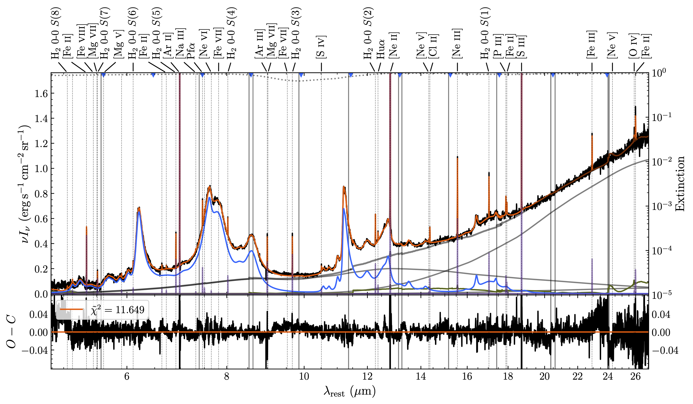

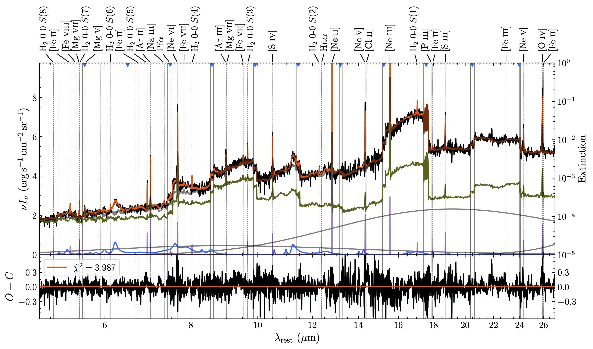

In the matplotlib-generated plot, the data is in black and the full model is in orange. The individual model components are also shown. The gray solid lines are the dust continua. The dark green line is the PSF template. The extinction curve is not visible in this spectrum, but it is plotted as a gray dotted line using the logarithmic vertical axis on the right-hand side of the plot. The summed-up, extincted continuum is the thick solid gray line. The PAHs are shown in light blue, and the emission lines are shown in purple. The residuals are shown in the bottom plot, along with the reduced $\chi^2$ of the fit in the legend.  The bottom axis of the plot shows the rest-frame wavelength, while the top axis labels prominent emission lines.  The plots above for NGC 7469 demonstrate the importance of using the PSF template in data cubes that have bright point sources---the PSF template is the only way to capture the sharp jumps in continuum level between channels (the channel boundaries are demarcated by blue triangles along the top of the plot).

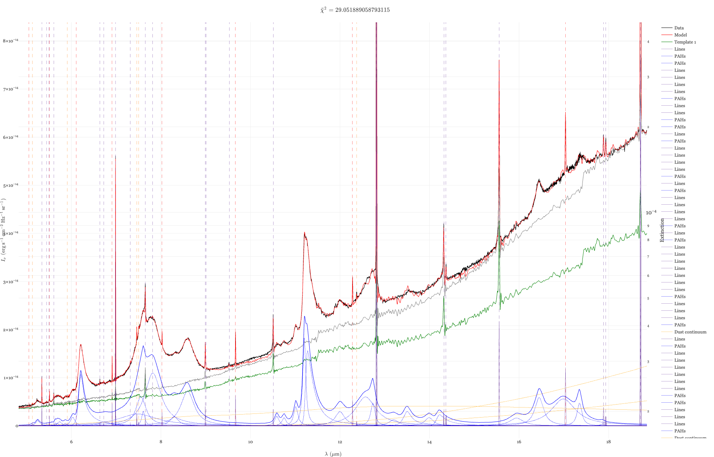

The plotly-generated plot, shown above, is similar to the matplotlib-generated one, but not completely the same. The matplotlib-generated plots are intended to be publication quality, whereas the plotly-generated plots are more for data inspection purposes since they are interactive. As such, there are minor differences in what is plotted (other than unimportant differences like color choices or line styles): in the matplotlib plots, the quantity plotted will be either $\nu I_\nu$ or $\lambda I_\lambda$ (depending on the units of the input data) as a function of wavelength, whereas the plotly plots simply plot $I_\nu$ or $I_\lambda$ (again, depending on the input units) as a function of wavelength. The plotly plots also show each individual Drude profile for the PAH features, whereas the matplotlib plots just show the summed PAH spectrum. The residuals are also omitted from the plotly plots.

If one specifies a `plot_range` argument in the CubeFitter, a `zoomed_plots` folder will also be created with 1D spectra of each zoomed-in region that one specifies. These can be useful for examining the fits of certain emission lines in more detail.  This is useful because, by default, plotly plots are not generated for each spaxel, only for the initial fit (because they are relatively large files).

### v. Stellar Grids

If fitting stellar populations, you will also produce "stellar grid" plots which show the weights of each SSP in the final fit.  The grid that the weights are shown on goes over age and metallicity, and each pixel in the grid represents one SSP, with the color showing the weight. The weights are given in terms of both the luminosity fraction (upper panel) and the mass fraction (lower panel).

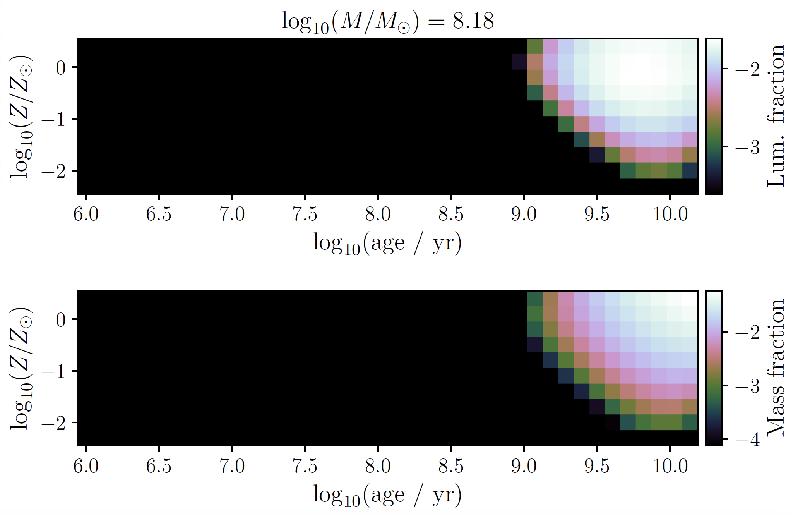

The color scales of both quantities are logarithmic.  The example shown is a prototypical "red and dead" elliptical galaxy with an old stellar population.  The smoothness of the weights is thanks to the regularization process.

### vi. Parameter Maps
If performing a full fit to each spaxel in a cube, 2D parameter maps for each model parameter will be generated in the `param_maps` directory (sorted into sub-directories based on the types of parameters) showing the spatial distribution of the parameter over the galaxy. Physical scale bars showing the spatial extend in both arcseconds and pc/kpc/Mpc are shown in the bottom-left corner of each plot. A circle the size of the FWHM of the point-spread function (PSF) is also shown in the bottom-right corner of each plot. Finally, the color bar is shown in the right of each plot. The function that's used to generate these plots, `plot_parameter_map`, is highly flexible and can be used on existing figure/axes objects with the `modify_ax=(fig, ax)` keyword argument. The color scale can also be manually set with the `colorscale_limits=(vmin, vmax)` argument. The function was created this way with the intention of allowing the user flexibility to re-plot desired quantities after making adjustments and/or making a grid of subplots. However, by default, each quantity is plotted individually, except for lines that have multiple components, for which some combined plots will be created showing the quantities for each component side-by-side. Some examples for NGC 7469 are shown below. Note that some maps appear to have "holes" at the center: this is a side-effect of the PSF subtraction. The brightest spaxels at the centroid of the PSF may be over-subtracted and thus appear as zeros or NaNs in the final parameter maps.

\*Note that all parameter maps shown below are purely for demonstrational purposes

Dust continuum amplitude for the $T = 90$ K component. Notice that the color scale is logarithmic for all amplitudes/fluxes:

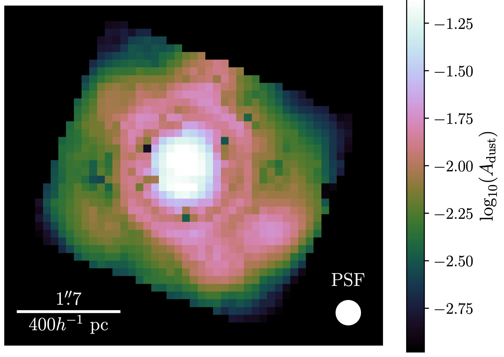

Optical depth at 9.7 μm:

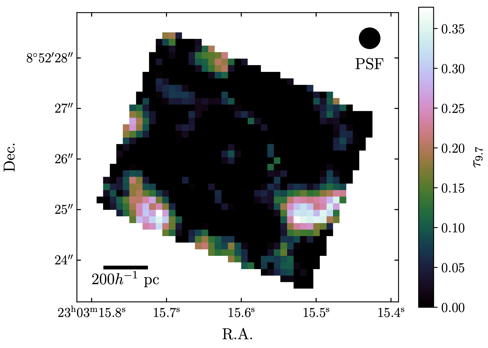

PAH 8.61 μm total flux:

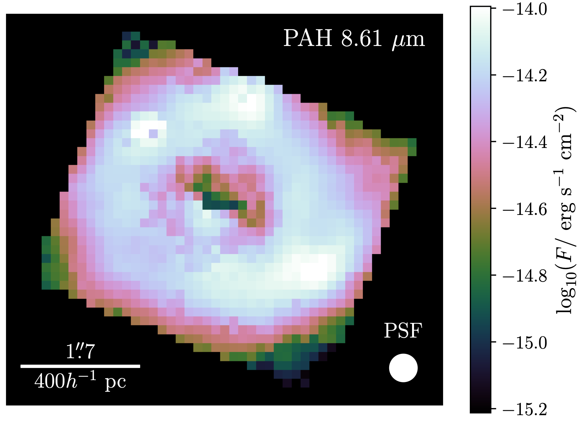

PAH 8.61 μm peak wavelength. Notice here that the plotted wavelengths are measured in the observed frame, so they are a factor of $(1+z)$ larger than the rest-frame 8.61 μm. The redshift of NGC 7469 is $z = 0.016317$, which puts this PAH at 8.75 μm:

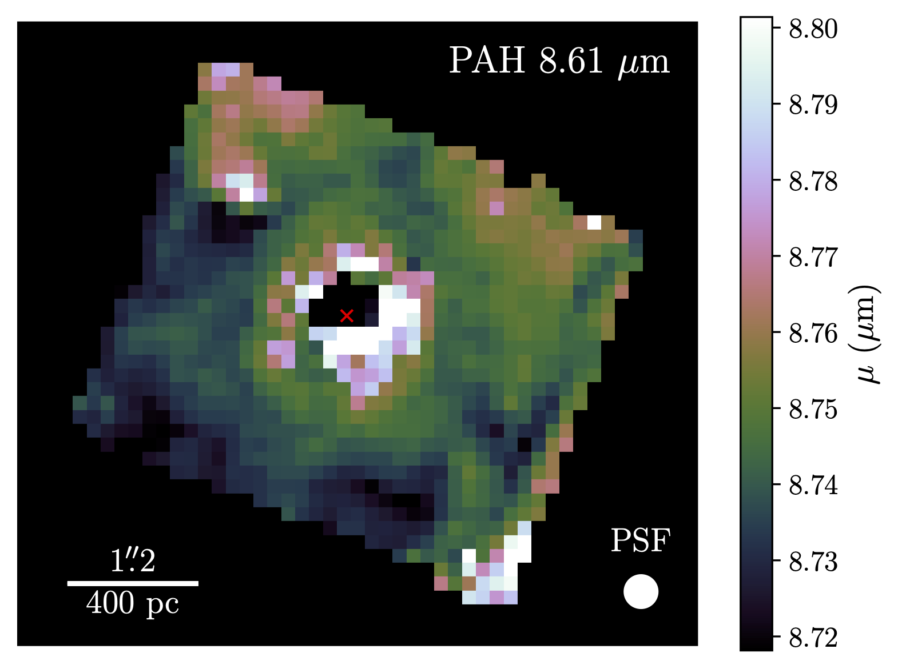

PAH 8.61 μm FWHM. Once again notice that the observed FWHMs will be a factor of $(1+z)$ larger than the rest-frame FWHMs:

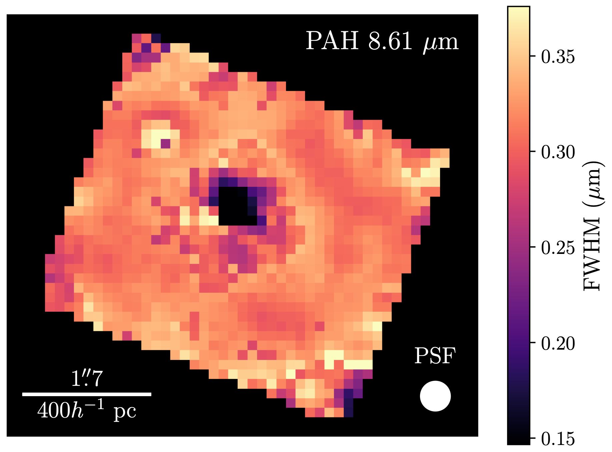

PAH 8.61 μm equivalent width. Once again keep in mind the widths are reported in the observed frame:

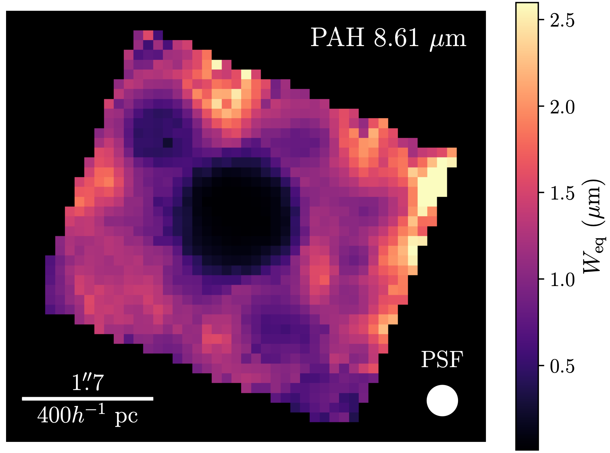

H<sub>2</sub> 0-0 S(3) flux:

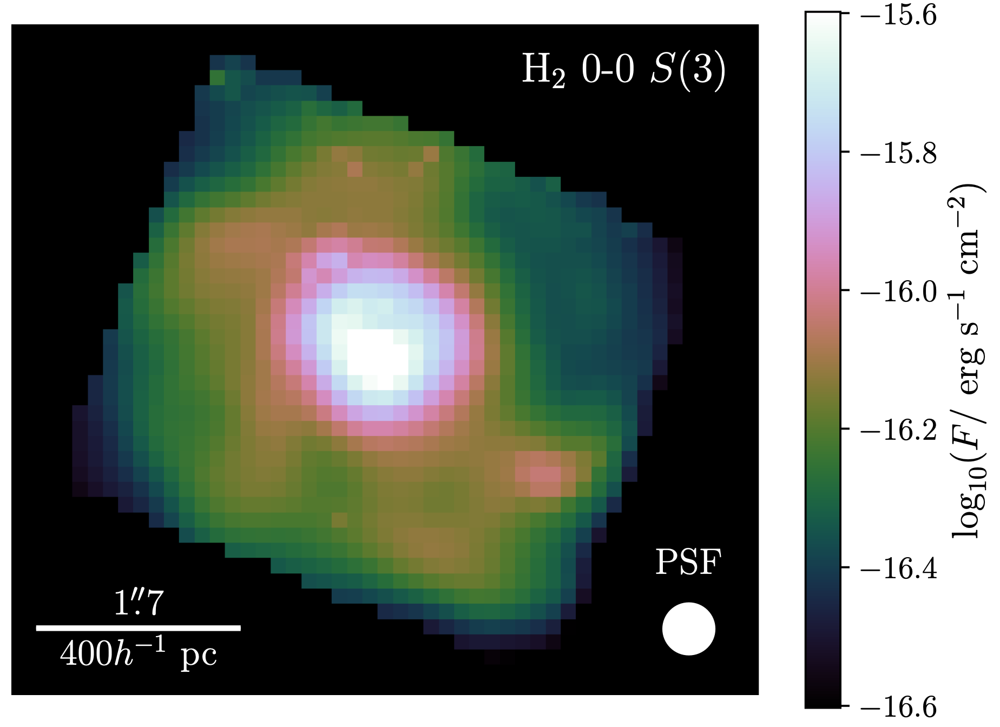

H<sub>2</sub> 0-0 S(3) velocity offset:


H<sub>2</sub> 0-0 S(3) FWHM:

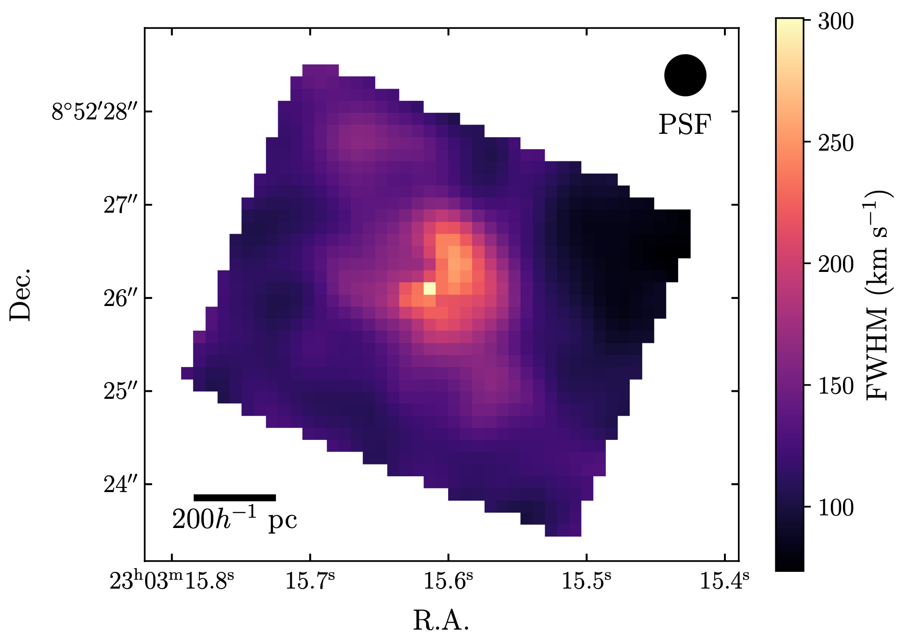

H<sub>2</sub> 0-0 S(3) equivalent width:

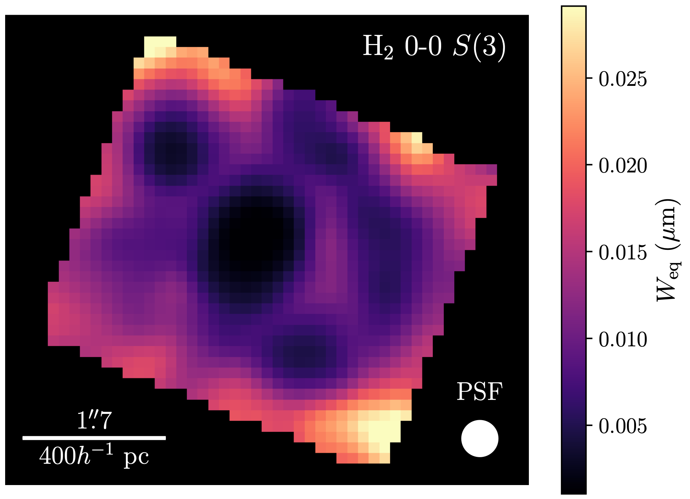

### vii. Aperture Plots
When fitting an integrated spectrum within an aperture, plots are generated at the beginning of the fitting procedure showing the locations/sizes/shapes of the apertures to confirm that they have been placed correctly.  An example is shown below for NGC 7469 where the black circle denotes the aperture:

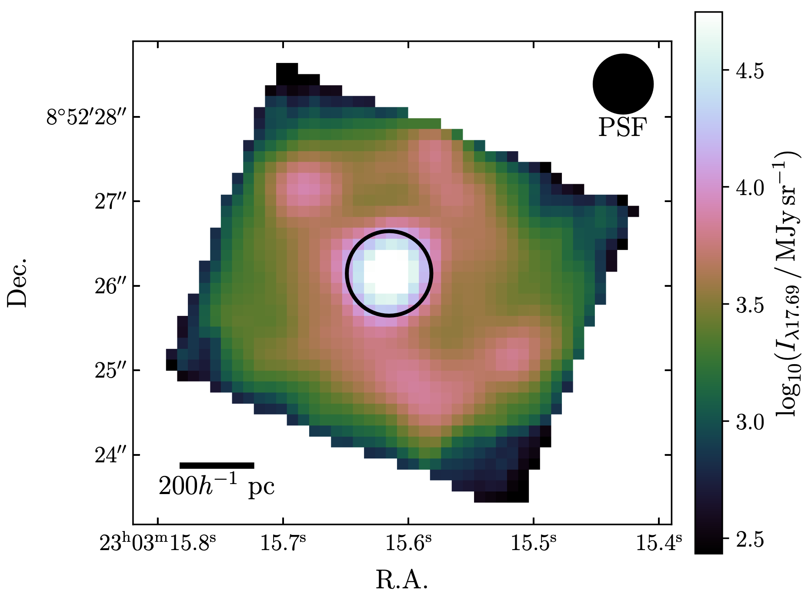

### viii. FITS Files
There are two main categories of output FITS files: parameter maps (2D; `_parameter_maps.fits`, `_parameter_errs_low.fits`, `_parameter_errs_upp.fits`) and model cubes (3D; `_full_model.fits`). As the names suggest, the parameter maps contain 2D maps of each model parameter (and the lower/upper uncertainties, if bootstrapping) for each spaxel, and the model cubes contain the full 3D models decomposed into the individual model components, evaluated at the same points as the data.

The parameter maps are organized as follows. Each model parameter has its own Header Data Unit (HDU) named appropriately, with a 2D shape corresponding to the spatial axes of the input data. An example of what this might look like, showing the names, dimensions, and formats of each HDU, is given below:
```
No.  Name                          Ver Type         Cards   Dimensions Format
  0  PRIMARY                         1 PrimaryHDU      29   (0,)
  1  CONTINUUM.STELLAR.TEMP          1 ImageHDU         9   (49, 44)   float64
  2  CONTINUUM.STELLAR.AMP           1 ImageHDU         9   (49, 44)   float64
...
 19  CONTINUUM.DUST.1.TEMP           1 ImageHDU         9   (49, 44)   float64
 20  CONTINUUM.DUST.1.AMP            1 ImageHDU         9   (49, 44)   float64
 21  CONTINUUM.HOT_DUST.TAU_COLD     1 ImageHDU         9   (49, 44)   float64
 22  CONTINUUM.HOT_DUST.TEMP         1 ImageHDU         9   (49, 44)   float64
 23  CONTINUUM.HOT_DUST.AMP          1 ImageHDU         9   (49, 44)   float64
 24  CONTINUUM.HOT_DUST.FRAC         1 ImageHDU         9   (49, 44)   float64
 25  CONTINUUM.HOT_DUST.TAU_WARM     1 ImageHDU         9   (49, 44)   float64
 26  CONTINUUM.HOT_DUST.SIL_PEAK     1 ImageHDU         9   (49, 44)   float64
 ...
 57  DUST_FEATURES.PAH_1100.FLUX     1 ImageHDU         9   (49, 44)   float64
 58  DUST_FEATURES.PAH_1100.SNR      1 ImageHDU         9   (49, 44)   float64
 59  DUST_FEATURES.PAH_1100.MEAN     1 ImageHDU         9   (49, 44)   float64
 60  DUST_FEATURES.PAH_1100.FWHM     1 ImageHDU         9   (49, 44)   float64
 61  DUST_FEATURES.PAH_1100.AMP      1 ImageHDU         9   (49, 44)   float64
 ...
 305  LINES.SIV_10511.2.FLUX         1 ImageHDU         9   (49, 44)   float64
 306  LINES.SIV_10511.2.SNR          1 ImageHDU         9   (49, 44)   float64
 307  LINES.SIV_10511.2.VOFF         1 ImageHDU         9   (49, 44)   float64
 308  LINES.SIV_10511.2.MIXING       1 ImageHDU         9   (49, 44)   float64
 309  LINES.SIV_10511.2.FWHM         1 ImageHDU         9   (49, 44)   float64
 310  LINES.SIV_10511.2.AMP          1 ImageHDU         9   (49, 44)   float64
 ...
 515  STATISTICS.DOF                 1 ImageHDU         9   (49, 44)   float64
 516  STATISTICS.CHI2                1 ImageHDU         9   (49, 44)   float64
```
This data can be accessed using Julia's FITSIO package or python's Astropy package. Examples of how to do so are provided below.

Using Julia:
```julia
using FITSIO
hdu = FITS("path/to/file.fits")
# Read the full 2D map
Pfa_flux_map = read(hdu["LINES.HI_PF_ALPHA.1.FLUX"])
# Pick out a specific spaxel
Pfa_flux = Pfa_flux_map[15,23]
```
Using Python:
```python
from astropy.io import fits
hdu = fits.open("path/to/file.fits")
# Read the full 2D map
Pfa_flux_map = hdu["LINES.HI_PF_ALPHA.1.FLUX"].data
# Pick out a specific spaxel
Pfa_flux = Pfa_flux_map[22,14]
```
When switching between python and julia, recall that python uses 0-based, row-major indexing, while julia uses 1-based, column-major indexing. This is why the indices between the two examples above are reversed and 1 smaller in the python example.

The model cubes are organized in a very similar manner. There are individual HDUs for the data, error, full model, and each component of the model. An example of the format, in the same manner as the parameter maps, is given below:
```
No.  Name                 Ver Type         Cards   Dimensions       Format
  0  PRIMARY                1 PrimaryHDU      29   (0,)
  1  DATA                   1 ImageHDU        10   (47, 42, 8985)   float32
  2  ERROR                  1 ImageHDU        10   (47, 42, 8985)   float32
  3  MODEL                  1 ImageHDU        10   (47, 42, 8985)   float32
  4  CONTINUUM.STELLAR      1 ImageHDU        10   (47, 42, 8985)   float32
  5  CONTINUUM.DUST.1       1 ImageHDU        10   (47, 42, 8985)   float32
 ...
 14  DUST_FEATURES.PAH_524  1 ImageHDU        10   (47, 42, 8985)   float32
 ...
 62  LINES.H200_S8          1 ImageHDU        10   (47, 42, 8985)   float32
 ...
 96  EXTINCTION             1 ImageHDU        10   (47, 42, 8985)   float32
 97  EXTINCTION.ABS_ICE     1 ImageHDU        10   (47, 42, 8985)   float32
 98  EXTINCTION.ABS_CH      1 ImageHDU        10   (47, 42, 8985)   float32
 99  WAVELENGTH             1 BinTableHDU     12   8985R x 1C       [1D]
```
They can be loaded in the same manner as the parameter maps, bearing in mind that there are now 3 dimensions to index for each HDU instead of 2. The "WAVELENGTH" HDU is an exception, being a table with one entry ("wave") that gives the 1-dimensional wavelength array that corresponds to the third axis of all the other HDUs. This was necessary because the wavelength arrays fitted by the code may not strictly be linear, especially when fitting multi-channel data, and trying to represent this with a 3D WCS is not possible. This is why the included WCS information in these outputs is strictly 2-dimensional, covering the 2 spatial dimensions of the cubes.

### ix. Line Tests
If any line tests are performed and the `plot_line_test` option is enabled, they will be stored in the `line_tests` directory. They will be fairly simple plots showing the spectrum immediately around the line, and the models with 1, 2, ... up to N components. There will be an annotation showing the F-test results and the final number of profiles that will be fit for the line.

An example of one of these plots is shown below for an [S IV] λ10.511μm line that fairly obviously needs two profiles to be fit well

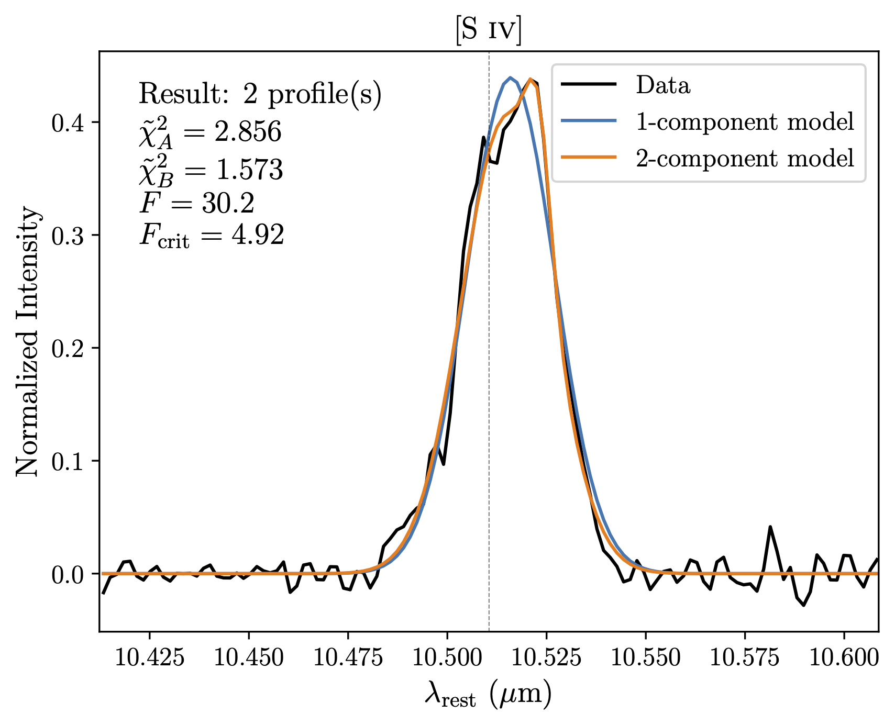

### x. Units
The units of outputs for different quantities are listed here. When relevant, output quantities are all given in the *observed* frame (this applies to both the parameter maps and the full 3D models):

- Stellar mass: $\log_{10}(M/M_\odot)$
    - Note: because SSPs are given in units of $L_\odot/M_\odot/{\rm \mathring{A}}$, this quantity is dependent on your chosen cosmology and scales inversely with the luminosity distance squared, so it also scales with $h^2$. This is also dependent on the IMF used for the stellar populations, which in this code is the Salpeter function.
- Dust continuum amplitudes: $\log_{10}$(normalized amp.)
    - An amplitude scaling factor on the thermal dust emission given by the modified Planck function, with an emissivity of $(9.7\,{\rm \mu m}/\lambda)^2$.
- Warm silicate emission amplitude: $\log_{10}$(normalized amp.)
    - Here the normalized amplitude is a multiplicative factor of the warm silicate emission model, which is a function of the Planck function, so once again the physical units are contained within the Planck function.
- Generic template amplitudes: $\log_{10}$(amp.)
- Warm silicate emission covering fraction: unitless
- Warm silicate emission peak wavelength: ${\rm \mu m}$ / $\mathring{\rm A}$ (depending on input spectrum units)
- All temperatures are measured in Kelvins
- All optical depths are unitless
    - If the `extinction_screen` option is true, then the extinction factor at 9.7 μm is $e^{-\tau_{9.7}}$. Otherwise, it is $(1-e^{-\tau_{9.7}})/\tau_{9.7}$.
    - $\tau_{\rm warm}$, $\tau_{\rm cold}$, and $\tau_{\rm CH}$ all satisfy $e^{-\tau}$.
- Olivine mass column density for the "decompose" extinction profile: ${\rm g}\ {\rm cm}^{-2}$
- Pyroxene and forsterite mass column densities for the "decompose" extinction profile are measured in units of the olivine mass column density: $N_{\rm oli}$.
- Covering fractions are unitless
- Line & PAH amplitudes: 
    - The units of the output here depend on the units of the input. If the spectrum is per unit frequency, the units will be $\log_{10}(I/{\rm erg}\ {\rm s}^{-1}\ {\rm cm}^{-2}\ {\rm Hz}^{-1}\ {\rm sr}^{-1})$.  If it is per unit wavelength in angstroms, the units will be $\log_{10}(I/{\rm erg}\ {\rm s}^{-1}\ {\rm cm}^{-2}\ {\rm \mathring{A}}^{-1}\ {\rm sr}^{-1})$.  Similarly, if it is per unit wavelength in microns, the units will be $\log_{10}(I/{\rm erg}\ {\rm s}^{-1}\ {\rm cm}^{-2}\ {\rm \mu m}^{-1}\ {\rm sr}^{-1})$.
- Line & PAH fluxes: $\log_{10}(F/{\rm erg}\ {\rm s}^{-1}\ {\rm cm}^{-2})$
    - Note: Line amplitudes and fluxes will NOT BE LOGS if the `lines_allow_negative` option is true, they will be in the linear CGS units (${\rm erg}\,{\rm s}^{-1}\,{\rm cm}^{-2}$ for fluxes and ${\rm erg}\,{\rm s}^{-1}\,{\rm cm}^{-2}\,{\rm Hz}^{-1}\,{\rm sr}^{-1}$ for amplitudes and the relevant per-wavelength equivalents)
- PAH peak wavelengths: ${\rm \mu m}$ / $\mathring{\rm A}$
- PAH FWHMs: ${\rm \mu m}$ / $\mathring{\rm A}$
- Line velocity offsets: ${\rm km}\ {\rm s}^{-1}$
- Line FWHMs: ${\rm km}\ {\rm s}^{-1}$
- Line Voigt mixing ratios: unitless
- Signal-to-noise ratios: unitless
- Stellar velocity and dispersion: ${\rm km}\ {\rm s}^{-1}$
- Power law amplitudes: same units as line & PAH amplitudes
- Power law indices: unitless
- Fe II amplitudes: same units as line & PAH amplitudes
- Fe II velocities and dispersions: ${\rm km}\ {\rm s}^{-1}$
- $E(B-V)$: magnitudes
- $E(B-V)$ gas-to-stellar conversion factor, UV slope, and covering fraction are all unitless
---

## V. Examples
Please see `examples` folder for a bunch of example notebooks for using MIRI/MRS data, NIRSpec/IFU data, and non-JWST data.

The main steps one must follow to fit a cube using LOKI are as follows:
1. Load in the LOKI module following the instructions in [Installation](#ii-installation). Then include it in your code:
```julia
using Loki
# or, if you wish to use the multiprocessing:
using Distributed
addprocs(Sys.CPU_THREADS)
@everywhere using Loki
```
2. Load in the data you want to fit from a FITS file using LOKI's "from_fits" function, which takes a list of strings that give the file paths to each FITS file that should be read, along with a float value giving the redshift of the object. This converts the data into an `Observation` object.
```julia
obs = from_fits(["file_1.fits", "file_2.fits", ...], redshift)
```
3. Convert the data to the rest-frame and mask out bad pixels using the "correct!" function on the `Observation` object.
```julia
correct!(obs)
```
4. To combine data from multiple channels/bands, use the `combine_channels!` function, which takes a number of smaller subroutines and combines them into one procedure for combining data for multiple channels. This procedure handles: 1. (optional) adjusting the WCS parameters in the header of each channel such that the centroids match on the overlapping parts of the spectrum, which may aid in refining the WCS parameters provided by the JWST pipeline. This may be enabled with the `adjust_wcs_headerinfo` keyword argument. 2. Reprojecting all of the channels onto the same 2D spaxel grid, which is done with interpolation, the order of which can be adjusted with the `order` keyword argument (default is linear). 3. (optional) extract the data from each spaxel using an aperture (i.e. a tophat kernel) to suppress resampling artifacts produced by the 3D drizzle algorithm. The size of the aperture may be adjusted using the `extract_from_ap` keyword argument, in units of the PSF FWHM. 4. The data is resampled in the wavelength direction in the regions where the channels overlap to a median resolution, while conserving flux. There are additional keyword arguments that can be used to adjust how the data is combined with even finer detail, which can be looked up using the code documentation itself. I.e., in the julia terminal, type `?combine_channels!`.
```julia 
combine_channels!(obs, [1,2,3], out_id=0, order=1, adjust_wcs_headerinfo=true, extract_from_ap=0.)
```
5. (Optional) It is often desirable to rotate the cubes to be aligned with the sky axes rather than the IFU axes, which can be achieved using the `rotate_to_sky_axes!` function:
```julia
rotate_to_sky_axes!(obs.channels[0])
```
6. Bad pixels can then be interpolated using the "interpolate_nans!" function on the desired channels. These pixels will be ignored during the fitting, but this step is necessary because the minimizer cannot deal with NaNs and Infs. 
```julia
interpolate_nans!(obs.channels[0])
```
7. The errors in the cube can be replaced with the "statistical errors", which are calculated as the standard deviation of the residuals between the flux and a cubic spline fit to the flux (with emission lines masked out) within a small window (60 pixels) around each pixel.  This is performed with the "calculate_statistical_errors!" function.
```julia
calculate_statistical_errors!(obs.channels[0])
```
8. Create the CubeFitter object, which contains all of the fitting data and options for fitting a cube. Here you can overwrite any options from the `options.toml` file, which will otherwise be the defaults when creating any CubeFitter object:
```julia
cube_fitter = CubeFitter(obs.channels[0], obs.z, name; parallel=true, plot_spaxels=:pyplot, plot_maps=true, save_fits=true)
```
9. If fitting each spaxel individually, simply call the "fit_cube!" function on the CubeFitter object
```julia
fit_cube!(cube_fitter)
```
10. If fitting an integrated spectrum within an aperture, first create the aperture with the "make_aperture" function, then call the "fit_cube!" function with the aperture. Apertures can be specified as `:Circular`, `:Rectangular`, or `:Elliptical`. The following two arguments are the R.A. in sexagesimal hours and the Dec. in sexagesimal degrees of the center of the aperture. Then, if the aperture is circular, the next argument is the radius of the aperture in arcseconds. For rectangular apertures, there are 3 arguments for the width and height in arcseconds and rotation angle in degrees. For elliptical apertures, there are 3 arguments for the semimajor and semiminor axes in arcseconds and rotation angle in degrees. The `auto_centroid` option will automatically adjust the centroid of the aperture to the local flux peak. The `scale_psf` argument creates a list of apertures with increasing sizes that scale up at the same rate as the FWHM of the PSF scales up over the input wavelength range.
```julia
ap = make_aperture(obs.channels[0], :Circular, "23:03:15.610", "+8:52:26.10", 0.5, auto_centroid=true, scale_psf=false)
fit_cube!(cube_fitter, ap)
```
In a similar vein, one can set up voronoi bins by first calling the "voronoi_rebin!" function.  This should be done before creating the CubeFitter object and calling fit_cube!.  The arguments for voronoi_rebin! specify the target signal to noise ratio that you'd like to bin to (target_SNR) and, optionally, a wavelength window you'd like to restrict the SNR calculation to (formatted as a tuple of wavelengths, including units):
```julia
voronoi_rebin!(obs.channels[0], target_SNR, window)
```

If one wishes to model the PSF from a bright point source and include it in the model to separate it from the host galaxy emission, there are some additional utility functions that one can utilize:

```julia
generate_psf_model!(obs)
```
This function acts on an observation object and generates a PSF model cube that has been resized to match the size of the observation, shifted such that the centroids are aligned, background annulus subtracted, and interpolated over the spectral leak artifact at 12.2 microns. For this function to work, the input observation data MUST be aligned to the IFU axes, not the sky axes.

```julia
splinefit_psf_model!(obs.channels[0], 100)
```
To be used strictly after the `generate_psf_model` function, this function takes the PSF model generated by the previous function and fits a cubic spline to it, with a knot spacing given by the second argument (in pixels), since the PSF is expected to vary gradually in the wavelength dimension. This function should be applied between steps 4 and 5 in the above roadmap. This function is not required if one wishes to keep the more noisy PSF model generated in the previous step.

```julia
generate_nuclear_template(obs.channels[0], 0.)
```
This function, applied between steps 7-8 above, takes the PSF model and combines it with the spectrum of the brightest spaxel in the data cube (or, if the second argument defining the aperture radius in units of the PSF FWHM is > 0, it takes an integrated spectrum around the brightest point). This creates a 3D cube that is formatted such that it can be inputted directly into the CubeFitter object with the `templates` argument.

---

