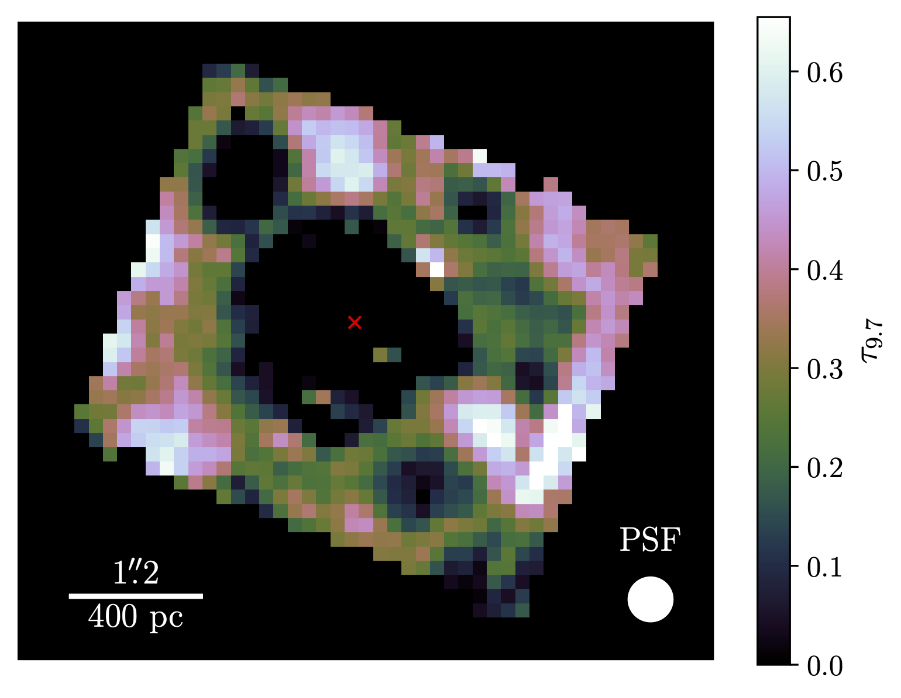
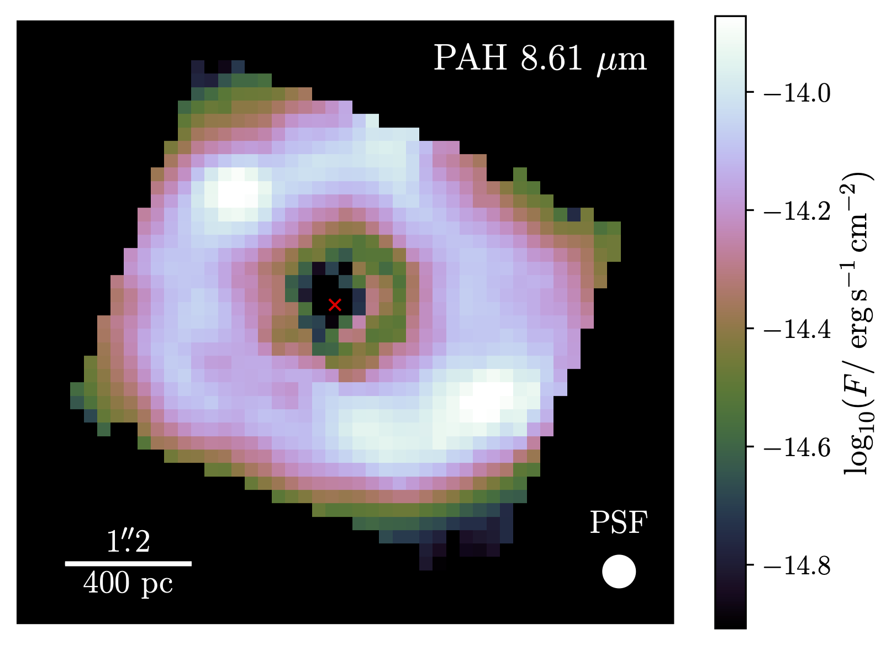
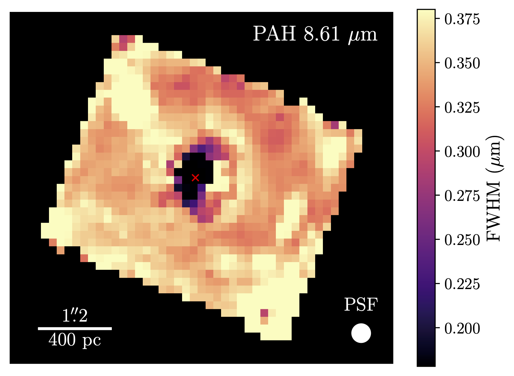

# LOKI: Likelihood Optimization of gas Kinematics in IFUs

### A Julia package for fitting and plotting IFU spectra in the mid-infrared or (newly added) optical

---
## Table of Contents

* [Introduction](#i-introduction)
* [Installation](#ii-installation)
    - [Julia Requirements](#julia-requirements)
    - [Python Requirements](#python-requirements)
    - [LaTeX](#latex)
* [Usage](#iii-usage)
    - [General Code Options](#i-general-code-options)
    - [MIR Continuum and PAH Options](#ii-mir-continuum-and-pah-options)
    - [Optical Continuum Options](#iii-optical-continuum-options)
    - [Line Options](#iv-line-options)
* [Outputs](#iv-outputs)
    - [The Output Directory Structure](#i-the-output-directory-structure)
    - [Logs](#ii-logs)
    - [CSV Files](#iii-csv-files)
    - [Spaxel Plots](#iv-spaxel-plots)
    - [Parameter Maps](#v-parameter-maps)
    - [Aperture Plots](#vi-aperture-plots)
    - [FITS Files](#vii-fits-files)
    - [Line Tests](#viii-line-tests)
    - [Units](#ix-units)
* [Examples](#v-examples)


---
## I. Introduction

This Julia package provides routines for reading, fitting, and plotting IFU data for spectra in the mid-infrared (MIR) or the optical. The MIR fitting models are based heavily on the widely used IDL tool PAHFIT (http://tir.astro.utoledo.edu/jdsmith/research/pahfit.php) from the Spitzer era, but many areas have been updated to account for the increased spectral resolution of the MIRI instrument, and special attention has been given to fitting emission lines, allowing for much more flexibile and robust fits. The optical fitting models are largely based on a combination of the Penalized Pixel Fitting ([pPXF](https://www-astro.physics.ox.ac.uk/~cappellari/software/#ppxf)) and Bayesian AGN Decomposition Analysis for SDSS Spectra ([BADASS](https://github.com/remingtonsexton/BADASS3)) models. However, unlike these tools, simple stellar populations are generated using Flexible Stellar Population Synthesis ([FSPS](https://dfm.io/python-fsps/current/)), and quantities like stellar age/metallicity can be interpolated and included as free parameters in the fit.

As a brief overview, the mid-infrared spectrum is decomposed into
- A stellar continuum modeled by a blackbody at a fixed temperature of $T = 5000$ K
- A dust continuum modeled by a series of modified blackbody functions with emissivities $\propto 1/\lambda^2$ at fixed temperatures of $T \in \{35,40,50,65,90,135,200,300,500\}$ K
- Emission from Polycyclic Aromatic Hydrocarbon (PAH) molecules reperesented by Drude (or Pearson type-IV) profiles with constrained central wavelengths and widths
- Silicate dust extinction using templates from [Kemper, Vriend, & Tielens (2004)](https://ui.adsabs.harvard.edu/abs/2004ApJ...609..826K), [Chiar & Tielens (2006)](https://ui.adsabs.harvard.edu/abs/2006ApJ...637..774C/abstract), [Ossenkopt, Henning, & Mathis (1992)](https://ui.adsabs.harvard.edu/abs/1992A&A...261..567O), or [Donnan et al. (2023)](https://ui.adsabs.harvard.edu/abs/2023MNRAS.519.3691D)
- Absorption features from water-ice, CH, and other molecules
- Warm silicate dust emission from an AGN torus using the simplified radiative transfer model of [Gallimore et al. (2010)](https://ui.adsabs.harvard.edu/abs/2010ApJS..187..172G)
- Emission lines from warm molecular H<sub>2</sub>, hydrogen recombination, and ionized species, modeled using Gaussian, Lorentzian, Gauss-Hermite, or pseudo-Voigt profiles.

Whereas the optical spectrum is decomposed into
- An aribtrary number of simple stellar population (SSP) models generated by FSPS, with ages and metallicities within the allowable ranges of FSPS.
- An intrinsic dust attenuation model using the extinction curve of either [Cardelli, Clayton, & Mathis (1989)](https://ui.adsabs.harvard.edu/abs/1989ApJ...345..245C/abstract) or [Calzetti et al. (2000)](https://ui.adsabs.harvard.edu/abs/2000ApJ...533..682C/abstract)
- Optional Narrow- and broad-line Fe II emission using the templates of [Véron-Cetty et al. (2004)](https://ui.adsabs.harvard.edu/abs/2004A%26A...417..515V/abstract) derived from the spectrum of I Zw 1.
- An arbitrary number of power laws to potentially model an AGN continuum.
- Emission lines from hydrogen recombination and ionized species, modeled using Gaussian, Lorentzian, Gauss-Hermite, or pseudo-Voigt profiles.

The code uses the [MPFIT](https://pages.physics.wisc.edu/~craigm/idl/cmpfit.html) ([Markwardt 2009](https://ui.adsabs.harvard.edu/abs/2009ASPC..411..251M)) implementation of the Levenberg-Marquardt (LM) least-squares minimization routine, as well as the simulated annealing (SA) global minimization method as implemented by [Optim](https://github.com/JuliaNLSolvers/Optim.jl), and optionally may estimate uncertainties using bootstrapping. Depending on how the code is configured, the fitting procedure may be performed in multiple steps. By default, the configuration contains two steps:
1. The emission lines are masked and the continuum + PAH features are fit with LM
2. The continuum + PAH features are subtracted and the emission lines are fit to the residual spectrum with SA, followed by LM

However, if one wishes, the code can be configured to fit the continuum and emission lines simultaneously in one step (using SA and/or LM), or it may be further broken down into 3 steps by splitting the continuum and PAH features up into 2 individual steps.

For a more detailed description of the PAHFIT decomposition and fitting methods, see [Smith et al. (2007)](https://ui.adsabs.harvard.edu/abs/2007ApJ...656..770S), and for a detailed overview of the changes and updates made by LOKI, see Reefe et al. (2023, in prep.).

---


## II. Installation

Simply clone the git repository: `git clone https://github.com/Michael-Reefe/Loki.jl`. You can then start using the code in a number of ways.

##### From the Julia REPL:
1. Type `]` to enter the package mode
2. Type `activate path`, replacing "path" with the appropriate path to your Loki installation
3. Type `instantiate` to instantiate the package
4. Type `precompile` to precompile the package
5. Return to command mode by hitting backspace, then type `using Loki` to import the Loki package

\*Steps 3 and 4 are only necessary the first time you start Julia, or whenever LOKI is updated.

##### From a file:
1. Use the following block of code to import the Loki package, again replacing "path" with the appropriate file path to your Loki installation
```julia
using Pkg
Pkg.activate("path")
Pkg.instantiate()
Pkg.precompile()
using Loki
```
2. If you plan on utilizing the multiprocessing capabilities of Loki, all lines in the previous code block should be prepended with `@everywhere` (or they can be wrapped within a `begin`/`end` block with `@everywhere`). See the example notebook in the `examples/` directory for an idea of how this is used in practice.

### Julia Requirements

These should be automatically installed with Julia's package manager upon importing Loki, but they are listed here for the sake of completeness.

- [Julia >= 1.9](https://julialang.org/) (earlier versions have not been tested)
- [AbstractFFTs](https://github.com/JuliaMath/AbstractFFTs.jl)
- [AstroAngles](http://juliaastro.org/dev/modules/AstroAngles/)
- [CMPFit](https://github.com/gcalderone/CMPFit.jl)
- [CSV](https://csv.juliadata.org/stable/)
- [ColorSchemes](https://juliagraphics.github.io/ColorSchemes.jl/stable/)
- [Cosmology](http://juliaastro.org/dev/modules/Cosmology/)
- [DataFrames](https://dataframes.juliadata.org/stable/)
- [Dates](https://docs.julialang.org/en/v1/stdlib/Dates/)
- [DelimitedFiles](https://docs.julialang.org/en/v1/stdlib/DelimitedFiles/)
- [Dierckx](https://github.com/kbarbary/Dierckx.jl)
- [Distributed](https://docs.julialang.org/en/v1/manual/distributed-computing/)
- [Distributions](https://juliastats.org/Distributions.jl/stable/starting/)
- [EllipsisNotation](https://github.com/SciML/EllipsisNotation.jl)
- [FFTW](https://juliamath.github.io/FFTW.jl/stable/)
- [FITSIO](http://juliaastro.org/dev/modules/FITSIO/)
- [IJulia](https://github.com/JuliaLang/IJulia.jl) (optional: Julia kernel for Jupyter notebooks)
- [InteractiveUtils](https://docs.julialang.org/en/v1/stdlib/InteractiveUtils/)
- [LaTeXStrings](https://github.com/JuliaStrings/LaTeXStrings.jl)
- [LinearAlgebra](https://docs.julialang.org/en/v1/stdlib/LinearAlgebra/)
- [Logging](https://docs.julialang.org/en/v1/stdlib/Logging/)
- [LoggingExtras](https://github.com/JuliaLogging/LoggingExtras.jl)
- [NaNStatistics](https://brenhinkeller.github.io/NaNStatistics.jl/dev/)
- [NumericalIntegration](https://github.com/dextorious/NumericalIntegration.jl)
- [Optim](https://julianlsolvers.github.io/Optim.jl/stable/)
- [Pipe](https://github.com/oxinabox/Pipe.jl)
- [PlotlyJS](http://juliaplots.org/PlotlyJS.jl/stable/)
- [Polynomials](https://juliamath.github.io/Polynomials.jl/stable/)
- [Printf](https://docs.julialang.org/en/v1/stdlib/Printf/)
- [ProgressMeter](https://github.com/timholy/ProgressMeter.jl)
- [PyCall](https://github.com/JuliaPy/PyCall.jl)
- [QuadGK](https://juliamath.github.io/QuadGK.jl/stable/)
- [Random](https://docs.julialang.org/en/v1/stdlib/Random/)
- [Serialization](https://docs.julialang.org/en/v1/stdlib/Serialization/)
- [SpecialFunctions](https://specialfunctions.juliamath.org/stable/)
- [Statistics](https://docs.julialang.org/en/v1/stdlib/Statistics/)
- [StatsBase](https://juliastats.org/StatsBase.jl/stable/)
- [TOML](https://docs.julialang.org/en/v1/stdlib/TOML/)
- [Unitful](https://painterqubits.github.io/Unitful.jl/stable/)
- [UnitfulAstro](http://juliaastro.org/UnitfulAstro.jl/stable/)

### Python Requirements

Loki utilizes the PyCall package (https://github.com/JuliaPy/PyCall.jl) to run some python routines that do not currently have good Julia alternatives. As such, some additional setup is required to ensure that you have the right python packages installed in the PyCall environment. To set up PyCall, open a julia REPL and input the following commands:

1. `]` to enter package mode
2. `activate path` to activate your LOKI environment, replacing path with the path to this repository
3. backspace to exit package mode
4. `using PyCall` to import the PyCall module
5. to link PyCall to a pre-existing python environment, enter `ENV["PYTHON"] = "path"`, filling in the path to the python binary.
6. otherwise, to link PyCall to a new, self-contained conda environment, enter `ENV["PYTHON"] = ""`, from personal experience I have
found this option to be troublesome, so I would recommend linking to a pre-existing environment
7. `]` to re-enter package mode
8. `build PyCall` to build the PyCall module with the specified python environment

And that's it! If you chose the option to link to a new, self-contained conda environment, then the necessary packages should be installed automatically upon the first time you run the code. Otherwise, if linking to an external environment, make sure all of the following packages are installed via pip or conda:

- [matplotlib](https://matplotlib.org/)
- [astropy](https://www.astropy.org/)
- [reproject](https://reproject.readthedocs.io/en/stable/)
- [photutils](https://photutils.readthedocs.io/en/stable/)
- [lineid_plot](https://github.com/phn/lineid_plot)
- [fsps](https://github.com/dfm/python-fsps) (only required for optical spectra fitting)

### LaTeX

Finally, LOKI assumes you have an installation of LaTeX that can be used with matplotlib to generate nicely formatted axis labels and annotations.  Common LaTeX distributions include [TeX Live](https://www.tug.org/texlive/) and [MiKTeX](https://miktex.org/about). Whichever you choose, you should also make sure that you have the siunitx package installed, since some of LOKI's plotting functionality makes use of it. It's fairly standard and it comes with both of the aforementioned distributions by default.

---

## III. Usage

### i. General Code Options

These options are found in `src/options/options.toml`:

`parallel = true`

This boolean option enables or disables multiprocessing (not to be confused with multithreading). If this option is true, when fitting individual spaxels, multiple spaxel fits may be performed in parallel across different CPUs.

`plot_spaxels = "pyplot"`

This option determines the plotting backend that is used for plotting the 1D spectral models of individual spaxels or integrated apertures. It may be "pyplot", "plotly", or "both".

`plot_maps = true`

This boolean option enables or disables plotting 2D maps of each model parameter at the end of fitting.

`save_fits = true`

This boolean option enables or disables saving the final model parameters and uncertainties as FITS files at the end of fitting.

`n_bootstrap = 0`

This option sets the number of bootstrap iterations that are performed on each fit. Setting it to 0 (the default) disables bootstrapping. When bootstrapping is disabled, the provided uncertainties will be calculated based on the covariance matrix of the LM fit.

`random_seed = 123456789`

This option sets the random seed that is used when resampling the data for bootstrapping iterations. By using the same seed, you are guaranteed to get the same results after repeated runs (assuming all other inputs are the same).

`overwrite = false`

This boolean option determines the behavior of the code when fitting results for a given spaxel or aperture already exist. If `false`, the old results will simply be read in. If `true`, the fits will be redone and the old results will be overwritten by the new results.

`track_memory = false`

This boolean option controls whether an additional log file is generated for each spaxel which specifically tracks the memory usage / allocations during the spaxel fitting. This is useful if memory usage is higher than expected.

`track_convergence = true`

This boolean option controls whether an additional log file is generated which prints convergence information for the simulated annealing emission line fit for each spaxel. Be warned that the way Optim.jl works with the simulated annealing method SAMIN makes it always print "status: failure" even if convergence was reached. The way to tell whether convergence was *actually* reached is if the number of iterations is less than the maximum (which is $10^6$ by default).

`make_movies = false`

This boolean option determines whether or not to generate an mp4 movie of the data and model at the end of fitting. The movie steps through the wavelength dimension over time. N.B. this option is old and has not been tested recently, and its scientific usefulness is minimal.

`save_full_model = true`

This boolean option determines whether or not to save the full 3D model, evaluated at the same grid points as the input data, in a FITS cube format at the end of fitting. N.B. these files tend to be very large (multiple gigabytes) and can take a while to generate.

`extinction_curve = "kvt"`

This option determines what dust extinction template to use, and has different options for the MIR and optical. 

The possible values for the MIR are "kvt" for the [Kemper, Vriend, & Tielens (2004)](https://ui.adsabs.harvard.edu/abs/2004ApJ...609..826K) template, "ct" for the [Chiar & Tielens (2006)](https://ui.adsabs.harvard.edu/abs/2006ApJ...637..774C/abstract) template, "ohm" for the [Ossenkopt, Henning, & Mathis (1992)](https://ui.adsabs.harvard.edu/abs/1992A&A...261..567O) template, or "d+" for the [Donnan et al. (2023)](https://ui.adsabs.harvard.edu/abs/2023MNRAS.519.3691D) template. Note that the template used for the warm silicate *emission* component is always the "ohm" template, regardless of what this option is.

The possible values for the optical are "ccm" for the [Cardelli, Clayton, & Mathis (1989)](https://ui.adsabs.harvard.edu/abs/1989ApJ...345..245C/abstract) template, or "calzetti" for the [Calzetti et al. (2000)](https://ui.adsabs.harvard.edu/abs/2000ApJ...533..682C/abstract) template.

`extinction_screen = true`

If `true`, dust extinction is modeled as a foreground screen $\propto e^{-\tau(\lambda)}$. If `false`, dust extinction is modeled as mixed $\propto (1-e^{-\tau(\lambda)})/\tau(\lambda)$. This option only applies for the MIR.

`fit_sil_emission = true`

This boolean option determines whether or not to include the warm silicate dust emission component of [Gallimore et al. (2010)](https://ui.adsabs.harvard.edu/abs/2010ApJS..187..172G) in the MIR model.

`fit_opt_na_feii = false`

This boolean option determines whether or not to include narrow Fe II line emission using the template from [Véron-Cetty et al. (2004)](https://ui.adsabs.harvard.edu/abs/2004A%26A...417..515V/abstract) in the optical model.

`fit_opt_br_feii = false`

Same as `fit_opt_na_feii` but pertaining to broad Fe II line emission.

`use_pah_templates = false`

This boolean option determines how the PAH features are fit. If `false`, they will be fit using Drude profiles simultaneously with the rest of the continuum, the exact same way that PAHFIT does.  However, if `true`, the continuum fitting is split up into two steps.  In the first step, the continuum is fit while the PAH features are included using two templates from [Smith et al. (2007)](https://ui.adsabs.harvard.edu/abs/2007ApJ...656..770S).  Then in the second step, the continuum from the previous step is subtracted, and PAH features are fit to the residual spectrum using Drude profiles, using the same Drude model as PAHFIT.  In general, it is best to leave this option `false` unless you are dealing with spectra with extremely weak PAH emission and a complicated underlying continuum that causes the fitted PAHs to become unphysical.

`fit_joint = false`

This boolean option determines how the emission lines are fit. If `false`, they will first be masked out and the continuum will be fit. Then the continuum will be subtracted and the lines will be fit to the residual spectrum in a second step. If `true`, the continuum and lines will be fit simultaneously in one step. It is recommended to set this to `true` when fitting optical spectra with nonzero reddening, since E(B-V) can be better constrained by fixing certain emission line amplitude ratios.

`fit_all_samin = false`

By default, simulated annealing is only performed for the line fit during the initial fit of the sum of all spaxels. If this option is set to `true`, then simulated annealing will be performed on all of the line fits for the individual spaxels as well.

`fit_uv_bump = false`

This boolean option determines whether to include the UV bump in the dust attenuation curve. This only applies if `extinction_curve` is set to `"calzetti"`.

`fit_covering_frac = false`

This boolean option determines whether to include a dust covering fraction in the attenuation curve. This only applies if `extinction_curve` is set to `"calzetti"`.

`user_mask = []`

This option allows the user to mask out predefined regions of the spectrum that will be ignored during the fitting process. To mask out a region bounded between $\lambda_1 < \lambda < \lambda_2$, add a tuple to the user mask of the format $(\lambda_1, \lambda_2)$. For example, `user_mask = [(5.5, 6.0), (10.2, 10.3)]` will mask out the regions between 5.5-6 μm and 10.2-10.3 μm.

`line_test_lines = []`

A list of lists of lines lines should be tested for additional components. The lines in this list must have multiple components to begin with (specified in the `lines.toml` file), otherwise they won't be tested. Each entry should be a string matching the name of the line in the `lines.toml` file. Lines that are grouped together into sub-lists will each be tested and given the maximum number of profiles that any one line in the group achieves during the test (this is useful if, for example, one is testing a tied doublet of lines). For example, this might look like `line_test_lines = [["OIII_05008", "OIII_04960"], ["HI_H_beta"]]` if one wanted to test the [O III] λλ4960,5008 doublet together and Hβ individually.

`line_test_threshold = 0.20`

This sets a threshold value on the chi-squared ratio, defined as $1 - \tilde{\chi}^2_B/\tilde{\chi}^2_A$, which must be met in order to consider additional line components as "significant."  Lines with multiple components will be tested by fitting iteratively, first with 1 component, and then adding additional components one at a time until reaching the value set in the line options files, or until this threshold fails to be achieved. Only components that pass this threshold will be fit in a given spaxel. This line testing can be disabled entirely by setting this threshold to 0.

`plot_line_test = true`

Whether or not to plot the line test results showing models with different numbers of components and their chi-squared ratios.

```toml
[cosmology]
h = 1.0           # Hubble constant (in km s^-1 Mpc^-1) / 100
omega_m = 0.27    # matter density parameter
omega_K = 0.0     # curvature density parameter
omega_r = 0.0     # radiation density parameter
```
The cosmology options determine the cosmology that the code assumes. Currently this is only used to calculate angular diameter distances for usage in physical scale bars on the 2D maps. $h$ is the standard Hubble constant normalized to $100\ {\rm km}\ {\rm s}^{-1}\ {\rm Mpc}^{-1}$, and $\Omega_m$, $\Omega_K$, and $\Omega_r$ are the standard matter, curvature, and radiation density parameters.

### ii. MIR Continuum and PAH Options
These options are found in `src/options/dust.toml`

**Stellar Continuum:**

There is only one stellar continuum component.
```toml
[stellar_continuum_temp]
val = 5000.0
plim = [4999.9, 5000.1]
locked = true
```
This option allows the user to modify the temperature of the stellar blackbody component of the continuum. `val` gives the starting value (default = 5000 K), `plim` gives the lower and upper limits on the parameter (which are only relevant if the parameter is allowed to vary, which in this case it is not), and `locked` is a boolean that determines whether the parameter is allowed to vary (`false`) or is fixed (`true`) during the fitting. The same format of `val`, `plim`, `locked` is used throughout these options and the line options (see the next section) for any parameter which the user may want to change.

**Dust Continuum:**

The dust continuum components are enumerated in a list signified by the double square brackets. By default there are 9.
```toml
[[dust_continuum_temps]]
val = 500.0
plim = [499.9, 500.1]
locked = true
```
Following the stellar blackbody temperature, the dust blackbody temperatures are given in the same way, and may be modified in the same way. Temperatures may be added or removed, allowed to vary or fixed, if one so desires.

**PAH Features:**

Each PAH feature is labeled by its name, taking the format "PAH_X.XX" where X.XX is the central wavelength of the PAH to a precision of 2 decimal places.

```toml
[dust_features."PAH_3.29".wave]
val = 3.29
plim = [-0.05, 0.05]
locked = false
```
The first option for each PAH feature is the central wavelength. `val` and `locked` work the same as before, but here `plim` is *additive* with `val`. In other words, a `plim` of `[-0.05, 0.05]` means that this value is allowed to vary from `3.29-0.05 = 3.24` to `3.29+0.05 = 3.34`.

```toml
[dust_features."PAH_3.29".fwhm]
val = 0.060
plim = [0.4, 1.4]
locked = false
```
The second option for each PAH feature is the FWHM. `val` and `locked` again work the same as always, but here `plim` is *multiplicative* with `val`. In other words, a `plim` of `[0.4, 1.4]` means that this value is allowed to vary from `0.060*0.4 = 0.024` to `0.060*1.4 = 0.084`.

Note: If one wishes to model a PAH feature with a Pearson type-IV profile (currently we model all PAHs with Drude profiles), then additional entries for the power index $m$ (`dust_features."PAH_3.29".index`) and exponential cutoff $\nu$ (`dust_features."PAH_3.29".cutoff`) are required. The `plim` entires for these two values are normal, i.e. they work the same way as the temperatures.

Finally, PAHs can be combined into complexes with multiple Drude profiles using the "complex" keyword:

```toml
[dust_features."PAH_7.42"]
complex = "7.7"

[dust_features."PAH_7.52"]
complex = "7.7"

[dust_features."PAH_7.60"]
complex = "7.7"

[dust_features."PAH_7.75"]
complex = "7.7"

[dust_features."PAH_7.85"]
complex = "7.7"

[dust_features."PAH_7.96"]
complex = "7.7"
```

The `complex` entry should be a uniquely identifying string for that complex that is parsable into a floating-point number that identifies the rough rest-frame wavelength at which the complex is located. The only purpose for combining features into complexes like this is to plot the combined flux of the complex in the final plotting step. The fitting itself is not affected.

**Absorption Features:**

Entries for absorption features modeled with Drude profiles work the exact same way as PAH features, with the exception that their names should be prefixed by "abs_".  One may set the "local" keyword to true if the feature in question is local (either from the Milky Way, or an instrumental effect), which will redshift the feature by the same amount as the source to keep it at the same observed wavelength. The example below shows a feature that models the spectral leak artifact at ~12.2 μm that is present in early versions of the JWST reduction pipeline.
```toml
[absorption_features."abs_leak_12.22"]
local = true

[absorption_features."abs_leak_12.22".tau]
val = 0.1
plim = [0.0, 0.2]
locked = false

[absorption_features."abs_leak_12.22".wave]
val = 12.22
plim = [-0.1, 0.1]
locked = true

[absorption_features."abs_leak_12.22".fwhm]
val = 0.133
plim = [0.4, 1.4]
locked = true
```
There is also an additional entry for "tau" which determines the peak optical depth of the absorption feature, modeled as a screen ($\propto e^{-\tau}$).

**Water-Ice/CH Absorption:**

This absorption feature is treated differently since it has a complex shape that is better suited for the usage of templates. It has two primary parameters, $\tau_{\rm CH}$ and $\tau_{\rm ice}$.
```toml
[extinction.tau_ch]
val = 0.1
plim = [0.0, 3.0]
locked = false

[extinction.tau_ice]
val = 0.48
plim = [0.43, 0.53]
locked = false
```
$\tau_{\rm CH}$ is the peak optical depth of the CH absorption feature. $\tau_{\rm ice}$ is *not* an optical depth, but rather it is a multiplicative factor with $\tau_{\rm CH}$ that determines the optical depth of the ice absorption. That is, if the optical depth of the ice absorption is $\tilde{\tau}$, then $\tilde{\tau} = \tau_{\rm ice} \times \tau_{\rm CH}.$ Here, $\tau_{\rm ice}$ is tightly constrained since this factor is typically close to $\sim 0.5$.

**Dust Extinction:**

Dust extinction has two primary parameters, $\tau_{9.7}$ and $\beta$:
```toml
[extinction.tau_9_7]
val = 0.1
plim = [0.0, 100.0]
locked = false

[extinction.beta]
val = 0.1
plim = [0.0, 1.0]
locked = true
```
$\tau_{9.7}$ is the optical depth of dust extinction at 9.7 μm (which is the peak of a large silicate absorption feature), and $\beta$ is a mixing ratio between the extinction profile specified in `options.toml` and a $-1.7$ index power law. $\beta$ is only relevant for the "kvt" and "d+" curves, and is typically locked to a value of 0.1.

**Warm Silicate Emission:**

The warm silicate emission component has 5 parameters: temperature $T_{\rm hot}$, covering fraction $C_f$, warm dust optical depth $\tau_{\rm warm}$, cold dust optical depth $\tau_{\rm cold}$, and the peak position of the silicate emission $\lambda_{\rm peak}$:
```toml
[hot_dust.temp]
val = 1200.0
plim = [800.0, 1600.0]
locked = false

[hot_dust.frac]
val = 0.5
plim = [0.0, 1.0]
locked = false

[hot_dust.tau_warm]
val = 0.1
plim = [0.0, 100.0]
locked = false

[hot_dust.tau_cold]
val = 0.1
plim = [0.0, 100.0]
locked = false

[hot_dust.peak]
val = 10.0178
plim = [10.0, 10.8]
locked = true
```
Here, `val`, `plim`, and `locked` all work the same as before. For details on what each parameter means, see equation 1 of [Gallimore et al. (2010)](https://ui.adsabs.harvard.edu/abs/2010ApJS..187..172G).

### iii. Optical Continuum Options
These options are found in `src/options/optical.toml`

**Simple Stellar Populations:**

For each Simple Stellar Population (SSP) that one wishes to include in the model, there should be an entry in the "stellar_population_ages" and "stellar_population_metallicities" lists. For example,

```toml
[[stellar_population_ages]]
val = 8.0
plim = [7.5, 10.0]
locked = true
[[stellar_population_ages]]
val = 0.002
plim = [0.001, 0.02]
locked = true

[[stellar_population_metallicities]]
val = 0.0
plim = [-2.3, 0.0]
locked = true
[[stellar_population_metallicities]]
val = 0.0
plim = [0.0, 0.40]
locked = true
```

This specifies two SSPs with ages of 8 Gyr and 2 Myr and metallicities of 0.0. The ages are specified in Gyr and
the metallicities are in [M/H], AKA $\log_{10}(Z/Z_\odot)$. The formatting for the "val", "plim", and "locked" entries
follows the same conventions as the MIR parameters, where "val" is the starting value, "plim" are the lower/upper limits,
and "locked" is a boolean specifying whether or not the parameter should be fixed during fitting.

**Stellar Kinematics:**

There are two stellar kinematics parameters, the offset velocity and velocity dispersion. The offset velocity is measured relative
to the input redshift. These both have entries formatted similarly to other parameters:

```toml
[stellar_kinematics.vel]
val = 0.0
plim = [-500.0, 500.0]
locked = false

[stellar_kinematics.vdisp]
val = 100.0
plim = [0.0, 1000.0]
locked = false
```

**Fe II kinematics:**

These options are formatted the same as the stellar kinematics, but they apply respectively to the narrow and broad Fe II templates instead of the SSPs:

```toml
[na_feii_kinematics.vel]
val = 0.0
plim = [-500.0, 500.0]
locked = false

[na_feii_kinematics.vdisp]
val = 100.0
plim = [0.0, 500.0]
locked = false

[br_feii_kinematics.vel]
val = 0.0
plim = [-500.0, 500.0]
locked = false

[br_feii_kinematics.vdisp]
val = 1000.0
plim = [500.0, 2000.0]
locked = false
```

**Power Laws:**

Each power law will have one entry for the index/slope:

```toml
[[power_law_indices]]
val = 0.0
plim = [-6.0, 6.0]
locked = false
```

**Dust attenuation:**

The attenuation curve will always have at least 2 parameters, the reddening on the gas $E(B-V)$, and the conversion factor
between the reddening on the gas and the reddening on the stars, which is usually locked to 0.44.

```toml
[attenuation.E_BV]
val = 0.10
plim = [0.0, 1.0]
locked = false

[attenuation.E_BV_factor]
val = 0.44
plim = [0.0, 10.0]
locked = true
```

If one is using the "calzetti" attenuation profile, there are also up to 2 more parameters specifying the UV bump slope and
the covering fraction:

```toml
[attenuation.uv_slope]
val = 0.0
plim = [-0.8, 0.2]
locked = false

# Dust covering fraction, not fit unless fit_covering_frac is true
[attenuation.frac]
val = 0.5
plim = [0.0, 1.0]
locked = false
```

### iv. Line Options
These options are found in `src/options/lines.toml`.

**Main Component Options:**

`tie_voigt_mixing = true`

This boolean option determines whether or not the mixing ratio of all lines with pseudo-Voigt profiles are tied or not.

`voff_plim = [-500.0, 500.0]`

This tuple gives the (minimum, maximum) allowable velocity offset from the rest-frame wavelength of each line, in km/s.

`fwhm_plim = [0.0, 500.0]`

This tuple gives the (minimum, maximum) allowable velocity FWHM of each line, in km/s. Note that these are limits on the *intrinsic* FWHM, not the *observed* FWHM. The observed FWHM is corrected by subtracting the FWHM of the instrumental line-spread function (LSF) in quadrature.

```
h3_plim = [-0.5, 0.5]
h4_plim = [-0.5, 0.5]
```
These tuples give the (minimum, maximum) allowable 3rd-order and 4th-order Gauss-Hermite moments (AKA skewness and kurtosis) for each line. These are only relevant for lines that are fit with Gauss-Hermite profiles.

`eta_plim = [0.0, 1.0]`

This tuple gives the (minimum, maximum) allowable mixing ratio for each line. This is only relevant for lines that are fit with pseudo-Voigt profiles, where a mixing ratio of 1 signifies a pure Gaussian profile and 0 signifies a pure Lorentzian profile.

**Additional Component Options:**

`n_acomps = 1`

If one desires to fit more than one profile to a single line, this option allows the user to set the maximum number of *additional* profiles that a line can have. In other words, a value of 0 means that each line should only be fit with one profile, whereas a value of 1 means that each line may have *up to* 2 profiles. This value only sets the *upper limit* on how many profiles each line can have, it does not force every line to have the maximum number of profiles.

`acomp_amp_plim = [[0.0, 1.0]]`

This gives amplitude constraints for the additional line profiles given by `n_acomps`. This is a 2D list where the first dimension should have a length of `n_acomps` and the second dimension should be 2 (for the lower and upper limits). The first pair gives the lower/upper limits for the first additional line profile, the second pair gives the limits for the second additional profile, etc. This amplitude is multiplicative with the primary line component's amplitude. Therefore, by having limits from (0,1) we force the primary component to be the brightest.

`acomp_voff_plim = [[-500.0, 500.0]]`

This is the same as `voff_plim`, but for the additional line profiles given by `n_acomps`. Like `acomp_amp_plim`, this is a 2D list where the first dimension should have a length of `n_acomps` and the second dimension should be 2. **N.B.** that the velocity offset of the additional line profiles is measured **relative to the main component**, ***not*** **the rest-frame wavelength.**. So, limits of $\pm 500$ km/s here mean that the additional component can be within $\pm 500$ km/s from the main component, even if the main component itself is at a large offset relative to the rest-frame wavelength. This parametrization is useful if one wishes to constrain the relative kinematics of each component. For example, if one wishes to measure an asymmetric blueshift (i.e. from an outflow), the additional voff component could be constrained to `[-500.0, 0.0]` which ensures that it will always be to the left of the main component.

`acomp_fwhm_plim = [[1.0, 5.0]]`

This is the same as `fwhm_plim`, but for the additional line profiles given by `n_acomps`. Like `acomp_amp_plim`, this is a 2D list where the first dimension should have a length of `n_acomps` and the second dimension should be 2. **N.B.** that the FWHM of the additional components here are **multiplicative factors with the main component.** So limits of `[1.0, 5.0]` signify that the additional component may have a FWHM 1-5x larger than the main FWHM.

**Kinematic Groups:**

```toml
kinematic_group_low = [
    "ArII_",
    "ArIII_",
    "FeII_",
    "ClII_",
    "FeIII_",
    "HeII_",
    "NeII_",
    "NiII_",
    "PIII_",
    "SIII_"
]
tie_voff_low = true
tie_fwhm_low = true
tie_amp_low = [1.0, 1.0, 1.0, 1.0, 1.0, 1.0, 1.0, 1.0, 1.0, 1.0]
```
The user may define arbitrary "kinematic groups" named with the prefix "kinematic_group_" followed by a unique identifying label. Inside the group should be a list of strings that can be matched to the names of emission lines. Any line that contains any of these strings within its name will be included in the group. By default, the velocity offset and FWHM of all lines in the group are tied together, but one can use the `tie_voff_[name]` and `tie_fwhm_[name]` options to enable or disable the velocity offset or FWHM individually from being tied. One may also specify that the amplitude ratios of the lines in the group should be fixed using the `tie_amp_[name]` keyword followed by a list that is the same length as the number of lines in the group (not that this may or may not be the same as the length of your list of strings, since one string can match multiple lines). By default, it is assumed that the amplitudes in a group should not be tied.

Kinematic groups can also be defined for the additional line components by prefixing the group with "acomp\_[N]\_kinematic_group_" where N is the number of the additional component (starting at 1) and using the keys "tie_acomp\_[N]\_voff_[name]", "tie_acomp\_[N]\_fwhm_[name]`", and "tie_acomp\_[N]\_amp_[name]".

```toml
flexible_wavesol = false
wavesol_unc = 30.0 
```
These options allow some flexibility in the relative velocity offsets of lines that are tied together. By default, lines with tied kinematics must have exactly the same velocity offset, but allowing `flexible_wavesol` to be `true` will allow some small variation in the velocity offsets of lines that are "tied" together, with the maximum allowed variation in km/s given by `wavesol_unc`. These options are intended for use if one believes the wavelength solution of the spectrum may not be accurate enough to tie certain lines together otherwise, as was the case with early versions of the JWST pipeline (these issues have since been resolved so there should be no problems with keeping the `flexible_wavesol` option disabled for MIRI data).

**Rest Wavelengths:**

The [lines] dictionary gives the main reference for which lines to fit, giving them each unique identifiers and providing their rest wavelengths (`wave`), $\LaTeX$-formatted labels (`latex`), and whether or not to explicitly annotate them on 1D spectra (`annotate`). A small subset of this dictionary is shown below:

```toml
[lines]

# Brackett Series (Hydrogen, n -> 4) Lines
[lines.HI_Br_alpha]
wave = 4.05225
latex = "Br$\\alpha$"
annotate = false

# Argon Lines
[lines.ArII_6985]
wave = 6.985274
latex = "[Ar II]"
annotate = true

# Molecular Hydrogen Lines
[lines.H200_S8]
wave = 5.05312
latex = "H$_2$ 0-0 $S(8)$"
annotate = true
```

Importantly, all lines are currently given in their *vacuum* wavelengths.  So when adding new lines, to ensure they are consistent, make sure you are also using vacuum wavelengths and not air wavelengths (otherwise, when tying lines together, their velocity offsets may be inconsistent). If you only have the air wavelength handy, you can use the `air_to_vacuum` function that LOKi exports to do a quick conversion (just make sure you input the wavelength in microns).

Lines may be arbitrarily added to or removed from this list based on what the user wishes to fit. It is not strictly necessary to adhere to any naming conventions for the lines, but doing so makes it easier when creating kinematic groups. As such, these are the conventions I have followed in the default line list:
* For hydrogen recombination lines, names should be formatted as "HI_[SS]_[LLL]" where "SS" is the abbreviated name of the series (i.e. the Brackett, Pfund, and Humphreys series shown above) and [LLL] is the greek letter corresponding to the specific transition in the series, starting from alpha.
* For molecular hydrogen lines, names should be formatted as "H2[VV]_[RR]" where [VV] are the vibrational quantum numbers of the transition and [RR] are the rotational quantum numbers of the transition, i.e. "H200_S3" for the H<sub>2</sub> 0-0 S(3) line.
* Lines for ionized species should be formatted as "[ION]_[WAVE]" where [ION] is the name of the ion and [WAVE] is the wavelength of the line in microns to three decimals, with the decimal removed. For example, "NeVI_7652" for the [Ne VI] λ7.652 line.

The `latex` entry is used for plotting purposes, and will be displayed on 1D spectra if the `annotate` option is enabled.  Otherwise, all lines will get a vertical dashed line denoting their position regardless of if the `annotate` option is enabled. These line annotations can get overcrowded very quickly if one tries annotating every single line that is fit, especially in the region from 4-6 μm which has a lot of closely-packed lines, so it is not recommended to have `annotate` enabled for every single line.  The default list provided only gives annotations for the lines likely to be the brightest in a typical galaxy.  The $\LaTeX$ labels are still necessary even for lines that are not annotated, since they are also used to label 2D parameter maps.

**Profiles:**

```toml
[profiles]
default = "Voigt"
```

The [profiles] dictionary gives the master reference for while profiles to use for each line in the fit. The "default" keyword provides the default profile used for all lines. The available profiles are "Gaussian", "Lorentzian", "Voigt", or "GaussHermite". Individual lines may have unique provides that override the default profile by adding additional keys that have the same name as the keys in the [lines] dictionary.

```toml
[acomps]
NeVI_7652 = ["Voigt"]
```

The [acomps] dictionary acts similarly to the [profiles] dictionary, but for the additional line components specified by `n_acomps.` In other words, this is the location where you actually specify which lines, if any, should have additional profiles, and what types of profiles they should be. In the example above, the [Ne VI] λ7.652 line is given one additional Voigt profile. This means that, in total, this line will be fit with two Voigt profiles. You will notice that the entries here are lists of strings, meaning one can add an arbitrary number of additional profiles to each line. However, there is an upper limit on the number of additional profiles given by `n_acomps.`

**Advanced Usage:**

One may get more in-depth about individual fitted parameters for lines by making use of the [parameters] dictionary. An example usage might look something like:

```toml
[parameters]

[NeVI_7652]
voff_plim = [-1000.0, 1000.0]
fwhm_init = 100.0
fwhm_locked = true
acomp_fwhm_init = 100.0
acomp_fwhm_locked = true
```

This tells the code that, for the [Ne VI] λ7.652 line specifically, we want to overwrite the default `voff_plim` values with those specified here, and we want to lock the FWHMs of both the main and additional line components to their starting values, which we have manually set to 100 km/s.

---

## IV. Outputs

### i. The Output Directory Structure
You may notice at the beginning of the fitting procedure that a series of output directories are created. The parent directory will be named "output_[name]_[region]" where [name] is the name of the object being fit (retrieved from the FITS headers) and [region] is either "mir" for mid-infrared or "opt" for optical. Within this folder will be a series of sub-directories for storing various outputs:
```
├── output_[name]
│   ├── line_tests
│   │   └── ...
│   ├── logs
│   │   ├── loki.spaxel_1_1.log
│   │   └── ...
│   ├── param_maps
│   │   ├── absorption_features
│   │   ├── continuum
│   │   ├── dust_features
│   │   ├── extinction
│   │   ├── hot_dust
│   │   ├── lines
│   │   └── reduced_chi2.pdf
│   ├── spaxel_binaries
│   │   ├── init_fit_cont.csv
│   │   ├── init_fit_line.csv
│   │   ├── spaxel_1_1.csv
│   │   └── ...
│   ├── spaxel_plots
│   │   ├── initial_sum_fit.pdf
│   │   ├── spaxel_1_1.pdf
│   │   └── ...
│   ├── zoomed_plots
│   │   └── ...
├── [name]_full_model.fits
├── [name]_parameter_errs_low.fits
├── [name]_parameter_errs_upp.fits
├── [name]_parameter_maps.fits
├── loki.convergence.log
├── loki.main.log
├── dust_options.archive.toml
├── general_options.archive.toml
└── line_options.archive.toml
```

### ii. Logs
The `logs` directory contains log files for the fits of each individual spaxel. The logs contain various information about the fit that may be useful for debugging purposes. This includes the results of the continuum and line fits printed in a nicely formatted table:
```
┌ Debug: 2023-06-06 11:17:04 ######################################################################
│ ################# SPAXEL FIT RESULTS -- CONTINUUM ####################
│ ######################################################################
│ 
│ #> STELLAR CONTINUUM <#
│ Stellar_amp: 			 0.000e+00 +/- 0.000e+00 [-] 	 Limits: (0, Inf)
│ Stellar_temp: 			 5000 +/- 0.000e+00 K 	 (fixed)
│ 
│ #> DUST CONTINUUM <#
│ Dust_continuum_1_amp: 		 0.000e+00 +/- 0.000e+00 [-] 	 Limits: (0, Inf)
│ Dust_continuum_1_temp: 		 500 +/- 0.000e+00 K 			 (fixed)
│ 
│ Dust_continuum_2_amp: 		 7.184e-08 +/- 5.721e-09 [-] 	 Limits: (0, Inf)
│ Dust_continuum_2_temp: 		 300 +/- 0.000e+00 K 			 (fixed)
│ 
│ Dust_continuum_3_amp: 		 3.137e-06 +/- 1.202e-07 [-] 	 Limits: (0, Inf)
│ Dust_continuum_3_temp: 		 200 +/- 0.000e+00 K 			 (fixed)
│ 
   ...
│ 
│ #> POWER LAWS <#
│ 
│ #> EXTINCTION <#
│ τ_9.7: 				 0.00 +/- 0.00 [-] 	 Limits: (0.00, 100.00)
│ τ_ice: 				 0.53 +/- 0.00 [-] 	 Limits: (0.43, 0.53)
│ τ_ch: 				 0.00 +/- 0.00 [-] 	 Limits: (0.00, 3.00)
│ β: 				 0.10 +/- 0.00 [-] 	 Limits: (0.00, 1.00) (fixed)
│ 
│ 
│ #> ABSORPTION FEATURES <#
│ abs_HCO+_12.1_τ:			 0.20813 +/- 0.14470 [x norm] 	 Limits: (0, 1000)
│ abs_HCO+_12.1_mean:  		 12.050 +/- 0.000 μm 	 Limits: (11.950, 12.150) (fixed)
│ abs_HCO+_12.1_fwhm:  		 0.125 +/- 0.000 μm 	 Limits: (0.050, 0.175) (fixed)
│ 
│ 
│ #> HOT DUST <#
│ Hot_dust_amp: 			 2.691e-09 +/- 0.000e+00 [-] 	 Limits: (0, Inf)
│ Hot_dust_temp: 			 800 +/- 0 K 	 Limits: (800, 1600)
│ Hot_dust_frac: 			 1.000 +/- 0.000 [-] 	 Limits: (0.000, 1.000)
│ Hot_dust_τ: 			 0.000 +/- 0.000 [-] 	 Limits: (0.000, 100.000)
│ Cold_dust_τ: 			 1.354 +/- 0.000 [-] 	 Limits: (0.000, 100.000)
│ Hot_dust_peak: 			 10.421 +/- 0.000 [-] 	 Limits: (10.000, 10.800) (fixed)
│ 
│ #> DUST FEATURES <#
│ PAH_5.24_amp:			 0.00000 +/- 0.00000 [x norm] 	 Limits: (0, 0.12518)
│ PAH_5.24_mean:  		 5.243 +/- 0.000 μm 	 Limits: (5.190, 5.290)
│ PAH_5.24_fwhm:  		 0.023 +/- 0.000 μm 	 Limits: (0.023, 0.081)
│ 
│ PAH_5.27_amp:			 0.00000 +/- 0.00000 [x norm] 	 Limits: (0, 0.12518)
│ PAH_5.27_mean:  		 5.252 +/- 0.000 μm 	 Limits: (5.220, 5.320)
│ PAH_5.27_fwhm:  		 0.072 +/- 0.000 μm 	 Limits: (0.072, 0.251)
│
   ...
│ ######################################################################
└ @ Loki /path/to/Loki/src/core/cubefit.jl:1010
```
```
┌ Debug: 2023-06-06 11:18:03 ######################################################################
│ ############### SPAXEL FIT RESULTS -- EMISSION LINES #################
│ ######################################################################
│ 
│ #> EMISSION LINES <#
│ FeII_4889_1_amp:			 0.005 +/- 0.001 [x norm] 	 Limits: (0, 1)
│ FeII_4889_1_voff:   		 -268 +/- 15 km/s 	 Limits: (-500, 500)
│ FeII_4889_1_fwhm:   		 0 +/- 0 km/s 	 Limits: (0, 500)
│ FeII_4889_1_η:     		 0.858 +/- 0.000      	 Limits: (0.000, 1.000)
│ 
│ H200_S8_1_amp:			 0.000 +/- 0.000 [x norm] 	 Limits: (0, 1)
│ H200_S8_1_voff:   		 -10 +/- 0 km/s 	 Limits: (-500, 500)
│ H200_S8_1_fwhm:   		 9 +/- 0 km/s 	 Limits: (0, 500)
│ H200_S8_1_η:     		 0.858 +/- 0.000      	 Limits: (0.000, 1.000)
│
   ... 
│
######################################################################
└ @ Loki /path/to/Loki/src/core/cubefit.jl:1304
```
Information is always printed out with a timestamp so one can track how long different steps of the code are taking. Logs files are meant to be a quick way to check that fits are performing as expected and there are no obvious bugs. They are *not* meant to be used to compile or analyze fit results (that is done with the output FITS files).

### iii. CSV Files
Located in the `spaxel_binaries` folder are CSV files which contain the best-fit parameters of each spaxel fit in a machine-readable table format. These are saved during the fitting process such that in the event of a crash or other interruption during the fitting process, the code can be restarted and pick up where it left off without losing any progress. Like the logs, these files are not necessarily meant to be used to perform any analysis, as all of the data will be compiled and re-saved in FITS format at the end.

### iv. Spaxel Plots
Located in the `spaxel_plots` folder are plots of the 1D spectra of each spaxel, including the data, model, each model component, and the residuals, either as PDFs or HTML files depending on the plotting backend. Example plots are shown below for the initial summed spaxel fit of NGC 7469:


In the matplotlib-generated plot, the data is in black and the full model is in orange. The individual model components are also shown. The magenta dashed line is the stellar continuum, the gray solid lines are the dust continua, and the light green line is the warm silicate emission. The extinction curve is not visible in this spectrum, but it is plotted as a gray dotted line using the logarithmic vertical axis on the right-hand side of the plot. The summed-up, extincted continuum is the thick solid gray line. The PAHs are shown in light blue, and the emission lines are shown in purple. The residuals are shown in the bottom plot, along with the reduced $\chi^2$ of the fit in the legend.  The bottom axis of the plot shows the rest-frame wavelength, while the top axis labels prominent emission lines.


The plotly-generated plot is similar to the matplotlib-generated one, but not completely the same. The matplotlib-generated plots are intended to be publication quality, whereas the plotly-generated plots are more for data inspection purposes since they are interactive. As such, there are minor differences in what is plotted (other than unimportant differences like color choices or line styles): in the matplotlib plots, the quantity plotted is $I_\nu / \lambda$ (specific intensity per unit frequency / wavelength) as a function of wavelength, whereas the plotly plots simply plot $I_\nu$ (specific intensity per unit frequency) as a function of wavelength. The plotly plots also show each individual Drude profile for the PAH features, whereas the matplotlib plots just show the summed PAH spectrum. The residuals are also omitted from the plotly plots.

If one specifies a `plot_range` argument in the CubeFitter, a `zoomed_plots` folder will also be created with 1D spectra of each zoomed-in region that one specifies. These can be useful for examining the fits of certain emission lines in more detail.

### v. Parameter Maps
If performing a full fit to each spaxel in a cube, 2D parameter maps for each model parameter will be generated in the `param_maps` directory (sorted into sub-directories based on the types of parameters) showing the spatial distribution of the parameter over the galaxy. Physical scale bars showing the spatial extend in both arcseconds and pc/kpc/Mpc are shown in the bottom-left corner of each plot. A circle the size of the FWHM of the point-spread function (PSF) is also shown in the bottom-right corner of each plot. Finally, the color bar is shown in the right of each plot. The function that's used to generate these plots, `plot_parameter_map`, is highly flexible and can be used on existing figure/axes objects with the `modify_ax=(fig, ax)` keyword argument. The color scale can also be manually set with the `colorscale_limits=(vmin, vmax)` argument. The function was created this way with the intention of allowing the user flexibility to re-plot desired quantities after making adjustments and/or making a grid of subplots. However, by default, each quantity is plotted individually. Some examples for NGC 7469 are shown below.

\*Note that all parameter maps shown below are purely for demonstrational purposes

Dust continuum amplitude for the $T = 90$ K component. Notice that the color scale is logarithmic for all amplitudes/fluxes:


Optical depth at 9.7 μm:


PAH 8.61 μm amplitude:


PAH 8.61 μm total flux:


PAH 8.61 μm peak wavelength. Notice here that the plotted wavelengths are measured in the observed frame, so they are a factor of $(1+z)$ larger than the rest-frame 8.61 μm. The redshift of NGC 7469 is $z = 0.016317$, which puts this PAH at 8.75 μm:


PAH 8.61 μm FWHM. Once again notice that the observed FWHMs will be a factor of $(1+z)$ larger than the rest-frame FWHMs:


PAH 8.61 μm equivalent width. Once again keep in mind the widths are reported in the observed frame:


H<sub>2</sub> 0-0 S(3) amplitude:


H<sub>2</sub> 0-0 S(3) flux:


H<sub>2</sub> 0-0 S(3) velocity offset:


H<sub>2</sub> 0-0 S(3) FWHM:


H<sub>2</sub> 0-0 S(3) equivalent width:


### vi. Aperture Plots
When fitting an integrated spectrum within an aperture, plots are generated at the beginning of the fitting procedure showing the locations/sizes/shapes of the apertures to confirm that they have been placed correctly.  An example is shown below for NGC 7469 where the black circle denotes the aperture:


### vii. FITS Files
There are two main categories of output FITS files: parameter maps (2D; `_parameter_maps.fits`, `_parameter_errs_low.fits`, `_parameter_errs_upp.fits`) and model cubes (3D; `_full_model.fits`). As the names suggest, the parameter maps contain 2D maps of each model parameter (and the lower/upper uncertainties, if bootstrapping) for each spaxel, and the model cubes contain the full 3D models decomposed into the individual model components, evaluated at the same points as the data.

The parameter maps are organized as follows. Each model parameter has its own Header Data Unit (HDU) named appropriately, with a 2D shape corresponding to the spatial axes of the input data. An example of what this might look like, showing the names, dimensions, and formats of each HDU, is given below:
```
No.  Name                          Ver Type         Cards   Dimensions Format
  0  PRIMARY                         1 PrimaryHDU      29   (0,)
  1  stellar_continuum_temp          1 ImageHDU         9   (49, 44)   float64
  2  stellar_continuum_amp           1 ImageHDU         9   (49, 44)   float64
...
 19  dust_continuum_1_temp           1 ImageHDU         9   (49, 44)   float64
 20  dust_continuum_1_amp            1 ImageHDU         9   (49, 44)   float64
 21  hot_dust_tau_cold               1 ImageHDU         9   (49, 44)   float64
 22  hot_dust_temp                   1 ImageHDU         9   (49, 44)   float64
 23  hot_dust_amp                    1 ImageHDU         9   (49, 44)   float64
 24  hot_dust_frac                   1 ImageHDU         9   (49, 44)   float64
 25  hot_dust_tau_warm               1 ImageHDU         9   (49, 44)   float64
 26  hot_dust_sil_peak               1 ImageHDU         9   (49, 44)   float64
 ...
 57  dust_features_PAH_11.00_flux    1 ImageHDU         9   (49, 44)   float64
 58  dust_features_PAH_11.00_SNR     1 ImageHDU         9   (49, 44)   float64
 59  dust_features_PAH_11.00_mean    1 ImageHDU         9   (49, 44)   float64
 60  dust_features_PAH_11.00_fwhm    1 ImageHDU         9   (49, 44)   float64
 61  dust_features_PAH_11.00_amp     1 ImageHDU         9   (49, 44)   float64
 ...
 305  lines_SIV_10511_2_flux         1 ImageHDU         9   (49, 44)   float64
 306  lines_SIV_10511_2_SNR          1 ImageHDU         9   (49, 44)   float64
 307  lines_SIV_10511_2_voff         1 ImageHDU         9   (49, 44)   float64
 308  lines_SIV_10511_2_mixing       1 ImageHDU         9   (49, 44)   float64
 309  lines_SIV_10511_2_fwhm         1 ImageHDU         9   (49, 44)   float64
 310  lines_SIV_10511_2_amp          1 ImageHDU         9   (49, 44)   float64
 ...
 515  statistics_dof                 1 ImageHDU         9   (49, 44)   float64
 516  statistics_chi2                1 ImageHDU         9   (49, 44)   float64
```
This data can be accessed using Julia's FITSIO package or python's Astropy package. Examples of how to do so are provided below.

Using Julia:
```julia
using FITSIO
hdu = FITS("path/to/file.fits")
# Read the full 2D map
Pfa_flux_map = read(hdu["lines_HI_Pf_alpha_1_flux"])
# Pick out a specific spaxel
Pfa_flux = Pfa_flux_map[15,23]
```
Using Python:
```python
from astropy.io import fits
hdu = fits.open("path/to/file.fits")
# Read the full 2D map
Pfa_flux_map = hdu["lines_HI_Pf_alpha_1_flux"].data
# Pick out a specific spaxel
Pfa_flux = Pfa_flux_map[22,14]
```
When switching between python and julia, recall that python uses 0-based, row-major indexing, while julia uses 1-based, column-major indexing. This is why the indices between the two examples above are reversed and 1 smaller in the python example.

The model cubes are organized in a very similar manner. There are individual HDUs for the data, error, full model, and each component of the model. An example of the format, in the same manner as the parameter maps, is given below:
```
No.  Name               Ver Type         Cards   Dimensions       Format
  0  PRIMARY              1 PrimaryHDU      29   (0,)
  1  DATA                 1 ImageHDU        10   (47, 42, 8985)   float32
  2  ERROR                1 ImageHDU        10   (47, 42, 8985)   float32
  3  MODEL                1 ImageHDU        10   (47, 42, 8985)   float32
  4  STELLAR_CONTINUUM    1 ImageHDU        10   (47, 42, 8985)   float32
  5  DUST_CONTINUUM_1     1 ImageHDU        10   (47, 42, 8985)   float32
 ...
 14  PAH_5.24             1 ImageHDU        10   (47, 42, 8985)   float32
 ...
 62  H200_S8              1 ImageHDU        10   (47, 42, 8985)   float32
 ...
 96  EXTINCTION           1 ImageHDU        10   (47, 42, 8985)   float32
 97  ABS_ICE              1 ImageHDU        10   (47, 42, 8985)   float32
 98  ABS_CH               1 ImageHDU        10   (47, 42, 8985)   float32
 99  WAVELENGTH           1 BinTableHDU     12   8985R x 1C       [1D]
```
They can be loaded in the same manner as the parameter maps, bearing in mind that there are now 3 dimensions to index for each HDU instead of 2. The "WAVELENGTH" HDU is an exception, being a table with one entry ("wave") that gives the 1-dimensional wavelength array that corresponds to the third axis of all the other HDUs. This was necessary because the wavelength arrays fitted by the code may not strictly be linear, especially when fitting multi-channel data, and trying to represent this with a 3D WCS is difficult. This is why the included WCS information in these outputs is strictly 2-dimensional, covering the 2 spatial dimensions of the cubes.

### viii. Line Tests
If any line tests are performed and the `plot_line_test` option is enabled, they will be stored in the `line_tests` directory. They will be fairly simple plots showing the spectrum immediately around the line, and the models with 1, 2, ... up to N components. There will be an annotation showing the chi^2 ratio and the final number of profiles that will be fit for the line.

An example of one of these plots is shown below for an [O III] λ5008 line that fairly obviously needs two profiles to be fit well


### ix. Units
The units of outputs for different quantities are listed here. When relevant, output quantities are all given in the *observed* frame (this applies to both the parameter maps and the full 3D models):

- Stellar continuum amplitude: $\log_{10}$(normalized amp.)
    - Here, the normalized amplitude is a multiplicative factor of the Planck function per unit frequency. The physical units are contained within the Planck function: 
    $$B_\nu(\lambda,T) = \frac{3.973 \times 10^{13}\ {\rm MJy}\ {\rm sr}^{-1}\ {\rm \mu m}^{3}}{\lambda^3}\frac{1}{\exp(14387.8\ {\rm \mu m}\ {\rm K} /\lambda T)-1}$$
- Dust continuum amplitudes: $\log_{10}$(normalized amp.)
    - Same as the stellar continuum amplitude, except the Planck function is scaled by $(9.7\ {\rm \mu m}/\lambda)^2$
- Warm silicate emission amplitude: $\log_{10}$(normalized amp.)
    - Here the normalized amplitude is a multiplicative factor of the warm silicate emission model, which is a function of the Planck function, so once again the physical units are contained within the Planck function.
- Warm silicate emission covering fraction: unitless
- Warm silicate emission peak wavelength: μm
- All temperatures are measured in Kelvins
- All optical depths are unitless
    - If the `extinction_screen` option is true, then the extinction factor at 9.7 μm is $e^{-\tau_{9.7}}$. Otherwise, it is $(1-e^{-\tau_{9.7}})/\tau_{9.7}$.
    - $\tau_{\rm warm}$, $\tau_{\rm cold}$, and $\tau_{\rm CH}$ all satisfy $e^{-\tau}$.
- Line & PAH amplitudes: $\log_{10}(I/{\rm erg}\ {\rm s}^{-1}\ {\rm cm}^{-2}\ {\rm Hz}^{-1}\ {\rm sr}^{-1})$
- Line & PAH fluxes: $\log_{10}(F/{\rm erg}\ {\rm s}^{-1}\ {\rm cm}^{-2})$
- PAH peak wavelengths: μm
- PAH FWHMs: μm
- Line velocity offsets: ${\rm km}\ {\rm s}^{-1}$
- Line FWHMs: ${\rm km}\ {\rm s}^{-1}$
- Mixing ratios: unitless
- Signal-to-noise ratios: unitless
- Simple Stellar Population masses: $\log_{10}(M/M_\odot)$ (note: because SSPs are given in units of $L_\odot/M_\odot/{\rm \mathring{A}}$, this quantity is dependent on your chosen cosmology and scales inversely with the luminosity distance squared, i.e. $h^2$. This is also dependent on the IMF used for the stellar populations, which in this code is the Salpeter function.)
- Stellar velocity and dispersion: ${\rm km}\ {\rm s}^{-1}$
- Power law amplitudes: $\log_{10}(I/{\rm erg}\ {\rm s}^{-1}\ {\rm cm}^{-2}\ {\rm Hz}^{-1}\ {\rm sr}^{-1})$
- Power law indices: unitless
- Fe II amplitudes: $\log_{10}(I/{\rm erg}\ {\rm s}^{-1}\ {\rm cm}^{-2}\ {\rm Hz}^{-1}\ {\rm sr}^{-1})$
- Fe II velocities and dispersions: ${\rm km}\ {\rm s}^{-1}$
- $E(B-V)$: magnitudes
- $E(B-V)$ gas-to-stellar conversion factor, UV slope, and covering fraction are all unitless

---

## V. Examples
Please see `examples/example.ipynb` for a full example notebook for MIR data.

The main steps one must follow to fit a cube using LOKI are as follows:
1. Load in the LOKI module following the instructions in [Installation](#ii-installation). Typically, this means including a block of code at the top of your file that looks something like this:
```julia
using Distributed
procs = addprocs(Sys.CPU_THREADS)
@everywhere begin
    using Pkg; Pkg.activate("path/to/Loki")
    Pkg.instantiate(); Pkg.precompile()
    using Loki
end
```
2. Load in the data you want to fit from a FITS file using Loki's "from_fits" function, which takes a list of strings that give the file paths to each FITS file that should be read, along with a float value giving the redshift of the object. This converts the data into an `Observation` object.
```julia
obs = from_fits(["file_1.fits", "file_2.fits", ...], 0.0)
```
3. Convert the data to the rest-frame and mask out bad pixels using the "correct!" function on the `Observation` object.
```julia
correct!(obs)
```
4. Preliminary testing on MIRI data has shown that there is sometimes jumps in the continuum flux levels at the boundaries between channels and subchannels due to small misalignments between the WCS grids of each channel.  Hopefully these problems will be minimized by improvements in the data reduction pipeline in the future, but in the meantime we have attempted to minimize this problem by creating functions to adjust the WCS parameters of each subchannel and reproject them all onto the same grid. This tends to work well for subchannels, but sometimes jumps still remain between full channels, so we also include a multiplicative scaling factor between the full channels, which we constrain to be within 50\%. These adjustments can be applied by calling the "reproject_channels!" function on the `Observation` object while specifying which channels/subchannels to reproject and combine. The example below shows an application that combines channels 1, 2, and 3 and saves the full spectrum into a channel ID of 0.
```julia
reproject_channels!(obs, [1,2,3], out_id=0, method=:adaptive)
```
5. Bad pixels can then be interpolated using the "interpolate_nans!" function on the desired channels. These pixels will be ignored during the fitting, but this step is necessary because the minimizer cannot deal with NaNs and Infs. 
```julia
interpolate_nans!(obs.channels[0], obs.z)
```
5. Create the CubeFitter object, which contains all of the fitting data and options for fitting a cube. Here you can overwrite any options from the `options.toml` file, which will otherwise be the defaults when creating any CubeFitter object:
```julia
cube_fitter = CubeFitter(obs.channels[0], obs.z, name; parallel=true, plot_spaxels=:pyplot, plot_maps=true, 
    save_fits=true)
```
- Additionally, there is also an `extinction_map` keyword argument where one may input a 2D map of extinction values. I.e. for MIR spectra, these will be interpreted as $\tau_{9.7}$ values, whereas for optical spectra they will be interpreted as $E(B-V)$ values. In either case, these maps will lock the extinction values to the given values in the map corresponding to each spaxel. This is useful if, for example, one wishes to fit a small part of the spectrum where it would otherwise be difficult to constrain the extinction with the other continuum parameters.
6. If fitting each spaxel individually, simply call the "fit_cube!" function on the CubeFitter object
```julia
fit_cube!(cube_fitter)
```
7. If fitting an integrated spectrum within an aperture, first create the aperture with the "make_aperture" function, then call the "fit_cube!" function with the aperture. Apertures can be specified as `:Circular`, `:Rectangular`, or `:Elliptical`. The following two arguments are the R.A. in sexagesimal hours and the Dec. in sexagesimal degrees of the center of the aperture. Then, if the aperture is circular, the next argument is the radius of the aperture in arcseconds. For rectangular apertures, there are 3 arguments for the width and height in arcseconds and rotation angle in degrees. For elliptical apertures, there are 3 arguments for the semimajor and semiminor axes in arcseconds and rotation angle in degrees. The `auto_centroid` option will automatically adjust the centroid of the aperture to the local flux peak. The `scale_psf` argument creates a list of apertures with increasing sizes that scale up at the same rate as the FWHM of the PSF scales up over the input wavelength range.
```julia
ap = make_aperture(obs.channels[0], :Circular, "23:03:15.610", "+8:52:26.10", 0.5, auto_centroid=true, scale_psf=false)
fit_cube!(cube_fitter, ap)
```

---

