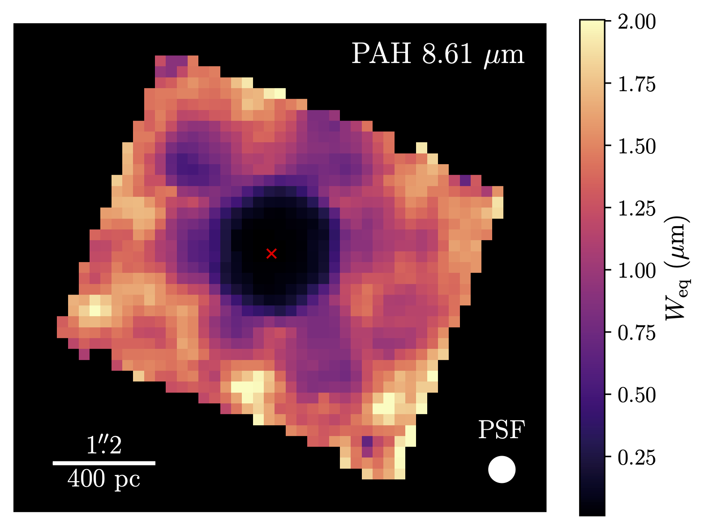
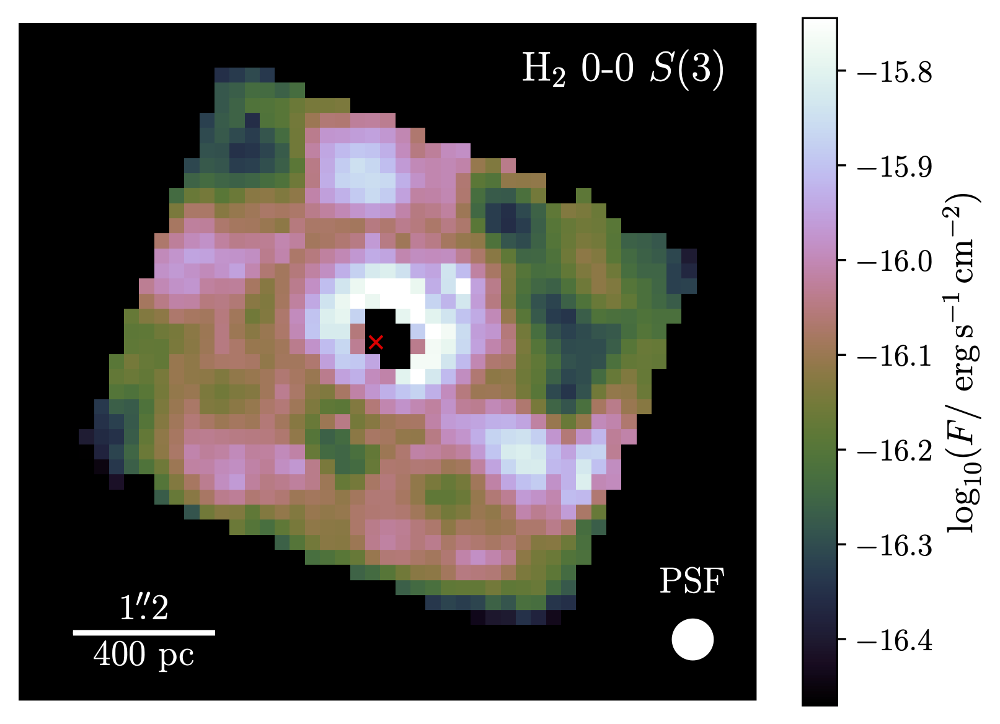
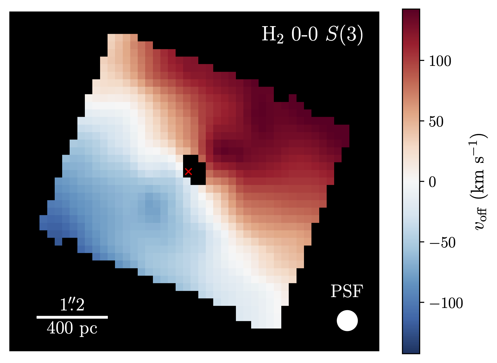
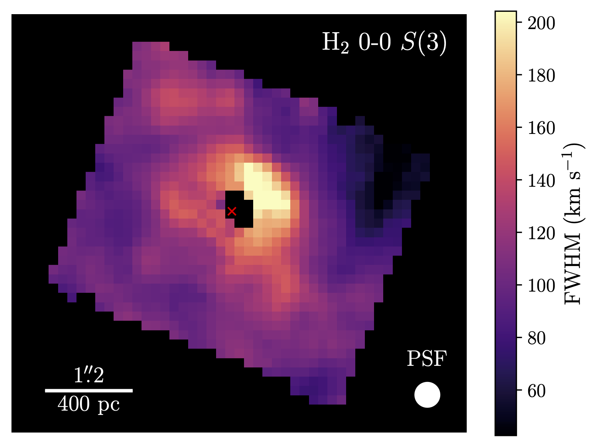
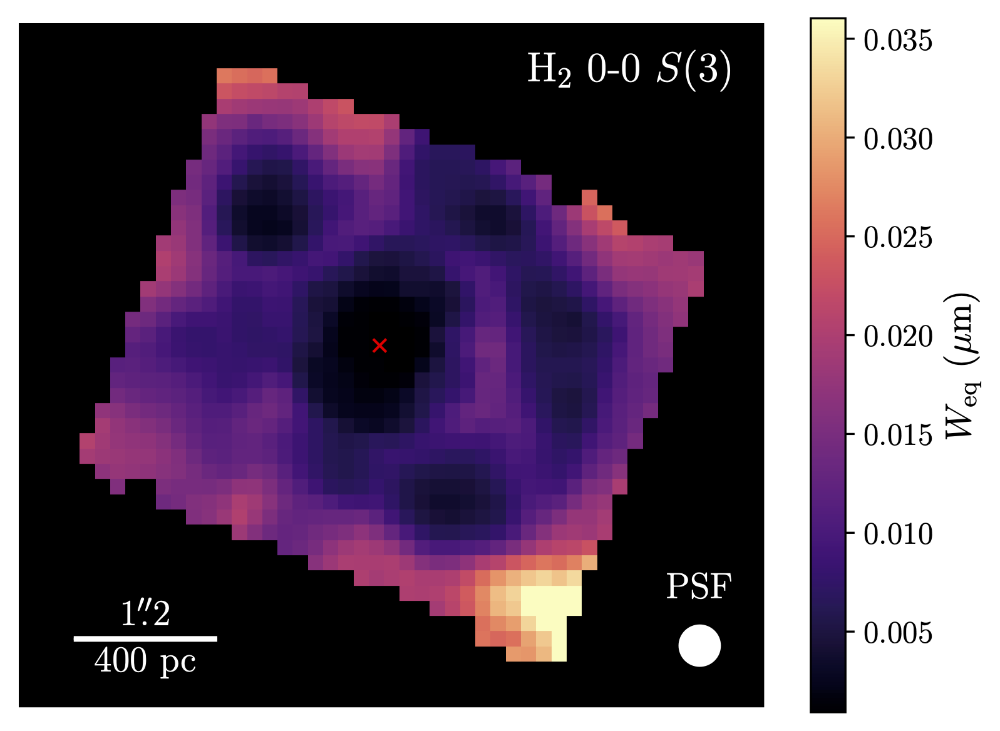

# LOKI: Likelihood Optimization of gas Kinematics in IFUs

### A Julia package for fitting and plotting IFU spectra in the mid-infrared or optical

---
## Table of Contents

* [Introduction](#i-introduction)
* [Installation](#ii-installation)
    - [Julia Requirements](#julia-requirements)
    - [Python Requirements](#python-requirements)
    - [LaTeX](#latex)
* [Usage](#iii-usage)
    - [General Code Options](#i-general-code-options)
    - [MIR Continuum and PAH Options](#ii-mir-continuum-and-pah-options)
    - [Optical Continuum Options](#iii-optical-continuum-options)
    - [Line Options](#iv-line-options)
* [Outputs](#iv-outputs)
    - [The Output Directory Structure](#i-the-output-directory-structure)
    - [Logs](#ii-logs)
    - [CSV Files](#iii-csv-files)
    - [Spaxel Plots](#iv-spaxel-plots)
    - [Parameter Maps](#v-parameter-maps)
    - [Aperture Plots](#vi-aperture-plots)
    - [FITS Files](#vii-fits-files)
    - [Line Tests](#viii-line-tests)
    - [Units](#ix-units)
* [Examples](#v-examples)


---
## I. Introduction

This Julia package provides routines for reading, fitting, and plotting IFU data for spectra in the mid-infrared (MIR) or the optical. The MIR fitting models are based on the widely used IDL tool [PAHFIT](http://tir.astro.utoledo.edu/jdsmith/research/pahfit.php) from the Spitzer era, but many areas have been updated to account for the increased spectral resolution of the MIRI instrument, and special attention has been given to fitting emission lines, allowing for much more flexibile and robust fits. The optical fitting models use stellar populations generated using the Flexible Stellar Population Synthesis ([FSPS](https://dfm.io/python-fsps/current/)) tool, allowing quantities like stellar age/metallicity to be interpolated and included as free paramters in the fit, and also fitting stellar velocities and velocity dispersions using a convolution with the line-of-sight velocity distribution (LOSVD), following the FFT-based methods utilized by [pPXF](https://www-astro.physics.ox.ac.uk/~cappellari/software/#ppxf) and [BADASS](https://github.com/remingtonsexton/BADASS3). 

As a brief overview, by default mid-infrared spectrum is decomposed into
- A stellar continuum modeled by a blackbody at a fixed temperature of $T = 5000$ K
- A dust continuum modeled by a series of modified blackbody functions with emissivities $\propto 1/\lambda^2$ at fixed temperatures of $T \in \{35,40,50,65,90,135,200,300,500\}$ K
- Emission from Polycyclic Aromatic Hydrocarbon (PAH) molecules reperesented by Drude (or Pearson type-IV) profiles with constrained central wavelengths and widths
- Silicate dust extinction using templates from [Kemper, Vriend, & Tielens (2004)](https://ui.adsabs.harvard.edu/abs/2004ApJ...609..826K), [Chiar & Tielens (2006)](https://ui.adsabs.harvard.edu/abs/2006ApJ...637..774C/abstract), [Ossenkopt, Henning, & Mathis (1992)](https://ui.adsabs.harvard.edu/abs/1992A&A...261..567O), or [Donnan et al. (2023)](https://ui.adsabs.harvard.edu/abs/2023MNRAS.519.3691D)
- Absorption features from water-ice, CH, and other molecules
- Warm silicate dust emission from an AGN torus using the simplified radiative transfer model of [Gallimore et al. (2010)](https://ui.adsabs.harvard.edu/abs/2010ApJS..187..172G)
- Emission lines from warm molecular H<sub>2</sub>, hydrogen recombination, and ionized species, modeled using Gaussian, Lorentzian, Gauss-Hermite, or pseudo-Voigt profiles.

Whereas the optical spectrum is decomposed into
- An aribtrary number of simple stellar population (SSP) models generated by FSPS, with ages and metallicities within the allowable ranges of FSPS.
- An intrinsic dust attenuation model using the extinction curve of either [Cardelli, Clayton, & Mathis (1989)](https://ui.adsabs.harvard.edu/abs/1989ApJ...345..245C/abstract) or [Calzetti et al. (2000)](https://ui.adsabs.harvard.edu/abs/2000ApJ...533..682C/abstract) (optionally with a UV bump parametrized by [Kriek & Conroy (2013)](https://ui.adsabs.harvard.edu/abs/2013ApJ...775L..16K/abstract)).
- Optional Narrow- and broad-line Fe II emission using the templates of [Véron-Cetty et al. (2004)](https://ui.adsabs.harvard.edu/abs/2004A%26A...417..515V/abstract) derived from the spectrum of I Zw 1.
- An arbitrary number of power laws to potentially model an AGN continuum.
- Emission lines from hydrogen recombination and ionized species, modeled using Gaussian, Lorentzian, Gauss-Hermite, or pseudo-Voigt profiles.

In the MIR regime, arbitrary templates may be included in the model with fitted normalizations. These may be used, for example, to model out and subtract the contamination from a nuclear quasar spectrum dispersed by the point-spread function (PSF). The code contains routines for creating templates in such a scenario, but the model for the PSF must be provided by the user.

Note that the code is very flexible and many of these continuum options can be changed, adjusted, or added/removed to fit one's individual needs. The code uses the [MPFIT](https://pages.physics.wisc.edu/~craigm/idl/cmpfit.html) ([Markwardt 2009](https://ui.adsabs.harvard.edu/abs/2009ASPC..411..251M)) implementation of the Levenberg-Marquardt (LM) least-squares minimization routine, as well as the simulated annealing (SA) global minimization method as implemented by [Optim.jl](https://github.com/JuliaNLSolvers/Optim.jl), and optionally may estimate uncertainties using bootstrapping. Depending on how the code is configured, the fitting procedure may be performed in multiple steps (up to 3). By default, the configuration contains two steps:
1. The emission lines are masked and the continuum + PAH features are fit with LM
2. The continuum + PAH features are subtracted and the emission lines are fit to the residual spectrum with DE, followed by LM

However, if one wishes, the code can be configured to fit the continuum and emission lines simultaneously in one step (using SA and/or LM), or it may be further broken down into 3 steps by splitting the continuum and PAH features up into 2 individual steps and fitting the PAHs with templates.

For a more detailed description of the PAHFIT decomposition and fitting methods, see [Smith et al. (2007)](https://ui.adsabs.harvard.edu/abs/2007ApJ...656..770S), and for a detailed overview of the changes and updates made by LOKI, see Reefe et al. (2023, in prep.).

---


## II. Installation

##### From the Julia REPL:

```julia
julia> ]
(Environment)> add https://github.com/Michael-Reefe/Loki.jl
```

or alternatively,

```julia
julia> using Pkg
julia> Pkg.add(url="https://github.com/Michael-Reefe/Loki.jl")
```

Once installed, you can start using the package simply with `using Loki`. N.B. If you plan on utilizing the multiprocessing capabilities of LOKI, make sure you prepend your using statement by an `@everywhere` macro (from the `Distributed` module) to include it in all running processes! If using multiprocessing on hardware with limited RAM, you may also want to include the `--heap-size-hint` command line argument to limit the memory usage of each julia process. Limiting each process to 4 GB has little to no effect on the performance.

### Python Requirements

LOKI utilizes the PyCall package (https://github.com/JuliaPy/PyCall.jl) to run some python routines that do not currently have good Julia alternatives. As such, some additional setup is required to ensure that you have the right python packages installed in the PyCall environment. To set up PyCall, open a julia REPL in your desired project environment and input the following commands, replacing "path/to/python/binary" with the actual path to the python binary for the python environment you want to link with PyCall:

```julia
julia> using Pkg
julia> using PyCall
julia> ENV["PYTHON"] = "path/to/python/binary"
julia> Pkg.build("PyCall")
```

Alternatively, you can set `ENV["PYTHON"] = ""` which will link PyCall to a new, self-contained conda environment managed by PyCall. If you choose this option, the python dependencies for LOKI should be automatically installed to the PyCall environment upon your first time running the LOKI package. Otherwise, if you've linked it with a preexisting environment, make sure you manually install the following python dependencies with pip or conda:

- [matplotlib](https://matplotlib.org/)
- [lineid_plot](https://github.com/phn/lineid_plot)
- [fsps](https://github.com/dfm/python-fsps) (only required for optical spectra fitting)
- [vorbin](https://pypi.org/project/vorbin/)

### LaTeX

Finally, LOKI assumes you have an installation of LaTeX that can be used with matplotlib to generate nicely formatted axis labels and annotations.  Common LaTeX distributions include [TeX Live](https://www.tug.org/texlive/) and [MiKTeX](https://miktex.org/about). Whichever you choose, you should also make sure that you have the siunitx package installed, since some of LOKI's plotting functionality makes use of it. It's fairly standard and it comes with both of the aforementioned distributions by default.

---

## III. Usage

### i. General Code Options

These options are found in `src/options/options.toml`:

`parallel = true`

This boolean option enables or disables multiprocessing (not to be confused with multithreading). If this option is true, when fitting individual spaxels, multiple spaxel fits may be performed in parallel across different CPUs.

`plot_spaxels = "pyplot"`

This option determines the plotting backend that is used for plotting the 1D spectral models of individual spaxels or integrated apertures. It may be "pyplot", "plotly", or "both".

`plot_maps = true`

This boolean option enables or disables plotting 2D maps of each model parameter at the end of fitting.

`save_fits = true`

This boolean option enables or disables saving the final model parameters and uncertainties as FITS files at the end of fitting.

`n_bootstrap = 0`

This option sets the number of bootstrap iterations that are performed on each fit. Setting it to 0 (the default) disables bootstrapping. When bootstrapping is disabled, the provided uncertainties will be calculated based on the covariance matrix of the LM fit.

`random_seed = 123456789`

This option sets the random seed that is used when resampling the data for bootstrapping iterations. By using the same seed, you are guaranteed to get the same results after repeated runs (assuming all other inputs are the same).

`overwrite = false`

This boolean option determines the behavior of the code when fitting results for a given spaxel or aperture already exist. If `false`, the old results will simply be read in. If `true`, the fits will be redone and the old results will be overwritten by the new results.

`track_memory = false`

This boolean option controls whether an additional log file is generated for each spaxel which specifically tracks the memory usage / allocations during the spaxel fitting. This is useful if memory usage is higher than expected.

`track_convergence = true`

This boolean option controls whether an additional log file is generated which prints convergence information for the simulated annealing emission line fit for each spaxel. Note that the way BlackBoxOptim.jl works with the differential evolution method, it just runs until a predetermined maximum number of iterations is reached (which LOKI sets to 10^5), and does not actually check for convergence.

`make_movies = false`

This boolean option determines whether or not to generate an mp4 movie of the data and model at the end of fitting. The movie steps through the wavelength dimension over time. N.B. this option is old and has not been tested recently, and its scientific usefulness is minimal.

`save_full_model = true`

This boolean option determines whether or not to save the full 3D model, evaluated at the same grid points as the input data, in a FITS cube format at the end of fitting. N.B. these files tend to be very large (multiple gigabytes) and can take a while to generate.

`extinction_curve = "kvt"`

This option determines what dust extinction template to use, and has different options for the MIR and optical. 

The possible values for the MIR are "kvt" for the [Kemper, Vriend, & Tielens (2004)](https://ui.adsabs.harvard.edu/abs/2004ApJ...609..826K) template, "ct" for the [Chiar & Tielens (2006)](https://ui.adsabs.harvard.edu/abs/2006ApJ...637..774C/abstract) template, "ohm" for the [Ossenkopt, Henning, & Mathis (1992)](https://ui.adsabs.harvard.edu/abs/1992A&A...261..567O) template, or "d+" for the [Donnan et al. (2023)](https://ui.adsabs.harvard.edu/abs/2023MNRAS.519.3691D) template. Note that the template used for the warm silicate *emission* component is always the "ohm" template, regardless of what this option is. Finally, if set to "decompose", the extinction curve will be decomposed into absorption profiles from three different species of silicates (amorphous olivine, amorphous pyroxene, and crystalline forsterite) with independent column densities as fitting parameters (this is only recommended for high S/N spectra that are not fit well by one of the other profiles).

The possible values for the optical are "ccm" for the [Cardelli, Clayton, & Mathis (1989)](https://ui.adsabs.harvard.edu/abs/1989ApJ...345..245C/abstract) template, or "calzetti" for the [Calzetti et al. (2000)](https://ui.adsabs.harvard.edu/abs/2000ApJ...533..682C/abstract) template.

Finally, the "custom" option allows one to input a custom template for the extinction profile using the `custom_ext_template` option (see below).

`olivine_y = 0.5`

This gives the Magnesium content for amorphous olivine (${\rm Mg}_{2y}{\rm Fe}_{2(1-y)}{\rm SiO}_{4}$) to be used when calculating the olivine absorption efficiencies and opacity profile as a function of wavelength. This option is only relevant if the extinction curve option is set to "decompose".

`pyroxene_x = 0.5`

This gives the Magnesium content for amorphous pyroxene (${\rm Mg}_{x}{\rm Fe}_{1-x}{\rm SiO}_{3}$) to be used when calculating the pyroxene absorption efficiencies and opacity profile as a function of wavelength. This option is only relevant if the extinction curve option is set to "decompose".

`grain_size = 0.1`

This gives the dust grain size in microns to be used when calculating the opacity profiles for both olivine and pyroxene. This option is only relevant if the extinction curve option is set to "decompose".

`extinction_screen = true`

If `true`, dust extinction is modeled as a foreground screen $\propto e^{-\tau(\lambda)}$. If `false`, dust extinction is modeled as mixed $\propto (1-e^{-\tau(\lambda)})/\tau(\lambda)$. This option only applies for the MIR.

`fit_stellar_continuum = true`

This boolean option determines whether or not to include the stellar continuum component in the MIR models (a blackbody at a fixed temperature of 5000 K).

`fit_sil_emission = true`

This boolean option determines whether or not to include the warm silicate dust emission component of [Gallimore et al. (2010)](https://ui.adsabs.harvard.edu/abs/2010ApJS..187..172G) in the MIR model.

`fit_temp_multexp = false`

This option, if enabled, will apply 4 multiplicative exponential profiles onto all of the input templates. This option can be utilized if one does not know the spatial or spectral shape of the PSF model ahead of time, with the hope that the flexibility afforded by these profiles will allow any generic PSF shape to be modeled. The exponential profiles obtained from [Rupke et al. (2017)](https://arxiv.org/pdf/1708.05139.pdf) equation 2:
$$a_1e^{-b_1\bar{\lambda}},~a_2e^{-b_2(1-\bar{\lambda})},~a_3(1-e^{-b_3\bar{\lambda}}),~{\rm and}~a_4(1-e^{-b_4(1-\bar{\lambda})})$$ 

`fit_opt_na_feii = false`

This boolean option determines whether or not to include narrow Fe II line emission using the template from [Véron-Cetty et al. (2004)](https://ui.adsabs.harvard.edu/abs/2004A%26A...417..515V/abstract) in the optical model.

`fit_opt_br_feii = false`

Same as `fit_opt_na_feii` but pertaining to broad Fe II line emission.

`use_pah_templates = false`

This boolean option determines how the PAH features are fit. If `false`, they will be fit using Drude profiles simultaneously with the rest of the continuum, the exact same way that PAHFIT does.  However, if `true`, the continuum fitting is split up into two steps.  In the first step, the continuum is fit while the PAH features are included using two templates from [Smith et al. (2007)](https://ui.adsabs.harvard.edu/abs/2007ApJ...656..770S).  Then in the second step, the continuum from the previous step is subtracted, and PAH features are fit to the residual spectrum using Drude profiles, using the same Drude model as PAHFIT.  In general, it is best to leave this option `false` unless you are dealing with spectra with extremely weak PAH emission and a heavily extincted underlying continuum. In these cases, the Drude model tends to get confused and unphysically attributes a large fraction of the underlying continuum to the left and right of the 9.7 micron silicate absorption feature to the PAH profiles.

`fit_joint = false`

This boolean option determines how the emission lines are fit. If `false`, they will first be masked out and the continuum will be fit. Then the continuum will be subtracted and the lines will be fit to the residual spectrum in a second step. If `true`, the continuum and lines will be fit simultaneously in one step. It is recommended to set this to `true` when fitting optical spectra with nonzero reddening, since E(B-V) can be better constrained by fixing certain emission line amplitude ratios.

`fit_all_global = false`

By default, global optimization with differential evolution is only performed for the line fit during the initial fit of the sum of all spaxels. If this option is set to `true`, then it will be performed on all of the line fits for the individual spaxels as well.

`fit_uv_bump = false`

This boolean option determines whether to include the UV bump in the dust attenuation curve. This only applies if `extinction_curve` is set to `"calzetti"`.

`fit_covering_frac = false`

This boolean option determines whether to include a dust covering fraction in the attenuation curve. This only applies if `extinction_curve` is set to `"calzetti"`.

`tie_template_amps = false`

This option determines whether or not template amplitudes should be tied between different channels - the default (false) means that a template may have different normalizations in each subchannel in the fit, allowing it to fit jumps in the continuum. This option only applies for MIR data. Optical data is assumed to only have 1 channel.

`decompose_lock_column_densities = true`

This option is used when fitting a "decompose"-type extinction curve. If enabled, the relative column densities of
olivine, pyroxene, and forsterite will be locked to their best-fit values after the initial fit. Thus, they will not be allowed to vary
for individual spaxel fits.

`user_mask = []`

This option allows the user to mask out predefined regions of the spectrum that will be ignored during the fitting process. To mask out a region bounded between $\lambda_1 < \lambda < \lambda_2$, add a tuple to the user mask of the format $(\lambda_1, \lambda_2)$. For example, `user_mask = [(5.5, 6.0), (10.2, 10.3)]` will mask out the regions between 5.5-6 μm and 10.2-10.3 μm.

`line_test_lines = []`

A list of lists of lines lines should be tested for additional components. The lines in this list must have multiple components to begin with (specified in the `lines.toml` file), otherwise they won't be tested. Each entry should be a string matching the name of the line in the `lines.toml` file. Lines that are grouped together into sub-lists will each be tested and given the maximum number of profiles that any one line in the group achieves during the test (this is useful if, for example, one is testing a tied doublet of lines). For example, this might look like `line_test_lines = [["OIII_05008", "OIII_04960"], ["HI_H_beta"]]` if one wanted to test the [O III] λλ4960,5008 doublet together and Hβ individually.

`line_test_threshold = 0.003`

This sets a threshold value on the F-test, where F is defined as $$F = \frac{(\chi^2_A - \chi^2_B)/(p_B-p_A)}{\chi^2_B / (n - p_B)}$$ (here $p$ is the number of model parameters, $n$ is the number of data points, and the A and B subscripts denote the models with $N$ and $N+1$ components), which must be met in order to consider additional line components as "significant." $F$ should follow an F-distribution, so the test threshold checks to see if the F measured from the data is greater than the critical value of the F distribution for a given significance threshold, which defaults to 0.3% or 3-sigma. Lines with multiple components will be tested by fitting iteratively, first with 1 component, and then adding additional components one at a time until reaching the value set in the line options files, or until this threshold fails to be achieved. Only components that pass this threshold will be fit in a given spaxel. This line testing can be disabled entirely by setting this threshold to 0.

`plot_line_test = true`

Whether or not to plot the line test results showing models with different numbers of components and their F values.

`subtract_cubic_spline = false`

If set to true, for the emission line fit, a cubic spline fit to the continuum will be subtracted instead of the actual continuum fit. Use this option if your continuum model is not fitting as accurately as you would like around emission lines of interest, but you still want to extract accurate fluxes for those lines.

```toml
[cosmology]
h = 0.7           # Hubble constant (in km s^-1 Mpc^-1) / 100
omega_m = 0.27    # matter density parameter
omega_K = 0.0     # curvature density parameter
omega_r = 0.0     # radiation density parameter
```
The cosmology options determine the cosmology that the code assumes. Currently this is only used to calculate angular diameter distances for usage in physical scale bars on the 2D maps. $h$ is the standard Hubble constant normalized to $100\ {\rm km}\ {\rm s}^{-1}\ {\rm Mpc}^{-1}$, and $\Omega_m$, $\Omega_K$, and $\Omega_r$ are the standard matter, curvature, and radiation density parameters. The default values give $H_0 = 70\ {\rm km}\ {\rm s}^{-1}\ {\rm Mpc}^{-1}$, $\Omega_m = 0.27$, and $\Omega_\Lambda = 0.73$.

---

Additional configuration options that do not have default entries in the `options.toml` file, but may be specified by either manually adding them to the file or including them as keyword arguments in the construction of a `CubeFitter` object, are listed below:

`plot_range`

A vector of tuples giving wavelength ranges for which to generate zoomed-in plots for each spaxel fit. Useful for plotting regions around emission lines to get a better view of how well the line itself is being fit.

`templates`

This allows one to include arbitrary templates in the fitting of MIR data, where the only fitting parameter is the normalization of the template for each channel in each spaxel (so, each template included adds a number of free parameters equal to the number of channels/bands in the spectrum being fit). Must be a 4-dimensional array where the first 3 axes match the shape of the data cube, and the 4th axis enumerates each different template. If provided, then it is required to also provide "template_names" to give labels to each template.

`template_names`

A 1D vector giving labels to each of the templates in `templates`. The length must match the length of the 4th axis of `templates`.

`linemask_delta`

This specifies the half-width, in pixels, to use in the calculation of the numerical second derivative when creating the emission line mask. Defaults to 3 for MIR data or 20 for optical data.

`linemask_n_inc_thresh`

This specifies the number of times the flux must increase to the left/right of a given emission line candidate before the line masking procedure halts. Increasing this number will tend to mask more to the left and right of each line.  Defaults to 3 for MIR and 7 for optical data.

`linemask_thresh`

This specifies the threshold, in number of standard deviations away from 0, that the second derivative must achieve to consider it an emission line detection in the line masking procedure. Defaults to 3.

`linemask_overrides`

One may use this to provide a vector of tuples, in the same format as `user_mask`, giving wavelength regions that should always be masked out during the line masking procedure. Masking regions with this option leads to slightly different behavior than simply masking them with `user_mask`: `user_mask` will force these regions to always be masked out during all steps of the fitting process, whereas masking them with `linemask_overrides` will *only* mask them out during the continuum fit, but will then unmask them during the line fit.

`map_snr_thresh`

Gives the threshold that the signal to noise ratio must reach in order for a given quantity (i.e. emission line flux) to be shown in a given spaxel in the final 2D parameter maps output at the end of the fitting process. Defaults to 3.

`guess_tau`

This may be a vector of two tuples specifying wavelength ranges, in the same format as `user_mask`. These wavelength ranges should be relatively free of PAH and line emission if possible, and they should be to the left and right of the 9.7 micron silicate absorption feature. If provided, flux is linearly interpolated between them to estimate the "unextincted" continuum level at 9.7 microns, which is then compared to the observed flux level to provide an initial estimate for the optical depth parameter.

`extinction_map`

This allows the user to provide a 2D grid of either the 9.7-micron optical depth (for MIR fitting) or the reddening E(B-V) (for optical fitting) for each spaxel. The values in the grid will be used as the values for the corresponding spaxels in the fitting process, and they will be locked to these values. This is useful in cases where one wishes to fit a region of the spectrum that doesn't constrain the extinction very well, but has results from fitting another region of the spectrum that does constrain it well and can use those results to constrain the extinction in the other region. If using a "decompose"-type extinction curve, one may provide a 3D array where
the third axis runs over the olivine, pyroxene, and forsterite column densities.

`custom_ext_template`

This allows the user to provide a 1D template for the normalized optical depth $\tau$ as a function of wavelength. It should be normalized such that the value at 9.7 $\mu$m is 1, to fit with the normalization of the other extinction curves and allow the $\tau_{9.7}$ fitting parameter to be interpreted as intended.

`pah_template_map`

A 2D map of boolean values where, if true, the spaxel at the corresponding location will be fit using the PAH templates, and where false they will be fit without the templates. This is useful if one wants to spatially divide up the fitting into regions where fitting with the templates is necessary while leaving the other regions to be fit more freely without the templates.

`sort_line_components = :flux`

Oftentimes one may desire to sort the components of lines fit with more than 1 profile based on a fitting quantity. This is controlled by the `sort_line_components` option, which by default is set to sort by the flux. Other sorting options are :amp for amplitude, :fwhm for FWHM, or :voff for velocity offsets. To disable sorting, set to `nothing`. N.B. sorting should be disabled if the additional line components are using relative parameters (see emission line options below), otherwise the sorting will not work correctly. The sorting order (increasing or decreasing) is also set by the emission line options.

`lock_hot_dust`

A boolean option that, if enabled, locks the hottest dust continuum component to 0 in the MIR. By default, this option is enabled if there are any templates in the fit, and disabled if there are no templates, but it can be overriden to whatever the user wants. The idea
is that an AGN template should be used to fit the hotter dust components and the other dust components should be from the host galaxy.

### ii. MIR Continuum and PAH Options
These options are found in `src/options/dust.toml`

**Stellar Continuum:**

There is only one stellar continuum component.
```toml
[stellar_continuum_temp]
val = 5000.0
plim = [4999.9, 5000.1]
locked = true
```
This option allows the user to modify the temperature of the stellar blackbody component of the continuum. `val` gives the starting value (default = 5000 K), `plim` gives the lower and upper limits on the parameter (which are only relevant if the parameter is allowed to vary, which in this case it is not), and `locked` is a boolean that determines whether the parameter is allowed to vary (`false`) or is fixed (`true`) during the fitting. The same format of `val`, `plim`, `locked` is used throughout these options and the line options (see the next section) for any parameter which the user may want to change.

**Dust Continuum:**

The dust continuum components are enumerated in a list signified by the double square brackets. The default setup is arbitrary and can be changed easily. In general, one should use dust temperatures between 35--300 K for host galaxy emission (this is the range of temperatures used by PAHFIT), and potentially hotter for AGN continuum (up to 1500 K, the dust sublimation temperature). One can choose between fewer components (2-3) with free temperatures, or more components (9+) with fixed temperatures, depending on the kind of decomposition that is desired. Both should provide relatively similar quality fits to the continuum.

```toml
[[dust_continuum_temps]]
val = 500.0
plim = [499.9, 500.1]
locked = true
```
Following the stellar blackbody temperature, the dust blackbody temperatures are given in the same way, and may be modified in the same way. Temperatures may be added or removed, allowed to vary or fixed, if one so desires.

**Power laws:**

One may optionally include power laws in the MIR continuum by specifying the power law indices as parameters:

```toml
[[power_law_indices]]
val = 1.65
plim = [-3.0, 3.0]
locked = true
```

where the index α is defined as $(\lambda/9.7)^\alpha$. By default, no power laws are included in the MIR continuum, as they are degenerate with the blackbodies. In general, one should fit one or the other, but not both.

**Templates:**

Amplitudes for the templates provided by the `templates` keyword argument to the `CubeFitter` can be specified as follows:

```toml
[[template_amps]]
val = 1.0
plim = [0.5, 2.0]
locked = false
```

If there are no templates, these options are ignored. Note: template amplitudes are assumed to automatically be independent for each channel/band included in the cube being fit. I.e. if you are fitting a channel 3 cube, the amplitudes for the short, medium, and long bands of channel 3 will be fit independently, and all 3 of them will have the parameters specified by the single entry in `[[template_amps]]` that corresponds to that specific template.

**PAH Features:**

Each PAH feature is labeled by its name, taking the format "PAH_XXX" where XXX is the central wavelength of the PAH to a precision of 2 decimal places. The decimal place is always assumed to come before the last 2 digits. This is only important for record-keeping purposes though, and it should have no affect on the code if this convention is broken. The only thing that may look weird is the PAH
labels in some parameter maps which assume the decimal is located before the last 2 digits.

```toml
[dust_features."PAH_329".wave]
val = 3.29
plim = [-0.05, 0.05]
locked = false
```
The first option for each PAH feature is the central wavelength. `val` and `locked` work the same as before, but here `plim` is *additive* with `val`. In other words, a `plim` of `[-0.05, 0.05]` means that this value is allowed to vary from `3.29-0.05 = 3.24` to `3.29+0.05 = 3.34`.

```toml
[dust_features."PAH_329".fwhm]
val = 0.050
plim = [0.9, 1.1]
locked = false
```
The second option for each PAH feature is the FWHM. `val` and `locked` again work the same as always, but here `plim` is *multiplicative* with `val`. In other words, a `plim` of `[0.9, 1.1]` means that this value is allowed to vary from `0.050*0.9 = 0.045` to `0.050*1.1 = 0.055`.

Note: If one wishes to model a PAH feature with a Pearson type-IV profile (currently we model all PAHs with Drude profiles), then additional entries for the power index $m$ (`dust_features."PAH_3.29".index`) and exponential cutoff $\nu$ (`dust_features."PAH_3.29".cutoff`) are required. The `plim` entires for these two values are normal, i.e. they work the same way as the temperatures.

Finally, PAHs can be combined into complexes with multiple Drude profiles using the "complex" keyword:

```toml
[dust_features."PAH_742"]
complex = "7.7"

[dust_features."PAH_752"]
complex = "7.7"

[dust_features."PAH_760"]
complex = "7.7"

[dust_features."PAH_775"]
complex = "7.7"

[dust_features."PAH_785"]
complex = "7.7"

[dust_features."PAH_796"]
complex = "7.7"
```

The `complex` entry should be a uniquely identifying string for that complex that is parsable into a floating-point number that identifies the rough rest-frame wavelength at which the complex is located. The only purpose for combining features into complexes like this is to plot the combined flux of the complex in the final plotting step. The fitting itself is not affected.

**Absorption Features:**

Entries for absorption features modeled with Drude profiles work the exact same way as PAH features, with the exception that their names should be prefixed by "abs_".  One may set the "local" keyword to true if the feature in question is local (either from the Milky Way, or an instrumental effect), which will redshift the feature by the same amount as the source to keep it at the same observed wavelength. The example below shows a feature that models the spectral leak artifact at ~12.2 μm that is present in early versions of the JWST reduction pipeline. Note that this is just an example, and for real fitting purposes an absorption feature should not be used for this feature since it is an additive and not a multiplicative effect. There are no absorption features defined this way that are enabled by default.
```toml
[absorption_features."abs_leak_1222"]
local = true

[absorption_features."abs_leak_1222".tau]
val = 0.1
plim = [0.0, 0.2]
locked = false

[absorption_features."abs_leak_1222".wave]
val = 12.22
plim = [-0.1, 0.1]
locked = true

[absorption_features."abs_leak_1222".fwhm]
val = 0.133
plim = [0.4, 1.4]
locked = true
```
There is also an additional entry for "tau" which determines the peak optical depth of the absorption feature, modeled as a screen ($\propto e^{-\tau}$).

**Water-Ice/CH Absorption:**

This absorption feature is treated differently since it has a complex shape that is better suited for the usage of templates. It has two primary parameters, $\tau_{\rm CH}$ and $\tau_{\rm ice}$.
```toml
[extinction.tau_ch]
val = 0.1
plim = [0.0, 3.0]
locked = false

[extinction.tau_ice]
val = 0.48
plim = [0.43, 0.53]
locked = false
```
$\tau_{\rm CH}$ is the peak optical depth of the CH absorption feature. $\tau_{\rm ice}$ is *not* an optical depth, but rather it is a multiplicative factor with $\tau_{\rm CH}$ that determines the optical depth of the ice absorption. That is, if the optical depth of the ice absorption is $\tilde{\tau}$, then $\tilde{\tau} = \tau_{\rm ice} \times \tau_{\rm CH}.$ Here, $\tau_{\rm ice}$ is tightly constrained since this factor is typically close to $\sim 0.5$.

**Dust Extinction:**

Dust extinction has two primary parameters, $\tau_{9.7}$ and $\beta$:
```toml
[extinction.tau_9_7]
val = 0.1
plim = [0.0, 100.0]
locked = false

[extinction.beta]
val = 0.1
plim = [0.0, 1.0]
locked = true
```
$\tau_{9.7}$ is the optical depth of dust extinction at 9.7 μm (which is the peak of a large silicate absorption feature), and $\beta$ is a mixing ratio between the extinction profile specified in `options.toml` and a $-1.7$ index power law. $\beta$ is only relevant for the "kvt" and "d+" curves, and is typically locked to a value of 0.1.

```toml
[extinction.N_oli]
val = 1.7e-3
plim = [0.0, 3e-3]
locked = false

[extinction.N_pyr]
val = 0.03
plim = [0.0, 3.0]
locked = false

[extinction.N_for]
val = 0.06
plim = [0.0, 3.0]
locked = false
```

If using the `"decompose"` option for the extinction curve, these three parameters become relevant. $N_{\rm oli}$, $N_{\rm pyr}$, and $N_{\rm for}$ are the mass column densities of the three dust species included in the model (olivine, pyroxene, and forsterite), and essentially act as amplitudes in the fitting. The units for olivine are ${\rm g}~{\rm cm}^{-2}$, whereas pyroxene and forsterite are measured relative to olivine (multiplicatively).

```toml
[extinction.frac]
val = 1.0
plim = [0.5, 1.0]
locked = true
```

Finally, this parameter defines a covering fraction $C_f$ such that the extinction is only applied to this fraction of the continuum. The model then becomes $(1-C_f) \times {\rm continuum} + C_f \times {\rm continuum} \times {\rm extinction}$. By default, this is locked to 1, applying the extinction to the full continuum.

**Warm Silicate Emission:**

The warm silicate emission component has 5 parameters: temperature $T_{\rm hot}$, covering fraction $C_f$, warm dust optical depth $\tau_{\rm warm}$, cold dust optical depth $\tau_{\rm cold}$, and the peak position of the silicate emission $\lambda_{\rm peak}$:
```toml
[hot_dust.temp]
val = 1200.0
plim = [800.0, 1600.0]
locked = false

[hot_dust.frac]
val = 0.5
plim = [0.0, 1.0]
locked = false

[hot_dust.tau_warm]
val = 0.1
plim = [0.0, 100.0]
locked = false

[hot_dust.tau_cold]
val = 0.1
plim = [0.0, 100.0]
locked = false

[hot_dust.peak]
val = 10.0178
plim = [10.0, 10.8]
locked = true
```
Here, `val`, `plim`, and `locked` all work the same as before. For details on what each parameter means, see equation 1 of [Gallimore et al. (2010)](https://ui.adsabs.harvard.edu/abs/2010ApJS..187..172G).

### iii. Optical Continuum Options
These options are found in `src/options/optical.toml`

**Simple Stellar Populations:**

For each Simple Stellar Population (SSP) that one wishes to include in the model, there should be an entry in the "stellar_population_ages" and "stellar_population_metallicities" lists. For example,

```toml
[[stellar_population_ages]]
val = 8.0
plim = [7.5, 10.0]
locked = true
[[stellar_population_ages]]
val = 0.002
plim = [0.001, 0.02]
locked = true

[[stellar_population_metallicities]]
val = 0.0
plim = [-2.3, 0.0]
locked = true
[[stellar_population_metallicities]]
val = 0.0
plim = [0.0, 0.40]
locked = true
```

This specifies two SSPs with ages of 8 Gyr and 2 Myr and metallicities of 0.0. The ages are specified in Gyr and
the metallicities are in [M/H], AKA $\log_{10}(Z/Z_\odot)$. The formatting for the "val", "plim", and "locked" entries
follows the same conventions as the MIR parameters, where "val" is the starting value, "plim" are the lower/upper limits,
and "locked" is a boolean specifying whether or not the parameter should be fixed during fitting.

**Stellar Kinematics:**

There are two stellar kinematics parameters, the offset velocity and velocity dispersion. The offset velocity is measured relative
to the input redshift. These both have entries formatted similarly to other parameters:

```toml
[stellar_kinematics.vel]
val = 0.0
plim = [-500.0, 500.0]
locked = false

[stellar_kinematics.vdisp]
val = 100.0
plim = [0.0, 1000.0]
locked = false
```

**Fe II kinematics:**

These options are formatted the same as the stellar kinematics, but they apply respectively to the narrow and broad Fe II templates instead of the SSPs:

```toml
[na_feii_kinematics.vel]
val = 0.0
plim = [-500.0, 500.0]
locked = false

[na_feii_kinematics.vdisp]
val = 100.0
plim = [0.0, 500.0]
locked = false

[br_feii_kinematics.vel]
val = 0.0
plim = [-500.0, 500.0]
locked = false

[br_feii_kinematics.vdisp]
val = 1000.0
plim = [500.0, 2000.0]
locked = false
```

**Power Laws:**

Each power law will have one entry for the index/slope:

```toml
[[power_law_indices]]
val = 0.0
plim = [-6.0, 6.0]
locked = false
```

**Dust attenuation:**

The attenuation curve will always have at least 2 parameters, the reddening on the gas $E(B-V)$, and the conversion factor
between the reddening on the gas and the reddening on the stars, which is usually locked to 0.44.

```toml
[attenuation.E_BV]
val = 0.10
plim = [0.0, 1.0]
locked = false

[attenuation.E_BV_factor]
val = 0.44
plim = [0.0, 10.0]
locked = true
```

If one is using the "calzetti" attenuation profile, there are also up to 2 more parameters specifying the UV bump slope and
the covering fraction:

```toml
[attenuation.uv_slope]
val = 0.0
plim = [-0.8, 0.2]
locked = false

# Dust covering fraction, not fit unless fit_covering_frac is true
[attenuation.frac]
val = 0.5
plim = [0.0, 1.0]
locked = false
```

### iv. Line Options
These options are found in `src/options/lines.toml`.

**Main Component Options:**

`tie_voigt_mixing = true`

This boolean option determines whether or not the mixing ratio of all lines with pseudo-Voigt profiles are tied or not.

`combined_maps = []`

This may be formatted as a list of lists to produce combined flux parameter maps for any lines. For example, to create a combined flux map for the [O II] doublet, `combined_maps = [["OII_03727", "OII_03729"]]`.

`voff_plim = [-500.0, 500.0]`

This tuple gives the (minimum, maximum) allowable velocity offset from the rest-frame wavelength of each line, in km/s.

`fwhm_plim = [0.0, 500.0]`

This tuple gives the (minimum, maximum) allowable velocity FWHM of each line, in km/s. Note that these are limits on the *intrinsic* FWHM, not the *observed* FWHM. The observed FWHM is corrected by subtracting the FWHM of the instrumental line-spread function (LSF) in quadrature.

```
h3_plim = [-0.5, 0.5]
h4_plim = [-0.5, 0.5]
```
These tuples give the (minimum, maximum) allowable 3rd-order and 4th-order Gauss-Hermite moments (AKA skewness and kurtosis) for each line. These are only relevant for lines that are fit with Gauss-Hermite profiles.

`eta_plim = [0.0, 1.0]`

This tuple gives the (minimum, maximum) allowable mixing ratio for each line. This is only relevant for lines that are fit with pseudo-Voigt profiles, where a mixing ratio of 1 signifies a pure Gaussian profile and 0 signifies a pure Lorentzian profile.

One may also provide values for `X_init` or `X_locked` where X is any of voff, fwhm, h3, h4, or eta. These specify the initial values and whether or not the paramter is locked during fitting.

**Additional Component Options:**

`n_acomps = 1`

If one desires to fit more than one profile to a single line, this option allows the user to set the maximum number of *additional* profiles that a line can have. In other words, a value of 0 means that each line should only be fit with one profile, whereas a value of 1 means that each line may have *up to* 2 profiles. This value only sets the *upper limit* on how many profiles each line can have, it does not force every line to have the maximum number of profiles.

`acomp_amp_plim = [[0.0, 1.0]]`

This gives amplitude constraints for the additional line profiles given by `n_acomps`. This is a 2D list where the first dimension should have a length of `n_acomps` and the second dimension should be 2 (for the lower and upper limits). The first pair gives the lower/upper limits for the first additional line profile, the second pair gives the limits for the second additional profile, etc. This amplitude is multiplicative with the primary line component's amplitude. Therefore, by having limits from (0,1) we force the primary component to be the brightest.

`acomp_voff_plim = [[-500.0, 500.0]]`

This is the same as `voff_plim`, but for the additional line profiles given by `n_acomps`. Like `acomp_amp_plim`, this is a 2D list where the first dimension should have a length of `n_acomps` and the second dimension should be 2. **N.B.** that the velocity offset of the additional line profiles is measured **relative to the main component**, ***not*** **the rest-frame wavelength.**. So, limits of $\pm 500$ km/s here mean that the additional component can be within $\pm 500$ km/s from the main component, even if the main component itself is at a large offset relative to the rest-frame wavelength. This parametrization is useful if one wishes to constrain the relative kinematics of each component. For example, if one wishes to measure an asymmetric blueshift (i.e. from an outflow), the additional voff component could be constrained to `[-500.0, 0.0]` which ensures that it will always be to the left of the main component.

`acomp_fwhm_plim = [[1.0, 5.0]]`

This is the same as `fwhm_plim`, but for the additional line profiles given by `n_acomps`. Like `acomp_amp_plim`, this is a 2D list where the first dimension should have a length of `n_acomps` and the second dimension should be 2. **N.B.** that the FWHM of the additional components here are **multiplicative factors with the main component.** So limits of `[1.0, 5.0]` signify that the additional component may have a FWHM 1-5x larger than the main FWHM.

As above, `acomp_X_init` and `acomp_X_locked` may also be specified.

**Kinematic Groups:**

```toml
kinematic_group_low = [
    "ArII_",
    "ArIII_",
    "FeII_",
    "ClII_",
    "FeIII_",
    "HeII_",
    "NeII_",
    "NiII_",
    "PIII_",
    "SIII_"
]
tie_voff_low = true
tie_fwhm_low = true
tie_amp_low = [1.0, 1.0, 1.0, 1.0, 1.0, 1.0, 1.0, 1.0, 1.0, 1.0]
```
The user may define arbitrary "kinematic groups" named with the prefix "kinematic_group_" followed by a unique identifying label. Inside the group should be a list of strings that can be matched to the names of emission lines. Any line that contains any of these strings within its name will be included in the group. By default, the velocity offset and FWHM of all lines in the group are tied together, but one can use the `tie_voff_[name]` and `tie_fwhm_[name]` options to enable or disable the velocity offset or FWHM individually from being tied. One may also specify that the amplitude ratios of the lines in the group should be fixed using the `tie_amp_[name]` keyword followed by a list that is the same length as the number of lines in the group (not that this may or may not be the same as the length of your list of strings, since one string can match multiple lines). By default, it is assumed that the amplitudes in a group should not be tied.

Kinematic groups can also be defined for the additional line components by prefixing the group with "acomp\_[N]\_kinematic_group_" where N is the number of the additional component (starting at 1) and using the keys "tie_acomp\_[N]\_voff_[name]", "tie_acomp\_[N]\_fwhm_[name]`", and "tie_acomp\_[N]\_amp_[name]".

```toml
flexible_wavesol = false
wavesol_unc = 30.0 
```
These options allow some flexibility in the relative velocity offsets of lines that are tied together. By default, lines with tied kinematics must have exactly the same velocity offset, but allowing `flexible_wavesol` to be `true` will allow some small variation in the velocity offsets of lines that are "tied" together, with the maximum allowed variation in km/s given by `wavesol_unc`. These options are intended for use if one believes the wavelength solution of the spectrum may not be accurate enough to tie certain lines together otherwise, as was the case with early versions of the JWST pipeline (these issues have since been resolved so there should be no problems with keeping the `flexible_wavesol` option disabled for MIRI data).

`default_sort_order = -1`

This specifies the order that line components are sorted in, with 1 being increasing (smallest first) and -1 being decreasing (largest first). Sort orders for individual lines may also be specified that override the default value.

**Rest Wavelengths:**

The [lines] dictionary gives the main reference for which lines to fit, giving them each unique identifiers and providing their rest wavelengths (`wave`), $\LaTeX$-formatted labels (`latex`), and whether or not to explicitly annotate them on 1D spectra (`annotate`). A small subset of this dictionary is shown below:

```toml
[lines]

# Brackett Series (Hydrogen, n -> 4) Lines
[lines.HI_Br_alpha]
wave = 4.05225
latex = "Br$\\alpha$"
annotate = false

# Argon Lines
[lines.ArII_6985]
wave = 6.985274
latex = "[Ar II]"
annotate = true

# Molecular Hydrogen Lines
[lines.H200_S8]
wave = 5.05312
latex = "H$_2$ 0-0 $S(8)$"
annotate = true
```

Importantly, all lines are currently given in their *vacuum* wavelengths.  So when adding new lines, to ensure they are consistent, make sure you are also using vacuum wavelengths and not air wavelengths (otherwise, when tying lines together, their velocity offsets may be inconsistent). If you only have the air wavelength handy, you can use the `airtovac` function from the `AstroLib` package to do a quick conversion (just make sure you input the wavelength in angstroms).

Lines may be arbitrarily added to or removed from this list based on what the user wishes to fit. It is not strictly necessary to adhere to any naming conventions for the lines, but doing so makes it easier when creating kinematic groups. As such, these are the conventions I have followed in the default line list:
* For hydrogen recombination lines, names should be formatted as "HI_[SS]_[LLL]" where "SS" is the abbreviated name of the series (i.e. the Brackett, Pfund, and Humphreys series shown above) and [LLL] is the greek letter corresponding to the specific transition in the series, starting from alpha.
* For molecular hydrogen lines, names should be formatted as "H2[VV]_[RR]" where [VV] are the vibrational quantum numbers of the transition and [RR] are the rotational quantum numbers of the transition, i.e. "H200_S3" for the H<sub>2</sub> 0-0 S(3) line.
* Lines for ionized species should be formatted as "[ION]_[WAVE]" where [ION] is the name of the ion and [WAVE] is the wavelength of the line in microns to three decimals, with the decimal removed. For example, "NeVI_7652" for the [Ne VI] λ7.652 line.

The `latex` entry is used for plotting purposes, and will be displayed on 1D spectra if the `annotate` option is enabled.  Otherwise, all lines will get a vertical dashed line denoting their position regardless of if the `annotate` option is enabled. These line annotations can get overcrowded very quickly if one tries annotating every single line that is fit, especially in the region from 4-6 μm which has a lot of closely-packed lines, so it is not recommended to have `annotate` enabled for every single line.  The default list provided only gives annotations for the lines likely to be the brightest in a typical galaxy.  The $\LaTeX$ labels are still necessary even for lines that are not annotated, since they are also used to label 2D parameter maps. One may also add a `sort_order` option to override the default sort order for a particular line.

**Profiles:**

```toml
[profiles]
default = "Voigt"
```

The [profiles] dictionary gives the master reference for which profiles to use for each line in the fit. The "default" keyword provides the default profile used for all lines. The available profiles are "Gaussian", "Lorentzian", "Voigt", or "GaussHermite". Individual lines may have unique provides that override the default profile by adding additional keys that have the same name as the keys in the [lines] dictionary.

```toml
[acomps]
NeVI_7652 = ["Voigt"]
```

The [acomps] dictionary acts similarly to the [profiles] dictionary, but for the additional line components specified by `n_acomps.` In other words, this is the location where you actually specify which lines, if any, should have additional profiles, and what types of profiles they should be. In the example above, the [Ne VI] λ7.652 line is given one additional Voigt profile. This means that, in total, this line will be fit with two Voigt profiles (assuming any testing for additional components is successful for a given fit, or one is not doing component testing). You will notice that the entries here are lists of strings, meaning one can add an arbitrary number of additional profiles to each line. However, there is an upper limit on the number of additional profiles given by `n_acomps.`

**Advanced Usage:**

One may get more in-depth about individual fitted parameters for lines by making use of the [parameters] dictionary. An example usage might look something like:

```toml
[parameters]

[NeVI_7652]
voff_plim = [-1000.0, 1000.0]
fwhm_init = 100.0
fwhm_locked = true
acomp_fwhm_init = 100.0
acomp_fwhm_locked = true
```

This tells the code that, for the [Ne VI] λ7.652 line specifically, we want to overwrite the default `voff_plim` values with those specified here, and we want to lock the FWHMs of both the main and additional line components to their starting values, which we have manually set to 100 km/s.

---

## IV. Outputs

### i. The Output Directory Structure
You may notice at the beginning of the fitting procedure that a series of output directories are created. The parent directory will be named "output_[name]_[region]" where [name] is the name of the object being fit (retrieved from the FITS headers) and [region] is either "mir" for mid-infrared or "opt" for optical. Within this folder will be a series of sub-directories for storing various outputs:
```
├── output_[name]
│   ├── line_tests
│   │   └── ...
│   ├── logs
│   │   ├── loki.spaxel_1_1.log
│   │   └── ...
│   ├── param_maps
│   │   ├── absorption_features
│   │   ├── continuum
│   │   ├── dust_features
│   │   ├── extinction
│   │   ├── hot_dust
│   │   ├── lines
│   │   └── reduced_chi2.pdf
│   ├── spaxel_binaries
│   │   ├── init_fit_cont.csv
│   │   ├── init_fit_line.csv
│   │   ├── spaxel_1_1.csv
│   │   └── ...
│   ├── spaxel_plots
│   │   ├── initial_sum_fit.pdf
│   │   ├── spaxel_1_1.pdf
│   │   └── ...
│   ├── zoomed_plots
│   │   └── ...
├── [name]_full_model.fits
├── [name]_parameter_errs_low.fits
├── [name]_parameter_errs_upp.fits
├── [name]_parameter_maps.fits
├── loki.convergence.log
├── loki.main.log
├── dust_options.archive.toml
├── general_options.archive.toml
└── line_options.archive.toml
```

### ii. Logs
The `logs` directory contains log files for the fits of each individual spaxel. The logs contain various information about the fit that may be useful for debugging purposes. This includes the results of the continuum and line fits printed in a nicely formatted table:
```
┌ Debug: 2023-06-06 11:17:04 ######################################################################
│ ################# SPAXEL FIT RESULTS -- CONTINUUM ####################
│ ######################################################################
│ 
│ #> STELLAR CONTINUUM <#
│ Stellar_amp: 			 0.000e+00 +/- 0.000e+00 [-] 	 Limits: (0, Inf)
│ Stellar_temp: 			 5000 +/- 0.000e+00 K 	 (fixed)
│ 
│ #> DUST CONTINUUM <#
│ Dust_continuum_1_amp: 		 0.000e+00 +/- 0.000e+00 [-] 	 Limits: (0, Inf)
│ Dust_continuum_1_temp: 		 500 +/- 0.000e+00 K 			 (fixed)
│ 
│ Dust_continuum_2_amp: 		 7.184e-08 +/- 5.721e-09 [-] 	 Limits: (0, Inf)
│ Dust_continuum_2_temp: 		 300 +/- 0.000e+00 K 			 (fixed)
│ 
│ Dust_continuum_3_amp: 		 3.137e-06 +/- 1.202e-07 [-] 	 Limits: (0, Inf)
│ Dust_continuum_3_temp: 		 200 +/- 0.000e+00 K 			 (fixed)
│ 
   ...
│ 
│ #> POWER LAWS <#
│ 
│ #> EXTINCTION <#
│ τ_9.7: 				 0.00 +/- 0.00 [-] 	 Limits: (0.00, 100.00)
│ τ_ice: 				 0.53 +/- 0.00 [-] 	 Limits: (0.43, 0.53)
│ τ_ch: 				 0.00 +/- 0.00 [-] 	 Limits: (0.00, 3.00)
│ β: 				 0.10 +/- 0.00 [-] 	 Limits: (0.00, 1.00) (fixed)
│ 
│ 
│ #> ABSORPTION FEATURES <#
│ abs_HCO+_12.1_τ:			 0.20813 +/- 0.14470 [x norm] 	 Limits: (0, 1000)
│ abs_HCO+_12.1_mean:  		 12.050 +/- 0.000 μm 	 Limits: (11.950, 12.150) (fixed)
│ abs_HCO+_12.1_fwhm:  		 0.125 +/- 0.000 μm 	 Limits: (0.050, 0.175) (fixed)
│ 
│ 
│ #> HOT DUST <#
│ Hot_dust_amp: 			 2.691e-09 +/- 0.000e+00 [-] 	 Limits: (0, Inf)
│ Hot_dust_temp: 			 800 +/- 0 K 	 Limits: (800, 1600)
│ Hot_dust_frac: 			 1.000 +/- 0.000 [-] 	 Limits: (0.000, 1.000)
│ Hot_dust_τ: 			 0.000 +/- 0.000 [-] 	 Limits: (0.000, 100.000)
│ Cold_dust_τ: 			 1.354 +/- 0.000 [-] 	 Limits: (0.000, 100.000)
│ Hot_dust_peak: 			 10.421 +/- 0.000 [-] 	 Limits: (10.000, 10.800) (fixed)
│ 
│ #> DUST FEATURES <#
│ PAH_5.24_amp:			 0.00000 +/- 0.00000 [x norm] 	 Limits: (0, 0.12518)
│ PAH_5.24_mean:  		 5.243 +/- 0.000 μm 	 Limits: (5.190, 5.290)
│ PAH_5.24_fwhm:  		 0.023 +/- 0.000 μm 	 Limits: (0.023, 0.081)
│ 
│ PAH_5.27_amp:			 0.00000 +/- 0.00000 [x norm] 	 Limits: (0, 0.12518)
│ PAH_5.27_mean:  		 5.252 +/- 0.000 μm 	 Limits: (5.220, 5.320)
│ PAH_5.27_fwhm:  		 0.072 +/- 0.000 μm 	 Limits: (0.072, 0.251)
│
   ...
│ ######################################################################
└ @ Loki /path/to/Loki/src/core/cubefit.jl:1010
```
```
┌ Debug: 2023-06-06 11:18:03 ######################################################################
│ ############### SPAXEL FIT RESULTS -- EMISSION LINES #################
│ ######################################################################
│ 
│ #> EMISSION LINES <#
│ FeII_4889_1_amp:			 0.005 +/- 0.001 [x norm] 	 Limits: (0, 1)
│ FeII_4889_1_voff:   		 -268 +/- 15 km/s 	 Limits: (-500, 500)
│ FeII_4889_1_fwhm:   		 0 +/- 0 km/s 	 Limits: (0, 500)
│ FeII_4889_1_η:     		 0.858 +/- 0.000      	 Limits: (0.000, 1.000)
│ 
│ H200_S8_1_amp:			 0.000 +/- 0.000 [x norm] 	 Limits: (0, 1)
│ H200_S8_1_voff:   		 -10 +/- 0 km/s 	 Limits: (-500, 500)
│ H200_S8_1_fwhm:   		 9 +/- 0 km/s 	 Limits: (0, 500)
│ H200_S8_1_η:     		 0.858 +/- 0.000      	 Limits: (0.000, 1.000)
│
   ... 
│
######################################################################
└ @ Loki /path/to/Loki/src/core/cubefit.jl:1304
```
Information is always printed out with a timestamp so one can track how long different steps of the code are taking. Logs files are meant to be a quick way to check that fits are performing as expected and there are no obvious bugs. They are *not* meant to be used to compile or analyze fit results (that is done with the output FITS files).

### iii. CSV Files
Located in the `spaxel_binaries` folder are CSV files which contain the best-fit parameters of each spaxel fit in a machine-readable table format. These are saved during the fitting process such that in the event of a crash or other interruption during the fitting process, the code can be restarted and pick up where it left off without losing any progress. Like the logs, these files are not necessarily meant to be used to perform any analysis, as all of the data will be compiled and re-saved in FITS format at the end.

### iv. Spaxel Plots
Located in the `spaxel_plots` folder are plots of the 1D spectra of each spaxel, including the data, model, each model component, and the residuals, either as PDFs or HTML files depending on the plotting backend. Example plots are shown below for the initial summed spaxel fit of NGC 7469:


In the matplotlib-generated plot, the data is in black and the full model is in orange. The individual model components are also shown. The magenta dashed line is the stellar continuum, the gray solid lines are the dust continua, and the light green line is the warm silicate emission. The extinction curve is not visible in this spectrum, but it is plotted as a gray dotted line using the logarithmic vertical axis on the right-hand side of the plot. The summed-up, extincted continuum is the thick solid gray line. The PAHs are shown in light blue, and the emission lines are shown in purple. The residuals are shown in the bottom plot, along with the reduced $\chi^2$ of the fit in the legend.  The bottom axis of the plot shows the rest-frame wavelength, while the top axis labels prominent emission lines.


The plotly-generated plot is similar to the matplotlib-generated one, but not completely the same. The matplotlib-generated plots are intended to be publication quality, whereas the plotly-generated plots are more for data inspection purposes since they are interactive. As such, there are minor differences in what is plotted (other than unimportant differences like color choices or line styles): in the matplotlib plots, the quantity plotted is $I_\nu / \lambda$ (specific intensity per unit frequency / wavelength) as a function of wavelength, whereas the plotly plots simply plot $I_\nu$ (specific intensity per unit frequency) as a function of wavelength. The plotly plots also show each individual Drude profile for the PAH features, whereas the matplotlib plots just show the summed PAH spectrum. The residuals are also omitted from the plotly plots.

If one specifies a `plot_range` argument in the CubeFitter, a `zoomed_plots` folder will also be created with 1D spectra of each zoomed-in region that one specifies. These can be useful for examining the fits of certain emission lines in more detail.

### v. Parameter Maps
If performing a full fit to each spaxel in a cube, 2D parameter maps for each model parameter will be generated in the `param_maps` directory (sorted into sub-directories based on the types of parameters) showing the spatial distribution of the parameter over the galaxy. Physical scale bars showing the spatial extend in both arcseconds and pc/kpc/Mpc are shown in the bottom-left corner of each plot. A circle the size of the FWHM of the point-spread function (PSF) is also shown in the bottom-right corner of each plot. Finally, the color bar is shown in the right of each plot. The function that's used to generate these plots, `plot_parameter_map`, is highly flexible and can be used on existing figure/axes objects with the `modify_ax=(fig, ax)` keyword argument. The color scale can also be manually set with the `colorscale_limits=(vmin, vmax)` argument. The function was created this way with the intention of allowing the user flexibility to re-plot desired quantities after making adjustments and/or making a grid of subplots. However, by default, each quantity is plotted individually, except for lines that have multiple components, for which some combined plots will be created showing the quantities for each component side-by-side. Some examples for NGC 7469 are shown below.

\*Note that all parameter maps shown below are purely for demonstrational purposes

Dust continuum amplitude for the $T = 90$ K component. Notice that the color scale is logarithmic for all amplitudes/fluxes:


Optical depth at 9.7 μm:


PAH 8.61 μm amplitude:


PAH 8.61 μm total flux:


PAH 8.61 μm peak wavelength. Notice here that the plotted wavelengths are measured in the observed frame, so they are a factor of $(1+z)$ larger than the rest-frame 8.61 μm. The redshift of NGC 7469 is $z = 0.016317$, which puts this PAH at 8.75 μm:


PAH 8.61 μm FWHM. Once again notice that the observed FWHMs will be a factor of $(1+z)$ larger than the rest-frame FWHMs:


PAH 8.61 μm equivalent width. Once again keep in mind the widths are reported in the observed frame:



H<sub>2</sub> 0-0 S(3) amplitude:


H<sub>2</sub> 0-0 S(3) flux:



H<sub>2</sub> 0-0 S(3) velocity offset:



H<sub>2</sub> 0-0 S(3) FWHM:



H<sub>2</sub> 0-0 S(3) equivalent width:



### vi. Aperture Plots
When fitting an integrated spectrum within an aperture, plots are generated at the beginning of the fitting procedure showing the locations/sizes/shapes of the apertures to confirm that they have been placed correctly.  An example is shown below for NGC 7469 where the black circle denotes the aperture:


### vii. FITS Files
There are two main categories of output FITS files: parameter maps (2D; `_parameter_maps.fits`, `_parameter_errs_low.fits`, `_parameter_errs_upp.fits`) and model cubes (3D; `_full_model.fits`). As the names suggest, the parameter maps contain 2D maps of each model parameter (and the lower/upper uncertainties, if bootstrapping) for each spaxel, and the model cubes contain the full 3D models decomposed into the individual model components, evaluated at the same points as the data.

The parameter maps are organized as follows. Each model parameter has its own Header Data Unit (HDU) named appropriately, with a 2D shape corresponding to the spatial axes of the input data. An example of what this might look like, showing the names, dimensions, and formats of each HDU, is given below:
```
No.  Name                          Ver Type         Cards   Dimensions Format
  0  PRIMARY                         1 PrimaryHDU      29   (0,)
  1  CONTINUUM.STELLAR.TEMP          1 ImageHDU         9   (49, 44)   float64
  2  CONTINUUM.STELLAR.AMP           1 ImageHDU         9   (49, 44)   float64
...
 19  CONTINUUM.DUST.1.TEMP           1 ImageHDU         9   (49, 44)   float64
 20  CONTINUUM.DUST.1.AMP            1 ImageHDU         9   (49, 44)   float64
 21  CONTINUUM.HOT_DUST.TAU_COLD     1 ImageHDU         9   (49, 44)   float64
 22  CONTINUUM.HOT_DUST.TEMP         1 ImageHDU         9   (49, 44)   float64
 23  CONTINUUM.HOT_DUST.AMP          1 ImageHDU         9   (49, 44)   float64
 24  CONTINUUM.HOT_DUST.FRAC         1 ImageHDU         9   (49, 44)   float64
 25  CONTINUUM.HOT_DUST.TAU_WARM     1 ImageHDU         9   (49, 44)   float64
 26  CONTINUUM.HOT_DUST.SIL_PEAK     1 ImageHDU         9   (49, 44)   float64
 ...
 57  DUST_FEATURES.PAH_1100.FLUX     1 ImageHDU         9   (49, 44)   float64
 58  DUST_FEATURES.PAH_1100.SNR      1 ImageHDU         9   (49, 44)   float64
 59  DUST_FEATURES.PAH_1100.MEAN     1 ImageHDU         9   (49, 44)   float64
 60  DUST_FEATURES.PAH_1100.FWHM     1 ImageHDU         9   (49, 44)   float64
 61  DUST_FEATURES.PAH_1100.AMP      1 ImageHDU         9   (49, 44)   float64
 ...
 305  LINES.SIV_10511.2.FLUX         1 ImageHDU         9   (49, 44)   float64
 306  LINES.SIV_10511.2.SNR          1 ImageHDU         9   (49, 44)   float64
 307  LINES.SIV_10511.2.VOFF         1 ImageHDU         9   (49, 44)   float64
 308  LINES.SIV_10511.2.MIXING       1 ImageHDU         9   (49, 44)   float64
 309  LINES.SIV_10511.2.FWHM         1 ImageHDU         9   (49, 44)   float64
 310  LINES.SIV_10511.2.AMP          1 ImageHDU         9   (49, 44)   float64
 ...
 515  STATISTICS.DOF                 1 ImageHDU         9   (49, 44)   float64
 516  STATISTICS.CHI2                1 ImageHDU         9   (49, 44)   float64
```
This data can be accessed using Julia's FITSIO package or python's Astropy package. Examples of how to do so are provided below.

Using Julia:
```julia
using FITSIO
hdu = FITS("path/to/file.fits")
# Read the full 2D map
Pfa_flux_map = read(hdu["LINES.HI_PF_ALPHA.1.FLUX"])
# Pick out a specific spaxel
Pfa_flux = Pfa_flux_map[15,23]
```
Using Python:
```python
from astropy.io import fits
hdu = fits.open("path/to/file.fits")
# Read the full 2D map
Pfa_flux_map = hdu["LINES.HI_PF_ALPHA.1.FLUX"].data
# Pick out a specific spaxel
Pfa_flux = Pfa_flux_map[22,14]
```
When switching between python and julia, recall that python uses 0-based, row-major indexing, while julia uses 1-based, column-major indexing. This is why the indices between the two examples above are reversed and 1 smaller in the python example.

The model cubes are organized in a very similar manner. There are individual HDUs for the data, error, full model, and each component of the model. An example of the format, in the same manner as the parameter maps, is given below:
```
No.  Name                 Ver Type         Cards   Dimensions       Format
  0  PRIMARY                1 PrimaryHDU      29   (0,)
  1  DATA                   1 ImageHDU        10   (47, 42, 8985)   float32
  2  ERROR                  1 ImageHDU        10   (47, 42, 8985)   float32
  3  MODEL                  1 ImageHDU        10   (47, 42, 8985)   float32
  4  CONTINUUM.STELLAR      1 ImageHDU        10   (47, 42, 8985)   float32
  5  CONTINUUM.DUST.1       1 ImageHDU        10   (47, 42, 8985)   float32
 ...
 14  DUST_FEATURES.PAH_524  1 ImageHDU        10   (47, 42, 8985)   float32
 ...
 62  LINES.H200_S8          1 ImageHDU        10   (47, 42, 8985)   float32
 ...
 96  EXTINCTION             1 ImageHDU        10   (47, 42, 8985)   float32
 97  EXTINCTION.ABS_ICE     1 ImageHDU        10   (47, 42, 8985)   float32
 98  EXTINCTION.ABS_CH      1 ImageHDU        10   (47, 42, 8985)   float32
 99  WAVELENGTH             1 BinTableHDU     12   8985R x 1C       [1D]
```
They can be loaded in the same manner as the parameter maps, bearing in mind that there are now 3 dimensions to index for each HDU instead of 2. The "WAVELENGTH" HDU is an exception, being a table with one entry ("wave") that gives the 1-dimensional wavelength array that corresponds to the third axis of all the other HDUs. This was necessary because the wavelength arrays fitted by the code may not strictly be linear, especially when fitting multi-channel data, and trying to represent this with a 3D WCS is not possible. This is why the included WCS information in these outputs is strictly 2-dimensional, covering the 2 spatial dimensions of the cubes.

### viii. Line Tests
If any line tests are performed and the `plot_line_test` option is enabled, they will be stored in the `line_tests` directory. They will be fairly simple plots showing the spectrum immediately around the line, and the models with 1, 2, ... up to N components. There will be an annotation showing the chi^2 ratio and the final number of profiles that will be fit for the line.

An example of one of these plots is shown below for an [O III] λ5008 line that fairly obviously needs two profiles to be fit well


### ix. Units
The units of outputs for different quantities are listed here. When relevant, output quantities are all given in the *observed* frame (this applies to both the parameter maps and the full 3D models):

- Stellar continuum amplitude: $\log_{10}$(normalized amp.)
    - Here, the normalized amplitude is a multiplicative factor of the Planck function per unit frequency. The physical units are contained within the Planck function: 
    $$B_\nu(\lambda,T) = \frac{3.973 \times 10^{13}\ {\rm MJy}\ {\rm sr}^{-1}\ {\rm \mu m}^{3}}{\lambda^3}\frac{1}{\exp(14387.8\ {\rm \mu m}\ {\rm K} /\lambda T)-1}$$
- Dust continuum amplitudes: $\log_{10}$(normalized amp.)
    - Same as the stellar continuum amplitude, except the Planck function is scaled by $(9.7\ {\rm \mu m}/\lambda)^2$
- Warm silicate emission amplitude: $\log_{10}$(normalized amp.)
    - Here the normalized amplitude is a multiplicative factor of the warm silicate emission model, which is a function of the Planck function, so once again the physical units are contained within the Planck function.
- Generic MIR template amplitudes: $\log_{10}$(amp.)
- Warm silicate emission covering fraction: unitless
- Warm silicate emission peak wavelength: μm
- All temperatures are measured in Kelvins
- All optical depths are unitless
    - If the `extinction_screen` option is true, then the extinction factor at 9.7 μm is $e^{-\tau_{9.7}}$. Otherwise, it is $(1-e^{-\tau_{9.7}})/\tau_{9.7}$.
    - $\tau_{\rm warm}$, $\tau_{\rm cold}$, and $\tau_{\rm CH}$ all satisfy $e^{-\tau}$.
- Olivine mass column density for the "decompose" extinction profile: ${\rm g}\ {\rm cm}^{-2}$
- Pyroxene and forsterite mass column densities for the "decompose" extinction profile are measured in units of the olivine mass column density: $N_{\rm oli}$.
- Covering fractions are unitless
- Line & PAH amplitudes: $\log_{10}(I/{\rm erg}\ {\rm s}^{-1}\ {\rm cm}^{-2}\ {\rm Hz}^{-1}\ {\rm sr}^{-1})$
- Line & PAH fluxes: $\log_{10}(F/{\rm erg}\ {\rm s}^{-1}\ {\rm cm}^{-2})$
- PAH peak wavelengths: μm
- PAH FWHMs: μm
- Line velocity offsets: ${\rm km}\ {\rm s}^{-1}$
- Line FWHMs: ${\rm km}\ {\rm s}^{-1}$
- Line Voigt mixing ratios: unitless
- Signal-to-noise ratios: unitless
- Simple Stellar Population masses: $\log_{10}(M/M_\odot)$ (note: because SSPs are given in units of $L_\odot/M_\odot/{\rm \mathring{A}}$, this quantity is dependent on your chosen cosmology and scales inversely with the luminosity distance squared, so it also scales with $h^2$. This is also dependent on the IMF used for the stellar populations, which in this code is the Salpeter function.)
- Stellar velocity and dispersion: ${\rm km}\ {\rm s}^{-1}$
- Power law amplitudes: $\log_{10}(I/{\rm erg}\ {\rm s}^{-1}\ {\rm cm}^{-2}\ {\rm Hz}^{-1}\ {\rm sr}^{-1})$
- Power law indices: unitless
- Fe II amplitudes: $\log_{10}(I/{\rm erg}\ {\rm s}^{-1}\ {\rm cm}^{-2}\ {\rm Hz}^{-1}\ {\rm sr}^{-1})$
- Fe II velocities and dispersions: ${\rm km}\ {\rm s}^{-1}$
- $E(B-V)$: magnitudes
- $E(B-V)$ gas-to-stellar conversion factor, UV slope, and covering fraction are all unitless

---

## V. Examples
Please see `examples/example.ipynb` for a full example notebook for MIR data.

The main steps one must follow to fit a cube using LOKI are as follows:
1. Load in the LOKI module following the instructions in [Installation](#ii-installation). Then include it in your code:
```julia
using Loki
# or, if you wish to use the multiprocessing:
using Distributed
addprocs(Sys.CPU_THREADS)
@everywhere using Loki
```
2. Load in the data you want to fit from a FITS file using LOKI's "from_fits" function, which takes a list of strings that give the file paths to each FITS file that should be read, along with a float value giving the redshift of the object. This converts the data into an `Observation` object.
```julia
obs = from_fits(["file_1.fits", "file_2.fits", ...], 0.0)
```
3. Convert the data to the rest-frame and mask out bad pixels using the "correct!" function on the `Observation` object.
```julia
correct!(obs)
```
4. To combine data from multiple channels/bands, use the `combine_channels!` function, which takes a number of smaller subroutines and combines them into one procedure for combining data for multiple channels. This procedure handles: 1. (optional) adjusting the WCS parameters in the header of each channel such that the centroids match on the overlapping parts of the spectrum, which may aid in refining the WCS parameters provided by the JWST pipeline. This may be enabled with the `adjust_wcs_headerinfo` keyword argument. 2. Reprojecting all of the channels onto the same 2D spaxel grid, which is done with interpolation, the order of which can be adjusted with the `order` keyword argument (default is linear). 3. (optional) extract the data from each spaxel using an aperture (i.e. a tophat kernel) to suppress resampling artifacts produced by the 3D drizzle algorithm. The size of the aperture may be adjusted using the `extract_from_ap` keyword argument, in units of the PSF FWHM. 4. (optional) rescale the data so that the continuum is continuous between channels. Sometimes there are discontinuous jumps in flux between the channels caused by differences in the PSF shape and size between the channels. NOTE: DO NOT rescale the data without knowing what you are doing -- if the jumps are purely caused by differences in the PSF, then it is not correct to simply rescale the data, the PSF should be included in the model (which LOKI has the capability to do). ONLY apply rescaling if the jumps are minor and the PSF is not believed to be a major contributor, otherwise it's best to model the PSF. This is controlled with the `rescale_channels` argument, which can be set to a specific ``reference'' wavelength which is used to select a channel/band which is used as the reference point that all other channels are rescaled to match. 5. The data is resampled in the wavelength direction in the regions where the channels overlap to a median resolution, while conserving flux. There are additional keyword arguments that can be used to adjust how the data is combined with even finer detail, which can be looked up using the code documentation itself. I.e., in the julia terminal, type `?combine_channels!`.
```julia 
combine_channels!(obs, [1,2,3], out_id=0, order=1, adjust_wcs_headerinfo=true, rescale_channels=nothing, rescale_limits=(0.0, Inf), rescale_snr=3., extract_from_ap=0.)
```
5. (Optional) It is often desirable to rotate the cubes to be aligned with the sky axes rather than the IFU axes, which can be achieved using the `rotate_to_sky_axes!` function:
```julia
rotate_to_sky_axes!(obs.channels[0])
```
6. Bad pixels can then be interpolated using the "interpolate_nans!" function on the desired channels. These pixels will be ignored during the fitting, but this step is necessary because the minimizer cannot deal with NaNs and Infs. 
```julia
interpolate_nans!(obs.channels[0])
```
7. The errors in the cube can be replaced with the "statistical errors", which are calculated as the standard deviation of the residuals between the flux and a cubic spline fit to the flux (with emission lines masked out) within a small window (60 pixels) around each pixel.  This is performed with the "calculate_statistical_errors!" function.
```julia
calculate_statistical_errors!(obs.channels[0])
```
8. Create the CubeFitter object, which contains all of the fitting data and options for fitting a cube. Here you can overwrite any options from the `options.toml` file, which will otherwise be the defaults when creating any CubeFitter object:
```julia
cube_fitter = CubeFitter(obs.channels[0], obs.z, name; parallel=true, plot_spaxels=:pyplot, plot_maps=true, save_fits=true)
```
9. If fitting each spaxel individually, simply call the "fit_cube!" function on the CubeFitter object
```julia
fit_cube!(cube_fitter)
```
10. If fitting an integrated spectrum within an aperture, first create the aperture with the "make_aperture" function, then call the "fit_cube!" function with the aperture. Apertures can be specified as `:Circular`, `:Rectangular`, or `:Elliptical`. The following two arguments are the R.A. in sexagesimal hours and the Dec. in sexagesimal degrees of the center of the aperture. Then, if the aperture is circular, the next argument is the radius of the aperture in arcseconds. For rectangular apertures, there are 3 arguments for the width and height in arcseconds and rotation angle in degrees. For elliptical apertures, there are 3 arguments for the semimajor and semiminor axes in arcseconds and rotation angle in degrees. The `auto_centroid` option will automatically adjust the centroid of the aperture to the local flux peak. The `scale_psf` argument creates a list of apertures with increasing sizes that scale up at the same rate as the FWHM of the PSF scales up over the input wavelength range.
```julia
ap = make_aperture(obs.channels[0], :Circular, "23:03:15.610", "+8:52:26.10", 0.5, auto_centroid=true, scale_psf=false)
fit_cube!(cube_fitter, ap)
```

If one wishes to model the PSF from a bright point source and include it in the model to separate it from the host galaxy emission, there are some additional utility functions that one can utilize:

`generate_psf_model!(obs)`: This function acts on an observation object and generates a PSF model cube that has been resized to match the size of the observation, shifted such that the centroids are aligned, background annulus subtracted, and interpolated over the spectral leak artifact at 12.2 microns. For this function to work, the input observation data MUST be aligned to the IFU axes, not the sky axes. One must have also prepared a data cube to be used as the PSF model for each channel/band and placed them in the `src/templates/psfs_stars/` directory (these files are too large to provide by default on github). The recommendation is to use a bright star that was observed during the calibration programs - i.e. proposal IDs 1536 and 1538 - to construct these PSF models. Applying this function should be done BEFORE step 3 in the above roadmap, as steps after this automatically apply themselves to both the data itself and the PSF model to ensure that they are transformed in the same way.

`splinefit_psf_model!(obs.channels[0], 100)`: To be used strictly after the `generate_psf_model` function, this function takes the PSF model generated by the previous function and fits a cubic spline to it, with a knot spacing given by the second argument (in pixels), since the PSF is expected to vary gradually in the wavelength dimension. This function should be applied between steps 4 and 5 in the above roadmap. This function is not required if one wishes to keep the more noisy PSF model generated in the previous step.

`generate_nuclear_template(obs.channels[0], 0.)`: This function, applied between steps 7-8 above, takes the PSF model and combines it with the spectrum of the brightest spaxel in the data cube (or, if the second argument defining the aperture radius in units of the PSF FWHM is > 0, it takes an integrated spectrum around the brightest point). This creates a 3D cube that is formatted such that it can be inputted directly into the CubeFitter object with the `templates` argument.

---

